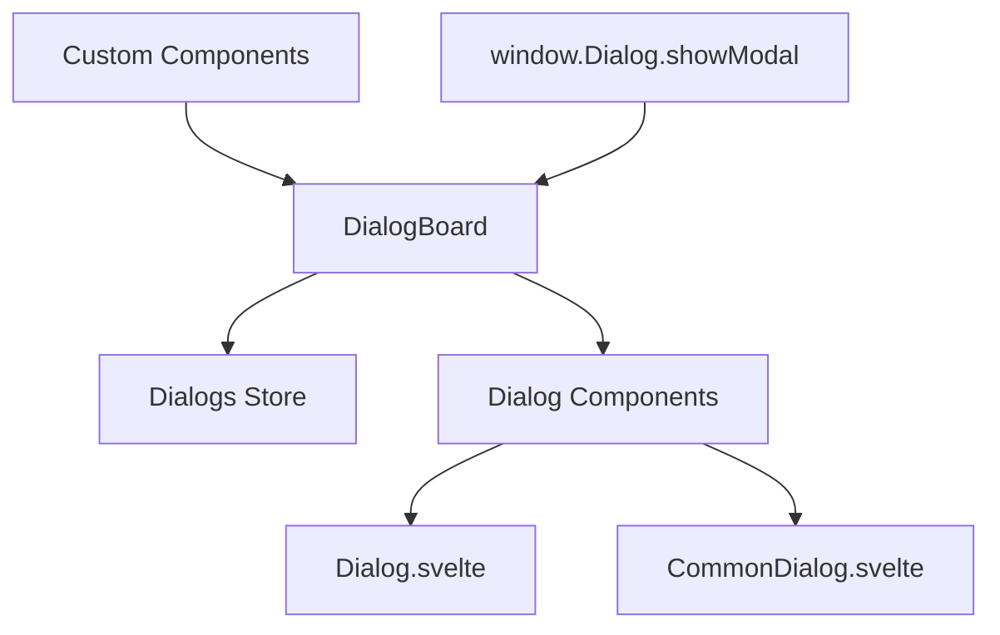

# Dialog System

The Uniface Element Dialog System provides a comprehensive modal dialog solution for Svelte applications. It includes global dialog management, built-in dialog components, and flexible customization options.

## Table of Contents

- [Architecture Overview](#architecture-overview)
- [DialogBoard - Global Dialog Manager](#dialogboard---global-dialog-manager)
- [Built-in Dialog Components](#built-in-dialog-components)
- [Creating Custom Dialogs](#creating-custom-dialogs)
- [API Reference](#api-reference)
- [Advanced Usage](#advanced-usage)
- [Best Practices](#best-practices)
- [Migration Guide](#migration-guide)

## Architecture Overview

The dialog system consists of several interconnected components:

- **DialogBoard**: Global dialog manager that handles dialog lifecycle
- **Dialog**: Base dialog component with standard UI elements
- **CommonDialog**: Pre-configured dialog for common use cases
- **IDialog**: TypeScript interface for global dialog access
- **Dialogs Store**: Svelte store managing dialog state



## DialogBoard - Global Dialog Manager

The `DialogBoard` component manages all modal dialogs in your application and provides global access through the `window.Dialog` API.

### Setup

Include `DialogBoard` in your root layout:

```svelte
<!-- +layout.svelte or app.html -->
<script lang="ts">
  import { DialogBoard } from "@ticatec/uniface-element/DialogBoard";
</script>

<!-- Your application content -->
<main>
  <slot />
</main>

<!-- Global dialog manager -->
<DialogBoard />
```

### Global API

Once `DialogBoard` is mounted, you can access the dialog system globally:

```typescript
// Open any Svelte component as a modal dialog
window.Dialog.showModal(MyComponent, {
  // Props to pass to the component
  title: "My Dialog",
  data: someData,
  onSave: (result) => {
    console.log("Saved:", result);
  }
});
```

### TypeScript Support

Add global type declarations:

```typescript
// src/app.d.ts
import type { IDialog } from '@ticatec/uniface-element';

declare global {
  interface Window {
    Dialog: IDialog;
  }
}
```

## Built-in Dialog Components

### Dialog Component

The base `Dialog` component provides standard dialog functionality:

```svelte
<script lang="ts">
  import { Dialog } from '@ticatec/uniface-element';
  import type { ButtonActions } from '@ticatec/uniface-element';
  
  let modalResult = null;
  
  const actions: ButtonActions = [
    {
      label: "Save",
      type: "primary",
      handler: async () => {
        // Perform save operation
        await saveData();
        return true; // Return true to auto-close dialog
      }
    }
  ];
  
  const onClose = (result) => {
    console.log("Dialog closed with result:", result);
  };
</script>

<Dialog
  title="My Dialog"
  width="500px"
  height="400px"
  bind:modalResult
  {actions}
  {onClose}
>
  <!-- Dialog content -->
  <p>This is the dialog content.</p>
</Dialog>
```

#### Dialog Properties

| Property | Type | Description |
|----------|------|-------------|
| `title` | `string` | Dialog title |
| `width` | `string` | Dialog width (CSS value) |
| `height` | `string` | Dialog height (CSS value) |
| `actions` | `ButtonActions` | Array of action buttons |
| `closeConfirm` | `DialogCloseConfirm` | Confirmation function for close |
| `content$style` | `string` | Custom styles for content area |
| `modalResult` | `ModalResult` | Result binding for programmatic close |
| `onClose` | `OnClose` | Callback when dialog closes |

### CommonDialog Component

The `CommonDialog` is a pre-configured dialog for typical use cases:

```svelte
<script lang="ts">
  import { CommonDialog, ModalResult } from '@ticatec/uniface-element';
  
  export let user: any;
  export let onSave: (user: any) => void;
  
  let modalResult = null;
  let enableConfirm = true;
  
  const confirmHandler = async () => {
    try {
      await onSave(user);
      return true; // Return true to auto-close
    } catch (error) {
      console.error("Save failed:", error);
      return false; // Keep dialog open on error
    }
  };
  
  const onClose = (result) => {
    if (result === ModalResult.Ok) {
      console.log("User saved successfully");
    }
  };
</script>

<CommonDialog
  title="Edit User"
  width="600px"
  height="500px"
  bind:modalResult
  bind:enableConfirm
  {confirmHandler}
  confirmText="Save Changes"
  {onClose}
>
  <div class="form-content">
    <label>
      Name:
      <input bind:value={user.name} />
    </label>
    <label>
      Email:
      <input bind:value={user.email} type="email" />
    </label>
  </div>
</CommonDialog>

<style>
  .form-content {
    display: flex;
    flex-direction: column;
    gap: 16px;
  }
  
  label {
    display: flex;
    flex-direction: column;
    gap: 4px;
  }
  
  input {
    padding: 8px;
    border: 1px solid #ccc;
    border-radius: 4px;
  }
</style>
```

#### CommonDialog Properties

| Property | Type | Description |
|----------|------|-------------|
| `title` | `string` | Dialog title |
| `width` | `string` | Dialog width |
| `height` | `string` | Dialog height |
| `closeConfirm` | `DialogCloseConfirm` | Close confirmation function |
| `content$style` | `string` | Content area custom styles |
| `modalResult` | `ModalResult` | Result binding |
| `enableConfirm` | `boolean` | Enable/disable confirm button |
| `confirmHandler` | `() => Promise<boolean>` | Confirm button handler |
| `confirmText` | `string` | Custom confirm button text |
| `onClose` | `OnClose` | Close callback |

## Creating Custom Dialogs

### Method 1: Using Context API (Recommended)

Create custom dialog components using Svelte's context system:

```svelte
<!-- UserEditDialog.svelte -->
<script lang="ts">
  import { getContext } from 'svelte';
  
  export let user: any;
  export let onSave: (user: any) => Promise<void>;
  
  // Get close function from context
  const closeDialog = getContext('closeDialog');
  
  let saving = false;
  let formData = { ...user };
  
  const handleSave = async () => {
    if (saving) return;
    
    saving = true;
    try {
      await onSave(formData);
      closeDialog(); // Close dialog on successful save
    } catch (error) {
      console.error('Save failed:', error);
      // Dialog stays open on error
    } finally {
      saving = false;
    }
  };
  
  const handleCancel = () => {
    closeDialog();
  };
</script>

<div class="custom-dialog">
  <div class="dialog-backdrop" on:click={handleCancel}></div>
  <div class="dialog-content">
    <header class="dialog-header">
      <h2>Edit User</h2>
      <button class="close-btn" on:click={handleCancel}>&times;</button>
    </header>
    
    <main class="dialog-body">
      <form on:submit|preventDefault={handleSave}>
        <div class="field">
          <label for="name">Name:</label>
          <input id="name" bind:value={formData.name} required />
        </div>
        
        <div class="field">
          <label for="email">Email:</label>
          <input id="email" type="email" bind:value={formData.email} required />
        </div>
        
        <div class="field">
          <label for="role">Role:</label>
          <select id="role" bind:value={formData.role}>
            <option value="user">User</option>
            <option value="admin">Admin</option>
          </select>
        </div>
      </form>
    </main>
    
    <footer class="dialog-footer">
      <button type="button" on:click={handleCancel} disabled={saving}>
        Cancel
      </button>
      <button 
        type="button" 
        class="primary" 
        on:click={handleSave} 
        disabled={saving}
      >
        {saving ? 'Saving...' : 'Save Changes'}
      </button>
    </footer>
  </div>
</div>

<style>
  .custom-dialog {
    position: fixed;
    top: 0;
    left: 0;
    width: 100%;
    height: 100%;
    z-index: 1000;
    display: flex;
    align-items: center;
    justify-content: center;
  }
  
  .dialog-backdrop {
    position: absolute;
    top: 0;
    left: 0;
    width: 100%;
    height: 100%;
    background: rgba(0, 0, 0, 0.5);
  }
  
  .dialog-content {
    position: relative;
    background: white;
    border-radius: 8px;
    box-shadow: 0 10px 25px rgba(0, 0, 0, 0.2);
    width: 90%;
    max-width: 500px;
    max-height: 90%;
    overflow: hidden;
    display: flex;
    flex-direction: column;
  }
  
  .dialog-header {
    padding: 20px;
    border-bottom: 1px solid #eee;
    display: flex;
    justify-content: space-between;
    align-items: center;
  }
  
  .dialog-header h2 {
    margin: 0;
    font-size: 1.5rem;
  }
  
  .close-btn {
    background: none;
    border: none;
    font-size: 1.5rem;
    cursor: pointer;
    padding: 0;
    width: 32px;
    height: 32px;
    display: flex;
    align-items: center;
    justify-content: center;
  }
  
  .dialog-body {
    padding: 20px;
    flex: 1;
    overflow-y: auto;
  }
  
  .field {
    margin-bottom: 16px;
  }
  
  .field label {
    display: block;
    margin-bottom: 4px;
    font-weight: 500;
  }
  
  .field input,
  .field select {
    width: 100%;
    padding: 8px 12px;
    border: 1px solid #ddd;
    border-radius: 4px;
    font-size: 14px;
  }
  
  .dialog-footer {
    padding: 20px;
    border-top: 1px solid #eee;
    display: flex;
    gap: 12px;
    justify-content: flex-end;
  }
  
  button {
    padding: 8px 16px;
    border: 1px solid #ddd;
    border-radius: 4px;
    background: white;
    cursor: pointer;
    font-size: 14px;
  }
  
  button:disabled {
    opacity: 0.6;
    cursor: not-allowed;
  }
  
  button.primary {
    background: #007bff;
    color: white;
    border-color: #007bff;
  }
  
  button.primary:hover:not(:disabled) {
    background: #0056b3;
  }
</style>
```

### Method 2: Using Built-in Components

Wrap your content in built-in dialog components:

```svelte
<!-- ProductDialog.svelte -->
<script lang="ts">
  import { CommonDialog, ModalResult } from '@ticatec/uniface-element';
  
  export let product: any;
  export let onSave: (product: any) => Promise<void>;
  
  let modalResult = null;
  let enableConfirm = true;
  let formData = { ...product };
  
  const confirmHandler = async () => {
    try {
      await onSave(formData);
      return true; // Auto-close on success
    } catch (error) {
      // Handle error, keep dialog open
      return false;
    }
  };
  
  const onClose = (result) => {
    console.log('Product dialog closed:', result);
  };
</script>

<CommonDialog
  title="Edit Product"
  width="600px"
  height="500px"
  bind:modalResult
  bind:enableConfirm
  {confirmHandler}
  confirmText="Save Product"
  {onClose}
>
  <div class="product-form">
    <div class="form-group">
      <label>Product Name:</label>
      <input bind:value={formData.name} placeholder="Enter product name" />
    </div>
    
    <div class="form-group">
      <label>Description:</label>
      <textarea bind:value={formData.description} rows="3"></textarea>
    </div>
    
    <div class="form-row">
      <div class="form-group">
        <label>Price:</label>
        <input type="number" bind:value={formData.price} step="0.01" />
      </div>
      
      <div class="form-group">
        <label>Category:</label>
        <select bind:value={formData.category}>
          <option value="electronics">Electronics</option>
          <option value="clothing">Clothing</option>
          <option value="books">Books</option>
        </select>
      </div>
    </div>
    
    <div class="form-group">
      <label>
        <input type="checkbox" bind:checked={formData.featured} />
        Featured Product
      </label>
    </div>
  </div>
</CommonDialog>

<style>
  .product-form {
    display: flex;
    flex-direction: column;
    gap: 16px;
  }
  
  .form-group {
    display: flex;
    flex-direction: column;
    gap: 4px;
  }
  
  .form-row {
    display: grid;
    grid-template-columns: 1fr 1fr;
    gap: 16px;
  }
  
  label {
    font-weight: 500;
    color: #333;
  }
  
  input, textarea, select {
    padding: 8px 12px;
    border: 1px solid #ddd;
    border-radius: 4px;
    font-size: 14px;
  }
  
  input[type="checkbox"] {
    width: auto;
    margin-right: 8px;
  }
</style>
```

### Usage Examples

```typescript
// Open custom dialog
window.Dialog.showModal(UserEditDialog, {
  user: { id: 1, name: "John Doe", email: "john@example.com" },
  onSave: async (userData) => {
    await api.updateUser(userData);
    // Refresh user list or show success message
  }
});

// Open product dialog
window.Dialog.showModal(ProductDialog, {
  product: { id: 1, name: "Widget", price: 29.99 },
  onSave: async (productData) => {
    await api.updateProduct(productData);
    // Handle success
  }
});
```

## API Reference

### IDialog Interface

```typescript
interface IDialog {
  showModal: (component: any, params: any) => void;
}
```

### ModalResult Enum

```typescript
enum ModalResult {
  Cancel = 0, // Cancel operation, close dialog
  Ok = 1      // Operation completed, normal close
}
```

### DialogCloseConfirm Type

```typescript
type DialogCloseConfirm = () => Promise<boolean>;
```

### OnClose Type

```typescript
type OnClose = (result: ModalResult | null) => void;
```

### ButtonAction Interface

```typescript
interface ButtonAction {
  label: string;
  type?: 'primary' | 'secondary' | 'danger';
  disabled?: boolean;
  handler?: () => void | Promise<void>;
}

type ButtonActions = ButtonAction[];
```

## Advanced Usage

### Dialog with Confirmation

Prevent accidental closing with confirmation:

```svelte
<script lang="ts">
  import { CommonDialog } from '@ticatec/uniface-element';
  
  let hasUnsavedChanges = false;
  
  const closeConfirm = async () => {
    if (hasUnsavedChanges) {
      return confirm("You have unsaved changes. Are you sure you want to close?");
    }
    return true;
  };
  
  const confirmHandler = async () => {
    // Save logic
    hasUnsavedChanges = false;
    return true;
  };
</script>

<CommonDialog
  title="Form with Unsaved Changes"
  {closeConfirm}
  {confirmHandler}
>
  <input on:input={() => hasUnsavedChanges = true} />
</CommonDialog>
```

### Dynamic Dialog Content

Load different content based on parameters:

```svelte
<!-- DynamicDialog.svelte -->
<script lang="ts">
  import { Dialog } from '@ticatec/uniface-element';
  
  export let type: 'create' | 'edit' | 'view';
  export let data: any;
  
  $: title = type === 'create' ? 'Create New Item' : 
             type === 'edit' ? 'Edit Item' : 
             'View Item';
             
  $: readonly = type === 'view';
</script>

<Dialog {title} width="500px">
  <div class="dynamic-content">
    {#if type === 'create'}
      <h3>Creating new item</h3>
      <!-- Create form -->
    {:else if type === 'edit'}
      <h3>Editing: {data.name}</h3>
      <!-- Edit form -->
    {:else}
      <h3>Viewing: {data.name}</h3>
      <!-- Read-only view -->
    {/if}
  </div>
</Dialog>
```

### Nested Dialogs

Open dialogs from within other dialogs:

```svelte
<script lang="ts">
  import { getContext } from 'svelte';
  import ConfirmDialog from './ConfirmDialog.svelte';
  
  const closeDialog = getContext('closeDialog');
  
  const handleDelete = () => {
    // Open confirmation dialog
    window.Dialog.showModal(ConfirmDialog, {
      message: "Are you sure you want to delete this item?",
      onConfirm: () => {
        // Delete and close parent dialog
        deleteItem();
        closeDialog();
      }
    });
  };
</script>
```

## Best Practices

### 1. Use Context for Dialog Control

Always use `getContext('closeDialog')` for proper dialog lifecycle management:

```svelte
<script lang="ts">
  import { getContext } from 'svelte';
  const closeDialog = getContext('closeDialog');
</script>
```

### 2. Handle Errors Gracefully

Keep dialogs open when operations fail:

```svelte
<script lang="ts">
  const confirmHandler = async () => {
    try {
      await saveData();
      return true; // Close on success
    } catch (error) {
      showErrorMessage(error);
      return false; // Keep open on error
    }
  };
</script>
```

### 3. Provide Loading States

Show loading states during async operations:

```svelte
<script lang="ts">
  let saving = false;
  
  const handleSave = async () => {
    saving = true;
    try {
      await saveData();
      closeDialog();
    } finally {
      saving = false;
    }
  };
</script>

<button disabled={saving} on:click={handleSave}>
  {saving ? 'Saving...' : 'Save'}
</button>
```

### 4. Use Semantic HTML

Ensure accessibility with proper HTML structure:

```svelte
<div role="dialog" aria-labelledby="dialog-title" aria-modal="true">
  <h2 id="dialog-title">Dialog Title</h2>
  <!-- Content -->
</div>
```

### 5. Focus Management

Manage focus for better UX:

```svelte
<script lang="ts">
  import { tick, onMount } from 'svelte';
  
  let firstInput;
  
  onMount(async () => {
    await tick();
    firstInput?.focus();
  });
</script>

<input bind:this={firstInput} />
```

## Migration Guide

### From v1.x to v2.x

**Old way (deprecated):**
```svelte
<script lang="ts">
  export let closeHandler: () => void;
</script>
```

**New way:**
```svelte
<script lang="ts">
  import { getContext } from 'svelte';
  const closeDialog = getContext('closeDialog');
</script>
```

### Updating Existing Dialogs

1. Remove `closeHandler` prop
2. Add `getContext` import
3. Replace `closeHandler()` calls with `closeDialog()`
4. Test dialog functionality

### Breaking Changes

- `closeHandler` prop is no longer automatically passed
- Dialog components must use Context API for closing
- `DialogBoard` now uses a different internal structure

### Compatibility

The new system is designed to be backward compatible where possible. Old dialogs will still work but should be updated to use the new Context API for better maintainability.