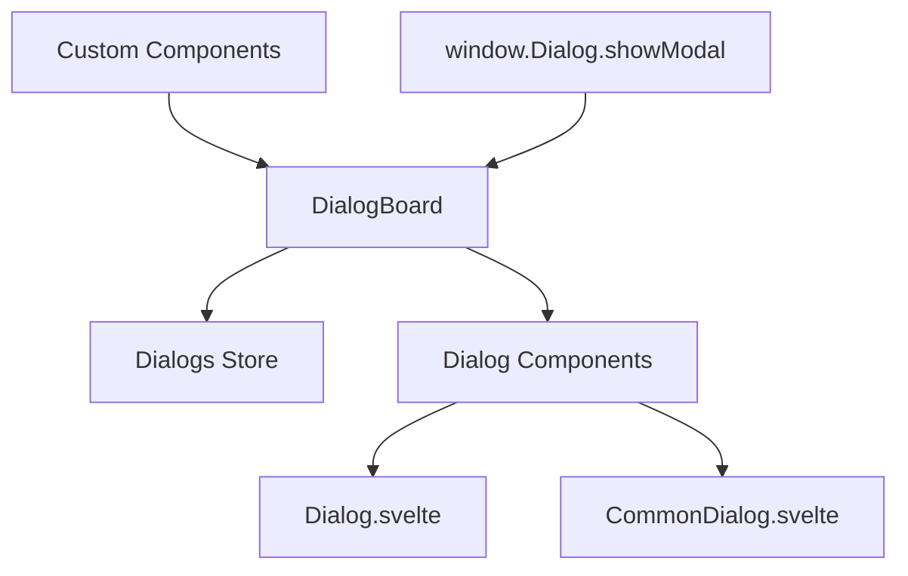

# 对话框系统

Uniface Element 对话框系统为 Svelte 应用程序提供了全面的模态对话框解决方案。它包括全局对话框管理、内置对话框组件和灵活的自定义选项。

## 目录

- [架构概述](#架构概述)
- [DialogBoard - 全局对话框管理器](#dialogboard---全局对话框管理器)
- [内置对话框组件](#内置对话框组件)
- [创建自定义对话框](#创建自定义对话框)
- [API 参考](#api-参考)
- [高级用法](#高级用法)
- [最佳实践](#最佳实践)
- [迁移指南](#迁移指南)

## 架构概述

对话框系统由几个相互关联的组件组成：

- **DialogBoard**: 处理对话框生命周期的全局对话框管理器
- **Dialog**: 具有标准 UI 元素的基础对话框组件
- **CommonDialog**: 为常见用例预配置的对话框
- **IDialog**: 全局对话框访问的 TypeScript 接口
- **Dialogs Store**: 管理对话框状态的 Svelte store



## DialogBoard - 全局对话框管理器

`DialogBoard` 组件管理应用程序中的所有模态对话框，并通过 `window.Dialog` API 提供全局访问。

### 设置

在根布局中包含 `DialogBoard`：

```svelte
<!-- +layout.svelte 或 app.html -->
<script lang="ts">
  import { DialogBoard } from "@ticatec/uniface-element/DialogBoard";
</script>

<!-- 您的应用程序内容 -->
<main>
  <slot />
</main>

<!-- 全局对话框管理器 -->
<DialogBoard />
```

### 全局 API

一旦 `DialogBoard` 挂载，您就可以全局访问对话框系统：

```typescript
// 将任何 Svelte 组件作为模态对话框打开
window.Dialog.showModal(MyComponent, {
  // 传递给组件的属性
  title: "我的对话框",
  data: someData,
  onSave: (result) => {
    console.log("已保存:", result);
  }
});
```

### TypeScript 支持

添加全局类型声明：

```typescript
// src/app.d.ts
import type { IDialog } from '@ticatec/uniface-element';

declare global {
  interface Window {
    Dialog: IDialog;
  }
}
```

## 内置对话框组件

### Dialog 组件

基础 `Dialog` 组件提供标准的对话框功能：

```svelte
<script lang="ts">
  import { Dialog } from '@ticatec/uniface-element';
  import type { ButtonActions } from '@ticatec/uniface-element';
  
  let modalResult = null;
  
  const actions: ButtonActions = [
    {
      label: "保存",
      type: "primary",
      handler: async () => {
        // 执行保存操作
        await saveData();
        return true; // 返回 true 自动关闭对话框
      }
    }
  ];
  
  const onClose = (result) => {
    console.log("对话框关闭，结果:", result);
  };
</script>

<Dialog
  title="我的对话框"
  width="500px"
  height="400px"
  bind:modalResult
  {actions}
  {onClose}
>
  <!-- 对话框内容 -->
  <p>这是对话框内容。</p>
</Dialog>
```

#### Dialog 属性

| 属性 | 类型 | 描述 |
|------|------|------|
| `title` | `string` | 对话框标题 |
| `width` | `string` | 对话框宽度（CSS 值） |
| `height` | `string` | 对话框高度（CSS 值） |
| `actions` | `ButtonActions` | 操作按钮数组 |
| `closeConfirm` | `DialogCloseConfirm` | 关闭确认函数 |
| `content$style` | `string` | 内容区域的自定义样式 |
| `modalResult` | `ModalResult` | 程序化关闭的结果绑定 |
| `onClose` | `OnClose` | 对话框关闭时的回调 |

### CommonDialog 组件

`CommonDialog` 是为典型用例预配置的对话框：

```svelte
<script lang="ts">
  import { CommonDialog, ModalResult } from '@ticatec/uniface-element';
  
  export let user: any;
  export let onSave: (user: any) => void;
  
  let modalResult = null;
  let enableConfirm = true;
  
  const confirmHandler = async () => {
    try {
      await onSave(user);
      return true; // 返回 true 自动关闭
    } catch (error) {
      console.error("保存失败:", error);
      return false; // 出错时保持对话框打开
    }
  };
  
  const onClose = (result) => {
    if (result === ModalResult.Ok) {
      console.log("用户保存成功");
    }
  };
</script>

<CommonDialog
  title="编辑用户"
  width="600px"
  height="500px"
  bind:modalResult
  bind:enableConfirm
  {confirmHandler}
  confirmText="保存更改"
  {onClose}
>
  <div class="form-content">
    <label>
      姓名:
      <input bind:value={user.name} />
    </label>
    <label>
      邮箱:
      <input bind:value={user.email} type="email" />
    </label>
  </div>
</CommonDialog>

<style>
  .form-content {
    display: flex;
    flex-direction: column;
    gap: 16px;
  }
  
  label {
    display: flex;
    flex-direction: column;
    gap: 4px;
  }
  
  input {
    padding: 8px;
    border: 1px solid #ccc;
    border-radius: 4px;
  }
</style>
```

#### CommonDialog 属性

| 属性 | 类型 | 描述 |
|------|------|------|
| `title` | `string` | 对话框标题 |
| `width` | `string` | 对话框宽度 |
| `height` | `string` | 对话框高度 |
| `closeConfirm` | `DialogCloseConfirm` | 关闭确认函数 |
| `content$style` | `string` | 内容区域自定义样式 |
| `modalResult` | `ModalResult` | 结果绑定 |
| `enableConfirm` | `boolean` | 启用/禁用确认按钮 |
| `confirmHandler` | `() => Promise<boolean>` | 确认按钮处理程序 |
| `confirmText` | `string` | 自定义确认按钮文本 |
| `onClose` | `OnClose` | 关闭回调 |

## 创建自定义对话框

### 方法 1: 使用 Context API（推荐）

使用 Svelte 的上下文系统创建自定义对话框组件：

```svelte
<!-- UserEditDialog.svelte -->
<script lang="ts">
  import { getContext } from 'svelte';
  
  export let user: any;
  export let onSave: (user: any) => Promise<void>;
  
  // 从上下文获取关闭函数
  const closeDialog = getContext('closeDialog');
  
  let saving = false;
  let formData = { ...user };
  
  const handleSave = async () => {
    if (saving) return;
    
    saving = true;
    try {
      await onSave(formData);
      closeDialog(); // 保存成功后关闭对话框
    } catch (error) {
      console.error('保存失败:', error);
      // 出错时对话框保持打开
    } finally {
      saving = false;
    }
  };
  
  const handleCancel = () => {
    closeDialog();
  };
</script>

<div class="custom-dialog">
  <div class="dialog-backdrop" on:click={handleCancel}></div>
  <div class="dialog-content">
    <header class="dialog-header">
      <h2>编辑用户</h2>
      <button class="close-btn" on:click={handleCancel}>&times;</button>
    </header>
    
    <main class="dialog-body">
      <form on:submit|preventDefault={handleSave}>
        <div class="field">
          <label for="name">姓名:</label>
          <input id="name" bind:value={formData.name} required />
        </div>
        
        <div class="field">
          <label for="email">邮箱:</label>
          <input id="email" type="email" bind:value={formData.email} required />
        </div>
        
        <div class="field">
          <label for="role">角色:</label>
          <select id="role" bind:value={formData.role}>
            <option value="user">用户</option>
            <option value="admin">管理员</option>
          </select>
        </div>
      </form>
    </main>
    
    <footer class="dialog-footer">
      <button type="button" on:click={handleCancel} disabled={saving}>
        取消
      </button>
      <button 
        type="button" 
        class="primary" 
        on:click={handleSave} 
        disabled={saving}
      >
        {saving ? '保存中...' : '保存更改'}
      </button>
    </footer>
  </div>
</div>

<style>
  .custom-dialog {
    position: fixed;
    top: 0;
    left: 0;
    width: 100%;
    height: 100%;
    z-index: 1000;
    display: flex;
    align-items: center;
    justify-content: center;
  }
  
  .dialog-backdrop {
    position: absolute;
    top: 0;
    left: 0;
    width: 100%;
    height: 100%;
    background: rgba(0, 0, 0, 0.5);
  }
  
  .dialog-content {
    position: relative;
    background: white;
    border-radius: 8px;
    box-shadow: 0 10px 25px rgba(0, 0, 0, 0.2);
    width: 90%;
    max-width: 500px;
    max-height: 90%;
    overflow: hidden;
    display: flex;
    flex-direction: column;
  }
  
  .dialog-header {
    padding: 20px;
    border-bottom: 1px solid #eee;
    display: flex;
    justify-content: space-between;
    align-items: center;
  }
  
  .dialog-header h2 {
    margin: 0;
    font-size: 1.5rem;
  }
  
  .close-btn {
    background: none;
    border: none;
    font-size: 1.5rem;
    cursor: pointer;
    padding: 0;
    width: 32px;
    height: 32px;
    display: flex;
    align-items: center;
    justify-content: center;
  }
  
  .dialog-body {
    padding: 20px;
    flex: 1;
    overflow-y: auto;
  }
  
  .field {
    margin-bottom: 16px;
  }
  
  .field label {
    display: block;
    margin-bottom: 4px;
    font-weight: 500;
  }
  
  .field input,
  .field select {
    width: 100%;
    padding: 8px 12px;
    border: 1px solid #ddd;
    border-radius: 4px;
    font-size: 14px;
  }
  
  .dialog-footer {
    padding: 20px;
    border-top: 1px solid #eee;
    display: flex;
    gap: 12px;
    justify-content: flex-end;
  }
  
  button {
    padding: 8px 16px;
    border: 1px solid #ddd;
    border-radius: 4px;
    background: white;
    cursor: pointer;
    font-size: 14px;
  }
  
  button:disabled {
    opacity: 0.6;
    cursor: not-allowed;
  }
  
  button.primary {
    background: #007bff;
    color: white;
    border-color: #007bff;
  }
  
  button.primary:hover:not(:disabled) {
    background: #0056b3;
  }
</style>
```

### 方法 2: 使用内置组件

将您的内容包装在内置对话框组件中：

```svelte
<!-- ProductDialog.svelte -->
<script lang="ts">
  import { CommonDialog, ModalResult } from '@ticatec/uniface-element';
  
  export let product: any;
  export let onSave: (product: any) => Promise<void>;
  
  let modalResult = null;
  let enableConfirm = true;
  let formData = { ...product };
  
  const confirmHandler = async () => {
    try {
      await onSave(formData);
      return true; // 成功时自动关闭
    } catch (error) {
      // 处理错误，保持对话框打开
      return false;
    }
  };
  
  const onClose = (result) => {
    console.log('产品对话框关闭:', result);
  };
</script>

<CommonDialog
  title="编辑产品"
  width="600px"
  height="500px"
  bind:modalResult
  bind:enableConfirm
  {confirmHandler}
  confirmText="保存产品"
  {onClose}
>
  <div class="product-form">
    <div class="form-group">
      <label>产品名称:</label>
      <input bind:value={formData.name} placeholder="输入产品名称" />
    </div>
    
    <div class="form-group">
      <label>描述:</label>
      <textarea bind:value={formData.description} rows="3"></textarea>
    </div>
    
    <div class="form-row">
      <div class="form-group">
        <label>价格:</label>
        <input type="number" bind:value={formData.price} step="0.01" />
      </div>
      
      <div class="form-group">
        <label>分类:</label>
        <select bind:value={formData.category}>
          <option value="electronics">电子产品</option>
          <option value="clothing">服装</option>
          <option value="books">书籍</option>
        </select>
      </div>
    </div>
    
    <div class="form-group">
      <label>
        <input type="checkbox" bind:checked={formData.featured} />
        推荐产品
      </label>
    </div>
  </div>
</CommonDialog>

<style>
  .product-form {
    display: flex;
    flex-direction: column;
    gap: 16px;
  }
  
  .form-group {
    display: flex;
    flex-direction: column;
    gap: 4px;
  }
  
  .form-row {
    display: grid;
    grid-template-columns: 1fr 1fr;
    gap: 16px;
  }
  
  label {
    font-weight: 500;
    color: #333;
  }
  
  input, textarea, select {
    padding: 8px 12px;
    border: 1px solid #ddd;
    border-radius: 4px;
    font-size: 14px;
  }
  
  input[type="checkbox"] {
    width: auto;
    margin-right: 8px;
  }
</style>
```

### 使用示例

```typescript
// 打开自定义对话框
window.Dialog.showModal(UserEditDialog, {
  user: { id: 1, name: "张三", email: "zhangsan@example.com" },
  onSave: async (userData) => {
    await api.updateUser(userData);
    // 刷新用户列表或显示成功消息
  }
});

// 打开产品对话框
window.Dialog.showModal(ProductDialog, {
  product: { id: 1, name: "小工具", price: 29.99 },
  onSave: async (productData) => {
    await api.updateProduct(productData);
    // 处理成功
  }
});
```

## API 参考

### IDialog 接口

```typescript
interface IDialog {
  showModal: (component: any, params: any) => void;
}
```

### ModalResult 枚举

```typescript
enum ModalResult {
  Cancel = 0, // 取消操作，关闭对话框
  Ok = 1      // 操作完成，正常关闭
}
```

### DialogCloseConfirm 类型

```typescript
type DialogCloseConfirm = () => Promise<boolean>;
```

### OnClose 类型

```typescript
type OnClose = (result: ModalResult | null) => void;
```

### ButtonAction 接口

```typescript
interface ButtonAction {
  label: string;
  type?: 'primary' | 'secondary' | 'danger';
  disabled?: boolean;
  handler?: () => void | Promise<void>;
}

type ButtonActions = ButtonAction[];
```

## 高级用法

### 带确认的对话框

使用确认防止意外关闭：

```svelte
<script lang="ts">
  import { CommonDialog } from '@ticatec/uniface-element';
  
  let hasUnsavedChanges = false;
  
  const closeConfirm = async () => {
    if (hasUnsavedChanges) {
      return confirm("您有未保存的更改。确定要关闭吗？");
    }
    return true;
  };
  
  const confirmHandler = async () => {
    // 保存逻辑
    hasUnsavedChanges = false;
    return true;
  };
</script>

<CommonDialog
  title="有未保存更改的表单"
  {closeConfirm}
  {confirmHandler}
>
  <input on:input={() => hasUnsavedChanges = true} />
</CommonDialog>
```

### 动态对话框内容

根据参数加载不同内容：

```svelte
<!-- DynamicDialog.svelte -->
<script lang="ts">
  import { Dialog } from '@ticatec/uniface-element';
  
  export let type: 'create' | 'edit' | 'view';
  export let data: any;
  
  $: title = type === 'create' ? '创建新项目' : 
             type === 'edit' ? '编辑项目' : 
             '查看项目';
             
  $: readonly = type === 'view';
</script>

<Dialog {title} width="500px">
  <div class="dynamic-content">
    {#if type === 'create'}
      <h3>创建新项目</h3>
      <!-- 创建表单 -->
    {:else if type === 'edit'}
      <h3>编辑: {data.name}</h3>
      <!-- 编辑表单 -->
    {:else}
      <h3>查看: {data.name}</h3>
      <!-- 只读视图 -->
    {/if}
  </div>
</Dialog>
```

### 嵌套对话框

从其他对话框中打开对话框：

```svelte
<script lang="ts">
  import { getContext } from 'svelte';
  import ConfirmDialog from './ConfirmDialog.svelte';
  
  const closeDialog = getContext('closeDialog');
  
  const handleDelete = () => {
    // 打开确认对话框
    window.Dialog.showModal(ConfirmDialog, {
      message: "确定要删除此项目吗？",
      onConfirm: () => {
        // 删除并关闭父对话框
        deleteItem();
        closeDialog();
      }
    });
  };
</script>
```

## 最佳实践

### 1. 使用 Context 进行对话框控制

始终使用 `getContext('closeDialog')` 进行适当的对话框生命周期管理：

```svelte
<script lang="ts">
  import { getContext } from 'svelte';
  const closeDialog = getContext('closeDialog');
</script>
```

### 2. 优雅地处理错误

操作失败时保持对话框打开：

```svelte
<script lang="ts">
  const confirmHandler = async () => {
    try {
      await saveData();
      return true; // 成功时关闭
    } catch (error) {
      showErrorMessage(error);
      return false; // 错误时保持打开
    }
  };
</script>
```

### 3. 提供加载状态

在异步操作期间显示加载状态：

```svelte
<script lang="ts">
  let saving = false;
  
  const handleSave = async () => {
    saving = true;
    try {
      await saveData();
      closeDialog();
    } finally {
      saving = false;
    }
  };
</script>

<button disabled={saving} on:click={handleSave}>
  {saving ? '保存中...' : '保存'}
</button>
```

### 4. 使用语义化 HTML

确保使用正确的 HTML 结构实现无障碍访问：

```svelte
<div role="dialog" aria-labelledby="dialog-title" aria-modal="true">
  <h2 id="dialog-title">对话框标题</h2>
  <!-- 内容 -->
</div>
```

### 5. 焦点管理

管理焦点以提供更好的用户体验：

```svelte
<script lang="ts">
  import { tick, onMount } from 'svelte';
  
  let firstInput;
  
  onMount(async () => {
    await tick();
    firstInput?.focus();
  });
</script>

<input bind:this={firstInput} />
```

## 迁移指南

### 从 v1.x 到 v2.x

**旧方式（已弃用）：**
```svelte
<script lang="ts">
  export let closeHandler: () => void;
</script>
```

**新方式：**
```svelte
<script lang="ts">
  import { getContext } from 'svelte';
  const closeDialog = getContext('closeDialog');
</script>
```

### 更新现有对话框

1. 移除 `closeHandler` 属性
2. 添加 `getContext` 导入
3. 将 `closeHandler()` 调用替换为 `closeDialog()`
4. 测试对话框功能

### 重大变更

- 不再自动传递 `closeHandler` 属性
- 对话框组件必须使用 Context API 进行关闭
- `DialogBoard` 现在使用不同的内部结构

### 兼容性

新系统设计为尽可能向后兼容。旧对话框仍可工作，但应更新为使用新的 Context API 以获得更好的可维护性。