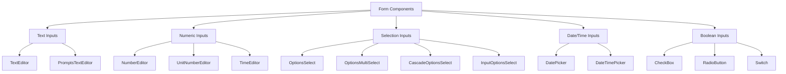

# Form Components

The Uniface Element Form Components provide a comprehensive set of input controls for building rich forms and data entry interfaces in Svelte applications. These components are designed with consistent styling, validation support, and flexible configuration options.

## Table of Contents

- [Architecture Overview](#architecture-overview)
- [TextEditor Component](#texteditor-component)
- [NumberEditor Component](#numbereditor-component)
- [TimeEditor Component](#timeeditor-component)
- [UnitNumberEditor Component](#unitnumbereditor-component)
- [CheckBox Component](#checkbox-component)
- [RadioButton Component](#radiobutton-component)
- [OptionsSelect Component](#optionsselect-component)
- [OptionsMultiSelect Component](#optionsmultiselect-component)
- [PromptsTextEditor Component](#promptstexteditor-component)
- [Switch Component](#switch-component)
- [InputOptionsSelect Component](#inputoptionsselect-component)
- [LookupEditor Component](#lookupeditor-component)
- [DatePicker Component](#datepicker-component)
- [DateTimePicker Component](#datetimepicker-component)
- [CascadeOptionsSelect Component](#cascadeoptionsselect-component)
- [Common Properties](#common-properties)
- [Display Modes](#display-modes)
- [Styling and Theming](#styling-and-theming)
- [Validation and Events](#validation-and-events)
- [Best Practices](#best-practices)
- [Accessibility](#accessibility)

## Architecture Overview

Form components in Uniface Element follow a consistent architecture:

- **CommonEditor**: Base wrapper providing consistent styling and behavior
- **CommonPicker**: Base for dropdown/picker components
- **DisplayMode**: Support for Edit/View/Display modes
- **Type Safety**: Full TypeScript support with proper type definitions
- **Event Handling**: Consistent onChange/onSelected event patterns
- **Icon Integration**: Uses `@ticatec/uniface-google-material-icons`



## TextEditor Component

A versatile text input component with support for prefixes, suffixes, and various styling options.

### Basic Usage

```svelte
<script lang="ts">
  import { TextEditor } from '@ticatec/uniface-element';
  
  let userInput = '';
  
  const handleChange = (value: string) => {
    console.log('Text changed:', value);
  };
</script>

<TextEditor 
  bind:value={userInput}
  placeholder="Enter text here"
  onChange={handleChange}
/>
```

### Advanced Features

```svelte
<script lang="ts">
  import { TextEditor } from '@ticatec/uniface-element';
  
  let email = '';
  let searchTerm = '';
  
  const handleEmailChange = (value: string) => {
    // Validate email format
    const isValid = /^[^\s@]+@[^\s@]+\.[^\s@]+$/.test(value);
    console.log('Email valid:', isValid);
  };
</script>

<!-- Email input with validation -->
<TextEditor 
  bind:value={email}
  placeholder="Enter email address"
  prefix="@"
  variant="outlined"
  onChange={handleEmailChange}
>
  <i class="icon_google_email" slot="leading-icon"></i>
</TextEditor>

<!-- Search input with clear button -->
<TextEditor 
  bind:value={searchTerm}
  placeholder="Search..."
  removable={true}
  compact={true}
>
  <i class="icon_google_search" slot="leading-icon"></i>
</TextEditor>
```

### TextEditor Properties

| Property | Type | Default | Description |
|----------|------|---------|-------------|
| `value` | `string` | `''` | Input value |
| `placeholder` | `string` | `''` | Placeholder text |
| `disabled` | `boolean` | `false` | Disable input |
| `readonly` | `boolean` | `false` | Read-only mode |
| `variant` | `'' \| 'plain' \| 'outlined' \| 'filled'` | `''` | Visual style variant |
| `compact` | `boolean` | `false` | Compact layout |
| `prefix` | `string` | `''` | Text prefix |
| `suffix` | `string` | `''` | Text suffix |
| `removable` | `boolean` | `true` | Show clear button |
| `displayMode` | `DisplayMode` | `DisplayMode.Edit` | Display mode |
| `onChange` | `(value: string) => void` | - | Change event handler |
| `setFocus` | `() => void` | - | Focus method |

## NumberEditor Component

Specialized numeric input with precision control, formatting, and validation.

### Basic Usage

```svelte
<script lang="ts">
  import { NumberEditor } from '@ticatec/uniface-element';
  
  let amount = null;
  let quantity = 1;
  
  const handleAmountChange = (value: number | null) => {
    console.log('Amount:', value);
  };
</script>

<NumberEditor 
  bind:value={amount}
  placeholder="Enter amount"
  precision={2}
  allowNegative={false}
  onChange={handleAmountChange}
/>

<NumberEditor 
  bind:value={quantity}
  min={1}
  max={100}
  precision={0}
  prefix="Qty: "
/>
```

### Currency and Formatting

```svelte
<script lang="ts">
  let price = 99.99;
  let percentage = 15.5;
  let weight = 2.5;
</script>

<!-- Currency input -->
<NumberEditor 
  bind:value={price}
  prefix="$"
  precision={2}
  allowNegative={false}
  placeholder="0.00"
/>

<!-- Percentage input -->
<NumberEditor 
  bind:value={percentage}
  suffix="%"
  precision={1}
  min={0}
  max={100}
/>

<!-- Weight with unit -->
<NumberEditor 
  bind:value={weight}
  suffix="kg"
  precision={2}
  allowNegative={false}
>
  <i class="icon_google_scale" slot="leading-icon"></i>
</NumberEditor>
```

### NumberEditor Properties

| Property | Type | Default | Description |
|----------|------|---------|-------------|
| `value` | `number \| null` | `null` | Numeric value |
| `precision` | `number \| null` | `null` | Decimal places |
| `min` | `number \| null` | `null` | Minimum value |
| `max` | `number \| null` | `null` | Maximum value |
| `allowNegative` | `boolean` | `false` | Allow negative numbers |
| `placeholder` | `string` | `''` | Placeholder text |
| `prefix` | `string` | `''` | Text prefix |
| `suffix` | `string` | `''` | Text suffix |
| `removable` | `boolean` | `true` | Show clear button |
| `onChange` | `OnChangeHandler<number \| null>` | - | Change event handler |

## TimeEditor Component

Time input component with hour/minute/second precision and custom formatting.

### Basic Usage

```svelte
<script lang="ts">
  import { TimeEditor } from '@ticatec/uniface-element';
  
  let startTime = null;
  let endTime = null;
  
  const handleTimeChange = (value: number) => {
    // Value is in minutes (e.g., 90 = 1:30)
    const hours = Math.floor(value / 60);
    const minutes = value % 60;
    console.log(`Time: ${hours}:${minutes}`);
  };
</script>

<!-- Hours and minutes -->
<TimeEditor 
  bind:value={startTime}
  precision="M"
  onChange={handleTimeChange}
/>

<!-- Hours, minutes, and seconds -->
<TimeEditor 
  bind:value={endTime}
  precision="S"
  mandatory={true}
/>
```

### Time Range Input

```svelte
<script lang="ts">
  let meetingStart = 540; // 9:00 AM (540 minutes from midnight)
  let meetingEnd = 600;   // 10:00 AM
  
  const validateTimeRange = () => {
    if (meetingEnd <= meetingStart) {
      console.warn('End time must be after start time');
    }
  };
</script>

<div class="time-range">
  <div class="time-input">
    <label>Start Time:</label>
    <TimeEditor 
      bind:value={meetingStart}
      precision="M"
      on:change={validateTimeRange}
    />
  </div>
  
  <div class="time-input">
    <label>End Time:</label>
    <TimeEditor 
      bind:value={meetingEnd}
      precision="M"
      on:change={validateTimeRange}
    />
  </div>
</div>

<style>
  .time-range {
    display: flex;
    gap: 16px;
    align-items: end;
  }
  
  .time-input {
    display: flex;
    flex-direction: column;
    gap: 4px;
  }
</style>
```

### TimeEditor Properties

| Property | Type | Default | Description |
|----------|------|---------|-------------|
| `value` | `number` | `null` | Time value in minutes |
| `precision` | `'M' \| 'S'` | `'M'` | Time precision (Minutes/Seconds) |
| `mandatory` | `boolean` | `false` | Require non-empty value |
| `disabled` | `boolean` | `false` | Disable input |
| `readonly` | `boolean` | `false` | Read-only mode |
| `variant` | `'' \| 'plain' \| 'outlined' \| 'filled'` | `''` | Visual style |
| `onChange` | `OnChangeHandler<number>` | - | Change event handler |

## UnitNumberEditor Component

Number input with selectable units (e.g., length, weight, currency).

### Basic Usage

```svelte
<script lang="ts">
  import { UnitNumberEditor, type UnitOption } from '@ticatec/uniface-element';
  
  let distance = 100;
  let unit = 'meters';
  
  const lengthUnits: UnitOption[] = [
    { code: 'mm', text: 'Millimeters', ratio: 0.001 },
    { code: 'cm', text: 'Centimeters', ratio: 0.01 },
    { code: 'meters', text: 'Meters', ratio: 1 },
    { code: 'km', text: 'Kilometers', ratio: 1000 }
  ];
  
  const handleDistanceChange = (value: number | null) => {
    console.log('Distance:', value, unit);
  };
</script>

<UnitNumberEditor
  bind:value={distance}
  bind:unitCode={unit}
  units={lengthUnits}
  allowNegative={false}
  onChange={handleDistanceChange}
/>
```

### Weight and Currency Examples

```svelte
<script lang="ts">
  let weight = 2.5;
  let weightUnit = 'kg';
  
  let price = 100;
  let currency = 'USD';
  
  const weightUnits = [
    { code: 'g', text: 'Grams', ratio: 0.001, precision: 0 },
    { code: 'kg', text: 'Kilograms', ratio: 1, precision: 2 },
    { code: 'lb', text: 'Pounds', ratio: 0.453592, precision: 2 }
  ];
  
  const currencies = [
    { code: 'USD', text: '$', ratio: 1, precision: 2 },
    { code: 'EUR', text: '€', ratio: 0.85, precision: 2 },
    { code: 'GBP', text: '£', ratio: 0.73, precision: 2 }
  ];
</script>

<!-- Weight input -->
<UnitNumberEditor
  bind:value={weight}
  bind:unitCode={weightUnit}
  units={weightUnits}
  placeholder="Enter weight"
/>

<!-- Currency input -->
<UnitNumberEditor
  bind:value={price}
  bind:unitCode={currency}
  units={currencies}
  allowNegative={false}
  prefix="Price: "
/>
```

### UnitNumberEditor Properties

| Property | Type | Default | Description |
|----------|------|---------|-------------|
| `value` | `number \| null` | `null` | Numeric value |
| `unitCode` | `string` | - | Selected unit code |
| `units` | `UnitOption[]` | - | Available units |
| `allowNegative` | `boolean` | `false` | Allow negative numbers |
| `placeholder` | `string` | `''` | Placeholder text |
| `prefix` | `string` | `''` | Text prefix |
| `removable` | `boolean` | `true` | Show clear button |
| `onChange` | `OnChangeHandler<number \| null>` | - | Change event handler |

## CheckBox Component

Boolean input component with support for indeterminate state.

### Basic Usage

```svelte
<script lang="ts">
  import { CheckBox } from '@ticatec/uniface-element';
  
  let agreedToTerms = false;
  let enableNotifications = true;
  
  const handleTermsChange = (checked: boolean) => {
    console.log('Terms agreed:', checked);
  };
</script>

<CheckBox
  bind:value={agreedToTerms}
  label="I agree to the terms and conditions"
  onChange={handleTermsChange}
/>

<CheckBox
  bind:value={enableNotifications}
  label="Enable notifications"
  compact={true}
/>
```

### Checkbox Groups

```svelte
<script lang="ts">
  let selectedFeatures = {
    darkMode: false,
    notifications: true,
    autoSave: true,
    analytics: false
  };
  
  const features = [
    { key: 'darkMode', label: 'Dark Mode' },
    { key: 'notifications', label: 'Push Notifications' },
    { key: 'autoSave', label: 'Auto Save' },
    { key: 'analytics', label: 'Usage Analytics' }
  ];
  
  const handleFeatureChange = (key: string) => (checked: boolean) => {
    selectedFeatures[key] = checked;
    selectedFeatures = { ...selectedFeatures };
  };
</script>

<div class="checkbox-group">
  <h3>Application Settings</h3>
  {#each features as feature}
    <CheckBox
      value={selectedFeatures[feature.key]}
      label={feature.label}
      onChange={handleFeatureChange(feature.key)}
    />
  {/each}
</div>

<style>
  .checkbox-group {
    display: flex;
    flex-direction: column;
    gap: 12px;
  }
</style>
```

### Indeterminate State

```svelte
<script lang="ts">
  let parentChecked = false;
  let childStates = [false, false, false];
  let indeterminate = false;
  
  const updateParentState = () => {
    const checkedCount = childStates.filter(Boolean).length;
    if (checkedCount === 0) {
      parentChecked = false;
      indeterminate = false;
    } else if (checkedCount === childStates.length) {
      parentChecked = true;
      indeterminate = false;
    } else {
      parentChecked = false;
      indeterminate = true;
    }
  };
  
  const handleParentChange = (checked: boolean) => {
    childStates = childStates.map(() => checked);
    updateParentState();
  };
  
  const handleChildChange = (index: number) => (checked: boolean) => {
    childStates[index] = checked;
    childStates = [...childStates];
    updateParentState();
  };
  
  $: updateParentState();
</script>

<CheckBox
  bind:value={parentChecked}
  bind:indeterminate
  label="Select All"
  onChange={handleParentChange}
/>

<div style="margin-left: 24px;">
  {#each childStates as childState, index}
    <CheckBox
      bind:value={childState}
      label={`Option ${index + 1}`}
      onChange={handleChildChange(index)}
    />
  {/each}
</div>
```

### CheckBox Properties

| Property | Type | Default | Description |
|----------|------|---------|-------------|
| `value` | `boolean` | `false` | Checkbox state |
| `label` | `string \| null` | `null` | Checkbox label |
| `indeterminate` | `boolean` | `false` | Indeterminate state |
| `disabled` | `boolean` | `false` | Disable checkbox |
| `readonly` | `boolean` | `false` | Read-only mode |
| `compact` | `boolean` | `false` | Compact layout |
| `autoFocus` | `boolean` | `false` | Auto focus on mount |
| `onChange` | `OnChangeHandler<boolean>` | - | Change event handler |
| `onClick` | `(event: MouseEvent) => void` | - | Click event handler |
| `setFocus` | `() => void` | - | Focus method |

## RadioButton Component

Single selection input for grouped options.

### Basic Usage

```svelte
<script lang="ts">
  import { RadioButton } from '@ticatec/uniface-element';
  
  let selectedPlan = 'basic';
  let selectedSize = 'medium';
  
  const plans = [
    { value: 'basic', label: 'Basic Plan' },
    { value: 'premium', label: 'Premium Plan' },
    { value: 'enterprise', label: 'Enterprise Plan' }
  ];
  
  const sizes = [
    { value: 'small', label: 'Small' },
    { value: 'medium', label: 'Medium' },
    { value: 'large', label: 'Large' }
  ];
</script>

<!-- Plan selection -->
<fieldset>
  <legend>Choose a plan:</legend>
  {#each plans as plan}
    <RadioButton
      bind:group={selectedPlan}
      value={plan.value}
      label={plan.label}
    />
  {/each}
</fieldset>

<!-- Size selection -->
<fieldset>
  <legend>Size:</legend>
  {#each sizes as size}
    <RadioButton
      bind:group={selectedSize}
      value={size.value}
      label={size.label}
      compact={true}
    />
  {/each}
</fieldset>
```

### Advanced Radio Groups

```svelte
<script lang="ts">
  let paymentMethod = 'credit_card';
  let shippingSpeed = 'standard';
  
  const paymentMethods = [
    { value: 'credit_card', label: 'Credit Card', disabled: false },
    { value: 'paypal', label: 'PayPal', disabled: false },
    { value: 'bank_transfer', label: 'Bank Transfer', disabled: true },
    { value: 'cryptocurrency', label: 'Cryptocurrency', disabled: false }
  ];
  
  const shippingOptions = [
    { value: 'standard', label: 'Standard (5-7 days)', price: 0 },
    { value: 'express', label: 'Express (2-3 days)', price: 10 },
    { value: 'overnight', label: 'Overnight', price: 25 }
  ];
</script>

<div class="radio-section">
  <h3>Payment Method</h3>
  {#each paymentMethods as method}
    <RadioButton
      bind:group={paymentMethod}
      value={method.value}
      label={method.label}
      disabled={method.disabled}
    />
  {/each}
</div>

<div class="radio-section">
  <h3>Shipping</h3>
  {#each shippingOptions as option}
    <RadioButton
      bind:group={shippingSpeed}
      value={option.value}
      label={`${option.label} ${option.price > 0 ? `(+$${option.price})` : '(Free)'}`}
    />
  {/each}
</div>

<style>
  .radio-section {
    margin-bottom: 24px;
  }
  
  .radio-section h3 {
    margin-bottom: 12px;
    font-size: 1.1em;
    color: #333;
  }
</style>
```

### RadioButton Properties

| Property | Type | Default | Description |
|----------|------|---------|-------------|
| `value` | `any` | - | Radio button value |
| `group` | `any` | - | Bound group value |
| `label` | `string` | - | Radio button label |
| `disabled` | `boolean` | `false` | Disable radio button |
| `readonly` | `boolean` | `false` | Read-only mode |
| `compact` | `boolean` | `false` | Compact layout |

## OptionsSelect Component

Dropdown selection component with search and filtering capabilities.

### Basic Usage

```svelte
<script lang="ts">
  import { OptionsSelect } from '@ticatec/uniface-element';
  
  let selectedCountry = null;
  let selectedCategory = 'electronics';
  
  const countries = [
    { code: 'US', text: 'United States' },
    { code: 'UK', text: 'United Kingdom' },
    { code: 'CA', text: 'Canada' },
    { code: 'AU', text: 'Australia' }
  ];
  
  const categories = [
    { code: 'electronics', text: 'Electronics' },
    { code: 'clothing', text: 'Clothing' },
    { code: 'books', text: 'Books' },
    { code: 'home', text: 'Home & Garden' }
  ];
  
  const handleCountryChange = (value: any) => {
    console.log('Selected country:', value);
  };
  
  const handleCountrySelected = (item: any) => {
    console.log('Selected country object:', item);
  };
</script>

<OptionsSelect
  bind:value={selectedCountry}
  options={countries}
  keyField="code"
  textField="text"
  placeholder="Select a country"
  onChange={handleCountryChange}
  onSelected={handleCountrySelected}
/>

<OptionsSelect
  bind:value={selectedCategory}
  options={categories}
  keyField="code"
  textField="text"
  mandatory={true}
/>
```

### Advanced Options with Disabled/Hidden Items

```svelte
<script lang="ts">
  let selectedRole = null;
  
  const roles = [
    { code: 'admin', text: 'Administrator', description: 'Full system access' },
    { code: 'editor', text: 'Editor', description: 'Content management' },
    { code: 'viewer', text: 'Viewer', description: 'Read-only access' },
    { code: 'guest', text: 'Guest User', description: 'Limited access' },
    { code: 'suspended', text: 'Suspended', description: 'Account suspended' }
  ];
  
  // Disable suspended accounts
  const disabledOptions = ['suspended'];
  // Hide guest role from normal users
  const hiddenOptions = ['guest'];
</script>

<OptionsSelect
  bind:value={selectedRole}
  options={roles}
  keyField="code"
  textField="text"
  disableOptions={disabledOptions}
  hideOptions={hiddenOptions}
  placeholder="Select user role"
  emptyText="No role selected"
/>
```

### Custom Item Rendering

```svelte
<script lang="ts">
  import { OptionsSelect } from '@ticatec/uniface-element';
  import UserRoleItem from './UserRoleItem.svelte';
  
  let selectedUser = null;
  
  const users = [
    { 
      code: 'john', 
      text: 'John Doe', 
      email: 'john@example.com',
      avatar: '/avatars/john.jpg',
      status: 'online'
    },
    { 
      code: 'jane', 
      text: 'Jane Smith', 
      email: 'jane@example.com',
      avatar: '/avatars/jane.jpg',
      status: 'offline'
    }
  ];
  
  const itemRenderer = {
    component: UserRoleItem,
    props: { showStatus: true }
  };
</script>

<OptionsSelect
  bind:value={selectedUser}
  options={users}
  keyField="code"
  textField="text"
  itemRender={itemRenderer}
  placeholder="Select user"
  menu$height={200}
/>
```

### OptionsSelect Properties

| Property | Type | Default | Description |
|----------|------|---------|-------------|
| `value` | `any` | `null` | Selected value |
| `options` | `Array<any>` | - | Available options |
| `keyField` | `string` | `'code'` | Key field name |
| `textField` | `string` | `'text'` | Display text field |
| `placeholder` | `string` | `''` | Placeholder text |
| `emptyText` | `string` | - | Text for null value |
| `mandatory` | `boolean` | `false` | Require selection |
| `disableOptions` | `string[]` | `[]` | Disabled option keys |
| `hideOptions` | `string[]` | `[]` | Hidden option keys |
| `itemRender` | `any` | `null` | Custom item renderer |
| `menu$height` | `number` | `0` | Menu height (px) |
| `onChange` | `OnChangeHandler<any>` | - | Change event handler |
| `onSelected` | `OnSelectedHandler` | - | Selection event handler |
| `setFocus` | `() => void` | - | Focus method |

## OptionsMultiSelect Component

Multi-selection component with tag-based display of selected items.

### Basic Usage

```svelte
<script lang="ts">
  import { OptionsMultiSelect } from '@ticatec/uniface-element';
  
  let selectedTags = '';
  let selectedCategories = 'tech;web';
  
  const tags = [
    { code: 'javascript', text: 'JavaScript' },
    { code: 'svelte', text: 'Svelte' },
    { code: 'typescript', text: 'TypeScript' },
    { code: 'css', text: 'CSS' },
    { code: 'html', text: 'HTML' }
  ];
  
  const categories = [
    { code: 'tech', text: 'Technology' },
    { code: 'web', text: 'Web Development' },
    { code: 'mobile', text: 'Mobile Apps' },
    { code: 'design', text: 'Design' },
    { code: 'data', text: 'Data Science' }
  ];
  
  const handleTagsChange = (selectedArray: string[]) => {
    console.log('Selected tags:', selectedArray);
  };
</script>

<OptionsMultiSelect
  bind:value={selectedTags}
  options={tags}
  keyField="code"
  textField="text"
  placeholder="Select tags"
  onChange={handleTagsChange}
/>

<OptionsMultiSelect
  bind:value={selectedCategories}
  options={categories}
  keyField="code"
  textField="text"
  delimiter=";"
  tagColor="#007bff"
  tagVariant="round"
/>
```

### Color-Coded Tags

```svelte
<script lang="ts">
  let selectedSkills = 'frontend;backend';
  
  const skills = [
    { code: 'frontend', text: 'Frontend Development' },
    { code: 'backend', text: 'Backend Development' },
    { code: 'database', text: 'Database Design' },
    { code: 'devops', text: 'DevOps' },
    { code: 'testing', text: 'Quality Assurance' },
    { code: 'design', text: 'UI/UX Design' }
  ];
  
  // Different colors for different skill categories
  const getSkillColor = (skill: string) => {
    const colors = {
      frontend: '#007bff',
      backend: '#28a745',
      database: '#ffc107',
      devops: '#dc3545',
      testing: '#6f42c1',
      design: '#fd7e14'
    };
    return colors[skill] || '#6c757d';
  };
</script>

<OptionsMultiSelect
  bind:value={selectedSkills}
  options={skills}
  keyField="code"
  textField="text"
  placeholder="Select your skills"
  tagColor="#28a745"
  tagVariant="border"
  emptyText="No skills selected"
/>
```

### With Disabled Options

```svelte
<script lang="ts">
  let selectedPermissions = 'read;write';
  
  const permissions = [
    { code: 'read', text: 'Read Access' },
    { code: 'write', text: 'Write Access' },
    { code: 'delete', text: 'Delete Access' },
    { code: 'admin', text: 'Admin Access' },
    { code: 'system', text: 'System Access' }
  ];
  
  // Admin and system access require special privileges
  const restrictedPermissions = ['admin', 'system'];
</script>

<OptionsMultiSelect
  bind:value={selectedPermissions}
  options={permissions}
  keyField="code"
  textField="text"
  disableOptions={restrictedPermissions}
  placeholder="Select permissions"
  menu$height={180}
/>
```

### OptionsMultiSelect Properties

| Property | Type | Default | Description |
|----------|------|---------|-------------|
| `value` | `string` | `''` | Selected values (delimited) |
| `options` | `Array<any>` | `[]` | Available options |
| `keyField` | `string` | `'code'` | Key field name |
| `textField` | `string` | `'text'` | Display text field |
| `delimiter` | `string` | `';'` | Value delimiter |
| `placeholder` | `string` | `''` | Placeholder text |
| `emptyText` | `string` | `''` | Empty state text |
| `tagColor` | `string` | `''` | Tag background color |
| `tagVariant` | `'borderless' \| 'border' \| 'round'` | `'border'` | Tag style variant |
| `disableOptions` | `string[]` | `[]` | Disabled option keys |
| `hideOptions` | `string[]` | `[]` | Hidden option keys |
| `menu$height` | `number` | `0` | Menu height (px) |
| `onChange` | `OnChangeHandler<string[]>` | - | Change event handler |
| `setFocus` | `() => void` | - | Focus method |

## PromptsTextEditor Component

Text input with word suggestions and autocomplete functionality.

### Basic Usage

```svelte
<script lang="ts">
  import { PromptsTextEditor } from '@ticatec/uniface-element';
  
  let userInput = '';
  
  const suggestions = [
    'JavaScript',
    'TypeScript',
    'Svelte',
    'React',
    'Vue',
    'Angular',
    'Node.js',
    'Express'
  ];
  
  const handleChange = (value: string) => {
    console.log('Input:', value);
  };
</script>

<PromptsTextEditor
  bind:value={userInput}
  words={suggestions}
  placeholder="Type to see suggestions"
  onChange={handleChange}
/>
```

### Dynamic Suggestions

```svelte
<script lang="ts">
  let searchQuery = '';
  let dynamicSuggestions = [];
  
  // Common search terms for different contexts
  const searchSuggestions = {
    tech: ['JavaScript', 'Python', 'React', 'Node.js', 'TypeScript'],
    food: ['Pizza', 'Burger', 'Sushi', 'Pasta', 'Salad'],
    movies: ['Action', 'Comedy', 'Drama', 'Thriller', 'Romance'],
    travel: ['Beach', 'Mountains', 'City', 'Adventure', 'Culture']
  };
  
  const updateSuggestions = (query: string) => {
    // Simple logic to determine context and provide relevant suggestions
    const lowerQuery = query.toLowerCase();
    
    if (lowerQuery.includes('code') || lowerQuery.includes('dev')) {
      dynamicSuggestions = searchSuggestions.tech;
    } else if (lowerQuery.includes('eat') || lowerQuery.includes('food')) {
      dynamicSuggestions = searchSuggestions.food;
    } else if (lowerQuery.includes('watch') || lowerQuery.includes('movie')) {
      dynamicSuggestions = searchSuggestions.movies;
    } else if (lowerQuery.includes('travel') || lowerQuery.includes('trip')) {
      dynamicSuggestions = searchSuggestions.travel;
    } else {
      // Default suggestions
      dynamicSuggestions = [
        'Popular search',
        'Trending topic',
        'Recent query',
        'Suggested term'
      ];
    }
  };
  
  const handleInputChange = (value: string) => {
    searchQuery = value;
    updateSuggestions(value);
  };
  
  // Initialize suggestions
  updateSuggestions('');
</script>

<PromptsTextEditor
  bind:value={searchQuery}
  words={dynamicSuggestions}
  placeholder="Search with smart suggestions"
  removable={true}
  onChange={handleInputChange}
>
  <i class="icon_google_search" slot="leading-icon"></i>
</PromptsTextEditor>

<!-- Show current suggestions -->
{#if dynamicSuggestions.length > 0}
  <div class="suggestions-info">
    Current suggestions: {dynamicSuggestions.join(', ')}
  </div>
{/if}

<style>
  .suggestions-info {
    margin-top: 8px;
    font-size: 0.9em;
    color: #666;
    font-style: italic;
  }
</style>
```

### PromptsTextEditor Properties

| Property | Type | Default | Description |
|----------|------|---------|-------------|
| `value` | `string \| null` | `null` | Input value |
| `words` | `string[]` | - | Suggestion words |
| `placeholder` | `string` | `''` | Placeholder text |
| `prefix` | `string` | `''` | Text prefix |
| `suffix` | `string` | `''` | Text suffix |
| `removable` | `boolean` | `true` | Show clear button |
| `menu$height` | `number` | `0` | Menu height (px) |
| `onChange` | `OnChangeHandler<string \| null>` | - | Change event handler |

## Switch Component

Toggle switch component for boolean values with custom labels.

### Basic Usage

```svelte
<script lang="ts">
  import { Switch } from '@ticatec/uniface-element';
  
  let darkMode = false;
  let notifications = true;
  let autoSave = true;
</script>

<Switch
  bind:value={darkMode}
  checkLabel="Dark"
  uncheckLabel="Light"
/>

<Switch
  bind:value={notifications}
  checkLabel="On"
  uncheckLabel="Off"
/>

<Switch
  bind:value={autoSave}
  checkLabel="Enabled"
  uncheckLabel="Disabled"
  disabled={false}
/>
```

### Settings Panel

```svelte
<script lang="ts">
  let settings = {
    notifications: true,
    autoBackup: false,
    publicProfile: true,
    emailAlerts: false,
    darkTheme: false
  };
  
  const settingsConfig = [
    {
      key: 'notifications',
      label: 'Push Notifications',
      description: 'Receive real-time notifications',
      onLabel: 'On',
      offLabel: 'Off'
    },
    {
      key: 'autoBackup',
      label: 'Automatic Backup',
      description: 'Backup your data automatically',
      onLabel: 'Enabled',
      offLabel: 'Disabled'
    },
    {
      key: 'publicProfile',
      label: 'Public Profile',
      description: 'Make your profile visible to others',
      onLabel: 'Public',
      offLabel: 'Private'
    },
    {
      key: 'emailAlerts',
      label: 'Email Alerts',
      description: 'Send important updates via email',
      onLabel: 'On',
      offLabel: 'Off'
    },
    {
      key: 'darkTheme',
      label: 'Dark Theme',
      description: 'Use dark color scheme',
      onLabel: 'Dark',
      offLabel: 'Light'
    }
  ];
  
  const handleSettingChange = (key: string, value: boolean) => {
    settings[key] = value;
    settings = { ...settings };
    console.log(`${key} changed to:`, value);
  };
</script>

<div class="settings-panel">
  <h3>Application Settings</h3>
  
  {#each settingsConfig as config}
    <div class="setting-item">
      <div class="setting-info">
        <div class="setting-label">{config.label}</div>
        <div class="setting-description">{config.description}</div>
      </div>
      
      <Switch
        value={settings[config.key]}
        checkLabel={config.onLabel}
        uncheckLabel={config.offLabel}
        on:change={(e) => handleSettingChange(config.key, e.detail)}
      />
    </div>
  {/each}
</div>

<style>
  .settings-panel {
    max-width: 500px;
    padding: 20px;
    border: 1px solid #ddd;
    border-radius: 8px;
  }
  
  .setting-item {
    display: flex;
    justify-content: space-between;
    align-items: center;
    padding: 12px 0;
    border-bottom: 1px solid #f0f0f0;
  }
  
  .setting-item:last-child {
    border-bottom: none;
  }
  
  .setting-info {
    flex: 1;
    margin-right: 16px;
  }
  
  .setting-label {
    font-weight: 500;
    color: #333;
    margin-bottom: 4px;
  }
  
  .setting-description {
    font-size: 0.9em;
    color: #666;
  }
</style>
```

### Switch Properties

| Property | Type | Default | Description |
|----------|------|---------|-------------|
| `value` | `boolean` | - | Switch state |
| `checkLabel` | `string` | `'On'` | Label when checked |
| `uncheckLabel` | `string` | `'Off'` | Label when unchecked |
| `disabled` | `boolean` | `false` | Disable switch |
| `readonly` | `boolean` | `false` | Read-only mode |

## InputOptionsSelect Component

Searchable select component with lazy loading and autocomplete.

### Basic Usage

```svelte
<script lang="ts">
  import { InputOptionsSelect } from '@ticatec/uniface-element';
  
  let selectedUser = null;
  let searchText = '';
  
  const searchUsers = async (query: string, page: number) => {
    // Simulate API call
    const users = [
      { code: 'john', text: 'John Doe' },
      { code: 'jane', text: 'Jane Smith' },
      { code: 'bob', text: 'Bob Johnson' },
      { code: 'alice', text: 'Alice Wilson' }
    ];
    
    const filtered = users.filter(user => 
      user.text.toLowerCase().includes(query.toLowerCase())
    );
    
    return {
      list: filtered.slice((page - 1) * 10, page * 10),
      hasMore: filtered.length > page * 10
    };
  };
  
  const handleUserChange = (user: any) => {
    console.log('Selected user:', user);
  };
</script>

<InputOptionsSelect
  bind:value={selectedUser}
  bind:text={searchText}
  placeholder="Search for users..."
  lazyLoader={searchUsers}
  keyField="code"
  textField="text"
  onChange={handleUserChange}
/>
```

### Advanced Search with Custom Rendering

```svelte
<script lang="ts">
  import UserSearchItem from './UserSearchItem.svelte';
  
  let selectedEmployee = null;
  let employeeSearchText = '';
  
  const searchEmployees = async (query: string, page: number) => {
    // Mock employee data
    const employees = [
      { 
        code: 'emp001', 
        text: 'John Doe',
        department: 'Engineering',
        title: 'Senior Developer',
        avatar: '/avatars/john.jpg'
      },
      { 
        code: 'emp002', 
        text: 'Jane Smith',
        department: 'Design',
        title: 'UX Designer',
        avatar: '/avatars/jane.jpg'
      }
    ];
    
    await new Promise(resolve => setTimeout(resolve, 500)); // Simulate network delay
    
    const filtered = employees.filter(emp => 
      emp.text.toLowerCase().includes(query.toLowerCase()) ||
      emp.department.toLowerCase().includes(query.toLowerCase()) ||
      emp.title.toLowerCase().includes(query.toLowerCase())
    );
    
    return {
      list: filtered.slice((page - 1) * 5, page * 5),
      hasMore: filtered.length > page * 5
    };
  };
  
  const customItemRenderer = UserSearchItem;
</script>

<InputOptionsSelect
  bind:value={selectedEmployee}
  bind:text={employeeSearchText}
  placeholder="Search employees..."
  lazyLoader={searchEmployees}
  keyField="code"
  textField="text"
  itemRender={customItemRenderer}
  menu$height={250}
/>
```

### InputOptionsSelect Properties

| Property | Type | Default | Description |
|----------|------|---------|-------------|
| `value` | `any` | `null` | Selected value |
| `text` | `string` | `''` | Search text |
| `placeholder` | `string` | `''` | Placeholder text |
| `keyField` | `string` | `'code'` | Key field name |
| `textField` | `string` | `'text'` | Display text field |
| `lazyLoader` | `LazyLoader` | - | Async data loader |
| `itemRender` | `any` | `null` | Custom item renderer |
| `menu$height` | `number` | `0` | Menu height (px) |
| `onChange` | `OnChangeHandler<any>` | - | Change event handler |

## LookupEditor Component

A specialized input component for selecting values through external lookup dialogs or modals.

### Basic Usage

```svelte
<script lang="ts">
  import { LookupEditor } from '@ticatec/uniface-element';
  
  let selectedUser = null;
  let userText = '';
  
  const handleUserLookup = () => {
    // Open user lookup dialog/modal
    console.log('Opening user lookup dialog');
    // This would typically open a modal or navigate to a lookup page
  };
  
  const handleUserChange = (value: any) => {
    console.log('User selected:', value);
  };
</script>

<LookupEditor
  bind:value={selectedUser}
  bind:text={userText}
  placeholder="Click to select user"
  onAction={handleUserLookup}
  onChange={handleUserChange}
/>
```

### Advanced Lookup with Modal

```svelte
<script lang="ts">
  import { LookupEditor } from '@ticatec/uniface-element';
  
  let selectedProduct = null;
  let productText = '';
  let showProductModal = false;
  
  const products = [
    { id: 1, name: 'Laptop Pro', sku: 'LP-001', price: 1299 },
    { id: 2, name: 'Wireless Mouse', sku: 'WM-002', price: 29 },
    { id: 3, name: 'USB Keyboard', sku: 'UK-003', price: 79 }
  ];
  
  const openProductLookup = () => {
    showProductModal = true;
  };
  
  const selectProduct = (product: any) => {
    selectedProduct = product.id;
    productText = `${product.name} (${product.sku})`;
    showProductModal = false;
  };
  
  const clearProduct = () => {
    selectedProduct = null;
    productText = '';
  };
</script>

<LookupEditor
  bind:value={selectedProduct}
  bind:text={productText}
  placeholder="Select a product"
  onAction={openProductLookup}
  mandatory={true}
/>

{#if showProductModal}
  <div class="modal-backdrop" on:click={() => showProductModal = false}>
    <div class="modal-content" on:click|stopPropagation>
      <div class="modal-header">
        <h3>Select Product</h3>
        <button class="close-btn" on:click={() => showProductModal = false}>×</button>
      </div>
      
      <div class="modal-body">
        <div class="product-list">
          {#each products as product}
            <div class="product-item" on:click={() => selectProduct(product)}>
              <div class="product-name">{product.name}</div>
              <div class="product-details">SKU: {product.sku} | ${product.price}</div>
            </div>
          {/each}
        </div>
      </div>
      
      <div class="modal-footer">
        <button on:click={() => showProductModal = false}>Cancel</button>
      </div>
    </div>
  </div>
{/if}

<style>
  .modal-backdrop {
    position: fixed;
    top: 0;
    left: 0;
    width: 100%;
    height: 100%;
    background: rgba(0, 0, 0, 0.5);
    display: flex;
    align-items: center;
    justify-content: center;
    z-index: 1000;
  }
  
  .modal-content {
    background: white;
    border-radius: 8px;
    width: 90%;
    max-width: 500px;
    max-height: 80vh;
    display: flex;
    flex-direction: column;
    overflow: hidden;
  }
  
  .modal-header {
    padding: 16px;
    border-bottom: 1px solid #eee;
    display: flex;
    justify-content: space-between;
    align-items: center;
  }
  
  .modal-header h3 {
    margin: 0;
  }
  
  .close-btn {
    background: none;
    border: none;
    font-size: 24px;
    cursor: pointer;
    padding: 0;
    width: 32px;
    height: 32px;
  }
  
  .modal-body {
    flex: 1;
    overflow-y: auto;
    padding: 16px;
  }
  
  .product-list {
    display: flex;
    flex-direction: column;
    gap: 8px;
  }
  
  .product-item {
    padding: 12px;
    border: 1px solid #ddd;
    border-radius: 4px;
    cursor: pointer;
    transition: background-color 0.2s;
  }
  
  .product-item:hover {
    background-color: #f8f9fa;
  }
  
  .product-name {
    font-weight: 500;
    margin-bottom: 4px;
  }
  
  .product-details {
    font-size: 0.9em;
    color: #666;
  }
  
  .modal-footer {
    padding: 16px;
    border-top: 1px solid #eee;
    display: flex;
    justify-content: flex-end;
  }
  
  .modal-footer button {
    padding: 8px 16px;
    border: 1px solid #ddd;
    border-radius: 4px;
    background: white;
    cursor: pointer;
  }
</style>
```

### Multi-Step Lookup

```svelte
<script lang="ts">
  import { LookupEditor } from '@ticatec/uniface-element';
  
  let selectedCustomer = null;
  let customerText = '';
  let selectedProject = null;
  let projectText = '';
  
  const openCustomerLookup = () => {
    // Open customer selection process
    // This could involve multiple steps: company → department → person
    console.log('Opening multi-step customer lookup');
  };
  
  const openProjectLookup = () => {
    if (!selectedCustomer) {
      alert('Please select a customer first');
      return;
    }
    // Open project lookup filtered by selected customer
    console.log('Opening project lookup for customer:', selectedCustomer);
  };
  
  const clearCustomer = () => {
    // Clear dependent field when customer changes
    if (selectedProject) {
      selectedProject = null;
      projectText = '';
    }
  };
</script>

<div class="lookup-form">
  <div class="form-row">
    <div class="form-field">
      <label>Customer *</label>
      <LookupEditor
        bind:value={selectedCustomer}
        bind:text={customerText}
        placeholder="Select customer"
        onAction={openCustomerLookup}
        onChange={clearCustomer}
        mandatory={true}
        variant="outlined"
      />
    </div>
  </div>
  
  <div class="form-row">
    <div class="form-field">
      <label>Project</label>
      <LookupEditor
        bind:value={selectedProject}
        bind:text={projectText}
        placeholder="Select project"
        onAction={openProjectLookup}
        disabled={!selectedCustomer}
        variant="outlined"
      />
    </div>
  </div>
</div>

<style>
  .lookup-form {
    max-width: 500px;
    display: flex;
    flex-direction: column;
    gap: 16px;
  }
  
  .form-row {
    display: flex;
    gap: 16px;
  }
  
  .form-field {
    flex: 1;
    display: flex;
    flex-direction: column;
    gap: 4px;
  }
  
  .form-field label {
    font-weight: 500;
    color: #333;
  }
</style>
```

### External API Integration

```svelte
<script lang="ts">
  import { LookupEditor } from '@ticatec/uniface-element';
  
  let selectedAddress = null;
  let addressText = '';
  
  const openAddressLookup = async () => {
    // Example: Open Google Maps or address lookup service
    try {
      // This would typically open a map picker or address search dialog
      const address = await openAddressPickerModal();
      if (address) {
        selectedAddress = address.id;
        addressText = address.formattedAddress;
      }
    } catch (error) {
      console.error('Address lookup failed:', error);
    }
  };
  
  // Mock address picker - replace with actual implementation
  const openAddressPickerModal = () => {
    return new Promise((resolve) => {
      // Simulate address selection
      setTimeout(() => {
        resolve({
          id: 'addr_123',
          formattedAddress: '123 Main St, Anytown, ST 12345',
          coordinates: { lat: 40.7128, lng: -74.0060 }
        });
      }, 1000);
    });
  };
</script>

<div class="address-lookup">
  <label>Delivery Address *</label>
  <LookupEditor
    bind:value={selectedAddress}
    bind:text={addressText}
    placeholder="Click to select address on map"
    onAction={openAddressLookup}
    mandatory={true}
  >
    <i class="icon_google_location_on" slot="leading-icon"></i>
  </LookupEditor>
  
  {#if selectedAddress}
    <div class="address-info">
      <small>Selected: {addressText}</small>
    </div>
  {/if}
</div>

<style>
  .address-lookup {
    display: flex;
    flex-direction: column;
    gap: 4px;
    max-width: 400px;
  }
  
  .address-lookup label {
    font-weight: 500;
    color: #333;
  }
  
  .address-info {
    color: #666;
    font-size: 0.9em;
    margin-top: 4px;
  }
</style>
```

### LookupEditor Properties

| Property | Type | Default | Description |
|----------|------|---------|-------------|
| `value` | `any` | `null` | Selected value |
| `text` | `string` | - | Display text |
| `placeholder` | `string` | `''` | Placeholder text |
| `disabled` | `boolean` | `false` | Disable component |
| `readonly` | `boolean` | `false` | Read-only mode |
| `mandatory` | `boolean` | `false` | Require selection |
| `variant` | `'' \| 'plain' \| 'outlined' \| 'filled'` | `''` | Visual style |
| `compact` | `boolean` | `false` | Compact layout |
| `displayMode` | `DisplayMode` | `DisplayMode.Edit` | Display mode |
| `onAction` | `() => void` | - | Lookup action handler |
| `onChange` | `OnChangeHandler<any>` | - | Change event handler |

### Usage Patterns

The `LookupEditor` is particularly useful for:

1. **Complex Entity Selection**: When selecting items requires complex filtering, searching, or hierarchical navigation
2. **External Service Integration**: When selection involves external APIs or services (maps, directories, etc.)
3. **Modal-based Selection**: When the selection process is too complex for a simple dropdown
4. **Dependent Field Scenarios**: When one lookup depends on the value of another field
5. **Rich Data Display**: When selected items need to show multiple pieces of information

The component provides a clean interface for triggering lookup actions while maintaining the selected value and display text separately, making it ideal for complex selection scenarios.

## DatePicker Component

Date selection component with calendar popup.

### Basic Usage

```svelte
<script lang="ts">
  import { DatePicker } from '@ticatec/uniface-element';
  
  let selectedDate = null;
  let birthDate = new Date('1990-01-01');
  
  const handleDateChange = (date: Date) => {
    console.log('Selected date:', date);
  };
</script>

<DatePicker
  bind:value={selectedDate}
  placeholder="Select a date"
  onChange={handleDateChange}
/>

<DatePicker
  bind:value={birthDate}
  placeholder="Birth date"
  mandatory={true}
/>
```

### Date Range Constraints

```svelte
<script lang="ts">
  import { DatePicker } from '@ticatec/uniface-element';
  
  let startDate = null;
  let endDate = null;
  
  const today = new Date();
  const nextYear = new Date();
  nextYear.setFullYear(today.getFullYear() + 1);
  
  const handleStartDateChange = (date: Date) => {
    if (endDate && date > endDate) {
      endDate = null; // Clear end date if it becomes invalid
    }
  };
  
  const handleEndDateChange = (date: Date) => {
    console.log('Date range:', startDate, '-', date);
  };
</script>

<!-- Event start date -->
<DatePicker
  bind:value={startDate}
  placeholder="Start date"
  min={today}
  max={nextYear}
  onChange={handleStartDateChange}
/>

<!-- Event end date -->
<DatePicker
  bind:value={endDate}
  placeholder="End date"
  min={startDate || today}
  max={nextYear}
  onChange={handleEndDateChange}
  disabled={!startDate}
/>
```

### DatePicker Properties

| Property | Type | Default | Description |
|----------|------|---------|-------------|
| `value` | `any` | `null` | Selected date |
| `placeholder` | `string` | `''` | Placeholder text |
| `mandatory` | `boolean` | `false` | Require date selection |
| `min` | `UniDate` | `null` | Minimum selectable date |
| `max` | `UniDate` | `null` | Maximum selectable date |
| `disabled` | `boolean` | `false` | Disable picker |
| `readonly` | `boolean` | `false` | Read-only mode |
| `variant` | `'' \| 'plain' \| 'outlined' \| 'filled'` | `''` | Visual style |
| `compact` | `boolean` | `false` | Compact layout |
| `onChange` | `OnChangeHandler<Date>` | - | Change event handler |
| `setFocus` | `() => void` | - | Focus method |

## DateTimePicker Component

Combined date and time selection component.

### Basic Usage

```svelte
<script lang="ts">
  import { DateTimePicker } from '@ticatec/uniface-element';
  
  let appointmentTime = null;
  let meetingTime = new Date();
  
  const handleAppointmentChange = (datetime: Date) => {
    console.log('Appointment scheduled for:', datetime);
  };
</script>

<DateTimePicker
  bind:value={appointmentTime}
  placeholder="Select appointment time"
  precision="M"
  onChange={handleAppointmentChange}
/>

<DateTimePicker
  bind:value={meetingTime}
  placeholder="Meeting time"
  precision="S"
  mandatory={true}
/>
```

### Meeting Scheduler

```svelte
<script lang="ts">
  let meetingStart = null;
  let meetingEnd = null;
  
  const businessHoursStart = new Date();
  businessHoursStart.setHours(9, 0, 0, 0);
  
  const businessHoursEnd = new Date();
  businessHoursEnd.setHours(17, 0, 0, 0);
  
  const validateMeetingTime = () => {
    if (meetingStart && meetingEnd) {
      if (meetingEnd <= meetingStart) {
        console.warn('Meeting end time must be after start time');
      }
      
      const duration = (meetingEnd.getTime() - meetingStart.getTime()) / (1000 * 60);
      console.log(`Meeting duration: ${duration} minutes`);
    }
  };
  
  const handleStartTimeChange = (datetime: Date) => {
    // Automatically set end time to 1 hour later
    if (!meetingEnd) {
      meetingEnd = new Date(datetime.getTime() + 60 * 60 * 1000);
    }
    validateMeetingTime();
  };
  
  const handleEndTimeChange = (datetime: Date) => {
    validateMeetingTime();
  };
</script>

<div class="meeting-scheduler">
  <div class="datetime-input">
    <label>Meeting Start:</label>
    <DateTimePicker
      bind:value={meetingStart}
      precision="M"
      min={businessHoursStart}
      max={businessHoursEnd}
      onChange={handleStartTimeChange}
    />
  </div>
  
  <div class="datetime-input">
    <label>Meeting End:</label>
    <DateTimePicker
      bind:value={meetingEnd}
      precision="M"
      min={meetingStart || businessHoursStart}
      max={businessHoursEnd}
      onChange={handleEndTimeChange}
      disabled={!meetingStart}
    />
  </div>
  
  {#if meetingStart && meetingEnd}
    <div class="meeting-info">
      Duration: {Math.round((meetingEnd.getTime() - meetingStart.getTime()) / (1000 * 60))} minutes
    </div>
  {/if}
</div>

<style>
  .meeting-scheduler {
    display: flex;
    flex-direction: column;
    gap: 16px;
    max-width: 400px;
  }
  
  .datetime-input {
    display: flex;
    flex-direction: column;
    gap: 4px;
  }
  
  .datetime-input label {
    font-weight: 500;
    color: #333;
  }
  
  .meeting-info {
    padding: 8px 12px;
    background: #f8f9fa;
    border-radius: 4px;
    font-size: 0.9em;
    color: #666;
  }
</style>
```

### DateTimePicker Properties

| Property | Type | Default | Description |
|----------|------|---------|-------------|
| `value` | `UniDate` | - | Selected datetime |
| `placeholder` | `string` | `''` | Placeholder text |
| `precision` | `'H' \| 'M' \| 'S'` | `'M'` | Time precision |
| `min` | `UniDate` | `null` | Minimum selectable datetime |
| `max` | `UniDate` | `null` | Maximum selectable datetime |
| `mandatory` | `boolean` | `false` | Require datetime selection |
| `disabled` | `boolean` | `false` | Disable picker |
| `readonly` | `boolean` | `false` | Read-only mode |
| `variant` | `'' \| 'plain' \| 'outlined' \| 'filled'` | `''` | Visual style |
| `compact` | `boolean` | `false` | Compact layout |
| `onChange` | `OnChangeHandler<Date>` | - | Change event handler |
| `setFocus` | `() => void` | - | Focus method |

## CascadeOptionsSelect Component

Hierarchical selection component for nested data structures.

### Basic Usage

```svelte
<script lang="ts">
  import { CascadeOptionsSelect } from '@ticatec/uniface-element';
  
  let selectedLocation = null;
  let locationText = '';
  
  const locations = [
    {
      code: 'us',
      text: 'United States',
      children: [
        {
          code: 'ca',
          text: 'California',
          children: [
            { code: 'sf', text: 'San Francisco' },
            { code: 'la', text: 'Los Angeles' },
            { code: 'sd', text: 'San Diego' }
          ]
        },
        {
          code: 'ny',
          text: 'New York',
          children: [
            { code: 'nyc', text: 'New York City' },
            { code: 'buffalo', text: 'Buffalo' },
            { code: 'rochester', text: 'Rochester' }
          ]
        }
      ]
    },
    {
      code: 'uk',
      text: 'United Kingdom',
      children: [
        {
          code: 'england',
          text: 'England',
          children: [
            { code: 'london', text: 'London' },
            { code: 'manchester', text: 'Manchester' },
            { code: 'birmingham', text: 'Birmingham' }
          ]
        }
      ]
    }
  ];
  
  const handleLocationChange = (value: any) => {
    console.log('Selected location code:', value);
  };
</script>

<CascadeOptionsSelect
  bind:value={selectedLocation}
  bind:text={locationText}
  nodes={locations}
  keyField="code"
  textField="text"
  abbrField="text"
  childrenField="children"
  placeholder="Select location"
  onChange={handleLocationChange}
/>
```

### Dynamic Loading

```svelte
<script lang="ts">
  let selectedCategory = null;
  let categoryText = '';
  
  const categories = [
    { code: 'electronics', text: 'Electronics' },
    { code: 'clothing', text: 'Clothing' },
    { code: 'books', text: 'Books' }
  ];
  
  // Simulate loading subcategories from API
  const loadSubcategories = async (parentItem: any) => {
    console.log('Loading subcategories for:', parentItem.text);
    
    // Simulate network delay
    await new Promise(resolve => setTimeout(resolve, 1000));
    
    const subcategoriesMap = {
      electronics: [
        { code: 'phones', text: 'Mobile Phones' },
        { code: 'laptops', text: 'Laptops' },
        { code: 'tablets', text: 'Tablets' }
      ],
      clothing: [
        { code: 'mens', text: "Men's Clothing" },
        { code: 'womens', text: "Women's Clothing" },
        { code: 'kids', text: "Kids' Clothing" }
      ],
      books: [
        { code: 'fiction', text: 'Fiction' },
        { code: 'nonfiction', text: 'Non-Fiction' },
        { code: 'textbooks', text: 'Textbooks' }
      ]
    };
    
    return subcategoriesMap[parentItem.code] || [];
  };
  
  // Determine if an item is a leaf node (no children)
  const isLeafNode = (item: any) => {
    // In this example, items with specific codes are leaf nodes
    const leafCodes = ['phones', 'laptops', 'tablets', 'mens', 'womens', 'kids', 'fiction', 'nonfiction', 'textbooks'];
    return leafCodes.includes(item.code);
  };
</script>

<CascadeOptionsSelect
  bind:value={selectedCategory}
  bind:text={categoryText}
  nodes={categories}
  keyField="code"
  textField="text"
  abbrField="text"
  childrenField="children"
  placeholder="Select category"
  onSelect={loadSubcategories}
  checkLeaf={isLeafNode}
  menu$height={200}
/>

{#if selectedCategory}
  <div class="selection-info">
    Selected: {categoryText} (Code: {selectedCategory})
  </div>
{/if}

<style>
  .selection-info {
    margin-top: 8px;
    padding: 8px 12px;
    background: #f0f8ff;
    border-radius: 4px;
    font-size: 0.9em;
    color: #0066cc;
  }
</style>
```

### CascadeOptionsSelect Properties

| Property | Type | Default | Description |
|----------|------|---------|-------------|
| `value` | `any` | `null` | Selected value |
| `text` | `string` | `''` | Display text |
| `nodes` | `Array<any>` | `[]` | Root level nodes |
| `keyField` | `string` | `'code'` | Key field name |
| `textField` | `string` | `'text'` | Display text field |
| `abbrField` | `string` | `'abbr'` | Abbreviated text field |
| `childrenField` | `string` | `'children'` | Children array field |
| `placeholder` | `string` | `''` | Placeholder text |
| `emptyText` | `string \| null` | `null` | Text for null value |
| `mandatory` | `boolean` | `false` | Require selection |
| `menu$height` | `number` | `150` | Menu height (px) |
| `checkLeaf` | `IsLeafDetermine \| null` | `null` | Leaf node checker |
| `onSelect` | `OnSelectOption` | - | Node selection handler |
| `onChange` | `OnChangeHandler<any>` | - | Change event handler |

## Common Properties

Most form components share these common properties:

### Styling Properties

| Property | Type | Default | Description |
|----------|------|---------|-------------|
| `variant` | `'' \| 'plain' \| 'outlined' \| 'filled'` | `''` | Visual style variant |
| `compact` | `boolean` | `false` | Compact layout mode |
| `style` | `string` | `''` | Custom CSS styles |
| `class` | `string` | `''` | CSS class name |

### State Properties

| Property | Type | Default | Description |
|----------|------|---------|-------------|
| `disabled` | `boolean` | `false` | Disable component |
| `readonly` | `boolean` | `false` | Read-only mode |
| `mandatory` | `boolean` | `false` | Required field |

### Behavioral Properties

| Property | Type | Default | Description |
|----------|------|---------|-------------|
| `placeholder` | `string` | `''` | Placeholder text |
| `displayMode` | `DisplayMode` | `DisplayMode.Edit` | Display mode |

## Display Modes

Components support different display modes:

```typescript
enum DisplayMode {
  Edit = 'edit',     // Full editing capabilities
  View = 'view',     // Read-only display
  Display = 'display' // Minimal display mode
}
```

### Usage Example

```svelte
<script lang="ts">
  import { DisplayMode } from '@ticatec/uniface-element';
  
  let currentMode = DisplayMode.Edit;
  let userInput = 'Sample text';
</script>

<!-- Edit mode - fully interactive -->
<TextEditor
  bind:value={userInput}
  displayMode={DisplayMode.Edit}
  placeholder="Edit me"
/>

<!-- View mode - read-only display -->
<TextEditor
  value={userInput}
  displayMode={DisplayMode.View}
/>

<!-- Display mode - minimal presentation -->
<TextEditor
  value={userInput}
  displayMode={DisplayMode.Display}
/>
```

## Styling and Theming

### CSS Custom Properties

Form components use CSS custom properties for theming:

```css
:root {
  --uniface-primary-color: #007bff;
  --uniface-border-color: #ddd;
  --uniface-background-color: #fff;
  --uniface-text-color: #333;
  --uniface-disabled-color: #999;
  --uniface-focus-color: #0056b3;
}
```

### Variant Styles

```svelte
<!-- Default styling -->
<TextEditor value="Default style" />

<!-- Plain variant - minimal borders -->
<TextEditor value="Plain style" variant="plain" />

<!-- Outlined variant - prominent borders -->
<TextEditor value="Outlined style" variant="outlined" />

<!-- Filled variant - background fill -->
<TextEditor value="Filled style" variant="filled" />
```

### Custom Styling

```svelte
<style>
  :global(.custom-form-field) {
    --uniface-border-color: #28a745;
    --uniface-focus-color: #20c997;
  }
  
  :global(.error-field) {
    --uniface-border-color: #dc3545;
    --uniface-focus-color: #c82333;
  }
  
  :global(.compact-form) {
    font-size: 0.9em;
  }
</style>

<TextEditor 
  bind:value={userInput}
  class="custom-form-field"
  placeholder="Custom styled input"
/>
```

## Validation and Events

### Form Validation

```svelte
<script lang="ts">
  import { TextEditor, NumberEditor } from '@ticatec/uniface-element';
  
  let formData = {
    name: '',
    email: '',
    age: null,
    website: ''
  };
  
  let errors = {};
  
  const validateName = (value: string) => {
    if (!value || value.trim().length < 2) {
      errors.name = 'Name must be at least 2 characters';
    } else {
      delete errors.name;
    }
    errors = { ...errors };
  };
  
  const validateEmail = (value: string) => {
    const emailRegex = /^[^\s@]+@[^\s@]+\.[^\s@]+$/;
    if (!value) {
      errors.email = 'Email is required';
    } else if (!emailRegex.test(value)) {
      errors.email = 'Please enter a valid email address';
    } else {
      delete errors.email;
    }
    errors = { ...errors };
  };
  
  const validateAge = (value: number | null) => {
    if (!value || value < 18 || value > 120) {
      errors.age = 'Age must be between 18 and 120';
    } else {
      delete errors.age;
    }
    errors = { ...errors };
  };
  
  const validateWebsite = (value: string) => {
    if (value && !value.match(/^https?:\/\/.+/)) {
      errors.website = 'Website must start with http:// or https://';
    } else {
      delete errors.website;
    }
    errors = { ...errors };
  };
  
  const isFormValid = () => {
    return Object.keys(errors).length === 0 && 
           formData.name && formData.email && formData.age;
  };
  
  const handleSubmit = () => {
    if (isFormValid()) {
      console.log('Form submitted:', formData);
    } else {
      console.log('Form has errors:', errors);
    }
  };
</script>

<form class="validation-form">
  <div class="form-group">
    <label>Name *</label>
    <TextEditor
      bind:value={formData.name}
      placeholder="Enter your name"
      onChange={validateName}
      class={errors.name ? 'error-field' : ''}
    />
    {#if errors.name}
      <div class="error-message">{errors.name}</div>
    {/if}
  </div>
  
  <div class="form-group">
    <label>Email *</label>
    <TextEditor
      bind:value={formData.email}
      placeholder="Enter your email"
      onChange={validateEmail}
      class={errors.email ? 'error-field' : ''}
    />
    {#if errors.email}
      <div class="error-message">{errors.email}</div>
    {/if}
  </div>
  
  <div class="form-group">
    <label>Age *</label>
    <NumberEditor
      bind:value={formData.age}
      placeholder="Enter your age"
      min={18}
      max={120}
      precision={0}
      onChange={validateAge}
      class={errors.age ? 'error-field' : ''}
    />
    {#if errors.age}
      <div class="error-message">{errors.age}</div>
    {/if}
  </div>
  
  <div class="form-group">
    <label>Website</label>
    <TextEditor
      bind:value={formData.website}
      placeholder="https://example.com"
      onChange={validateWebsite}
      class={errors.website ? 'error-field' : ''}
    />
    {#if errors.website}
      <div class="error-message">{errors.website}</div>
    {/if}
  </div>
  
  <button 
    type="button" 
    on:click={handleSubmit}
    disabled={!isFormValid()}
    class="submit-button"
  >
    Submit Form
  </button>
</form>

<style>
  .validation-form {
    max-width: 500px;
    display: flex;
    flex-direction: column;
    gap: 16px;
  }
  
  .form-group {
    display: flex;
    flex-direction: column;
    gap: 4px;
  }
  
  .form-group label {
    font-weight: 500;
    color: #333;
  }
  
  .error-message {
    color: #dc3545;
    font-size: 0.9em;
    margin-top: 4px;
  }
  
  :global(.error-field) {
    --uniface-border-color: #dc3545;
    --uniface-focus-color: #c82333;
  }
  
  .submit-button {
    padding: 12px 24px;
    background: #007bff;
    color: white;
    border: none;
    border-radius: 4px;
    cursor: pointer;
    font-size: 1em;
  }
  
  .submit-button:disabled {
    background: #6c757d;
    cursor: not-allowed;
  }
</style>
```

## Best Practices

### 1. Use Appropriate Input Types

Choose the right component for your data type:

```svelte
<!-- Text data -->
<TextEditor bind:value={userName} />

<!-- Numeric data -->
<NumberEditor bind:value={price} precision={2} />

<!-- Boolean data -->
<CheckBox bind:value={isEnabled} />

<!-- Single selection from options -->
<OptionsSelect bind:value={selectedCategory} options={categories} />

<!-- Multiple selection -->
<OptionsMultiSelect bind:value={selectedTags} options={tags} />
```

### 2. Provide Clear Labels and Placeholders

```svelte
<div class="form-field">
  <label for="email-input">Email Address *</label>
  <TextEditor
    id="email-input"
    bind:value={email}
    placeholder="Enter your email address"
    variant="outlined"
  />
</div>
```

### 3. Handle Loading States

```svelte
<script lang="ts">
  let isSubmitting = false;
  
  const handleSubmit = async () => {
    isSubmitting = true;
    try {
      await submitForm();
    } finally {
      isSubmitting = false;
    }
  };
</script>

<TextEditor
  bind:value={formData.field}
  disabled={isSubmitting}
  placeholder={isSubmitting ? "Submitting..." : "Enter value"}
/>
```

### 4. Implement Proper Error Handling

```svelte
<script lang="ts">
  let hasError = false;
  let errorMessage = '';
  
  const validateInput = (value: string) => {
    if (!value) {
      hasError = true;
      errorMessage = 'This field is required';
    } else {
      hasError = false;
      errorMessage = '';
    }
  };
</script>

<div class="form-field">
  <TextEditor
    bind:value={inputValue}
    onChange={validateInput}
    class={hasError ? 'error' : ''}
  />
  {#if hasError}
    <div class="error-message">{errorMessage}</div>
  {/if}
</div>
```

### 5. Use Consistent Styling

```svelte
<style>
  .form-container {
    --uniface-primary-color: #007bff;
    --uniface-border-radius: 6px;
    --uniface-spacing: 12px;
  }
  
  .form-row {
    display: flex;
    gap: var(--uniface-spacing);
    margin-bottom: var(--uniface-spacing);
  }
  
  .form-field {
    display: flex;
    flex-direction: column;
    gap: 4px;
    flex: 1;
  }
</style>
```

## Accessibility

### Current Accessibility Features

Form components include basic accessibility features:

- Semantic HTML structure where possible
- Label association support
- Keyboard navigation for some components
- Screen reader compatible content

### Accessibility Improvements

For better accessibility, consider these enhancements:

```svelte
<!-- Proper labeling -->
<label for="user-name">Full Name *</label>
<TextEditor
  id="user-name"
  bind:value={userName}
  required
  aria-describedby="name-help"
/>
<div id="name-help">Enter your first and last name</div>

<!-- Error announcements -->
<TextEditor
  bind:value={email}
  aria-invalid={emailError ? 'true' : 'false'}
  aria-describedby={emailError ? 'email-error' : undefined}
/>
{#if emailError}
  <div id="email-error" role="alert">{emailError}</div>
{/if}

<!-- Fieldset grouping -->
<fieldset>
  <legend>Contact Preferences</legend>
  <CheckBox value={emailNotifications} label="Email notifications" />
  <CheckBox value={smsNotifications} label="SMS notifications" />
</fieldset>
```

### Focus Management

```svelte
<script lang="ts">
  import { onMount } from 'svelte';
  
  let firstInput;
  
  onMount(() => {
    // Focus first input on form load
    if (firstInput && firstInput.setFocus) {
      firstInput.setFocus();
    }
  });
</script>

<TextEditor
  bind:this={firstInput}
  bind:value={firstName}
  placeholder="First name"
/>
```

This comprehensive guide covers all the major form components in the Uniface Element library, providing examples, best practices, and implementation details for building robust form interfaces.