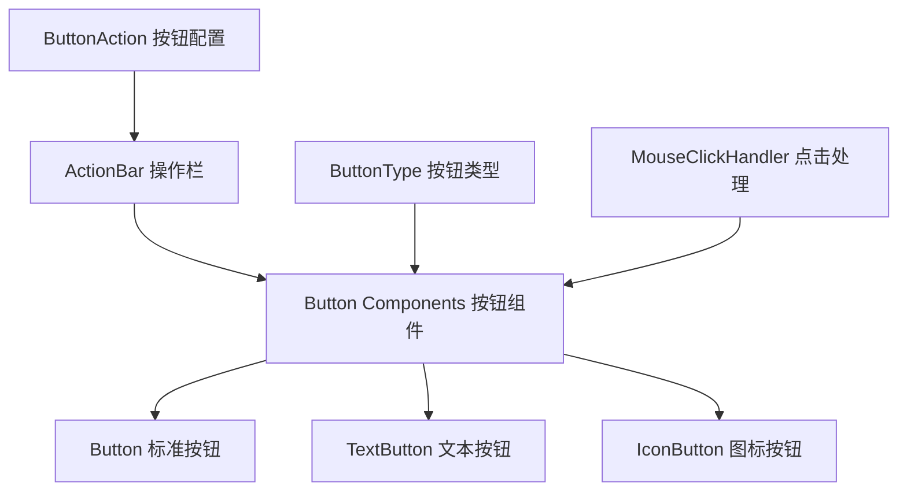

# 按钮组件系统

Uniface Element 按钮系统为 Svelte 应用程序提供了全面的交互式按钮组件集。它包括标准按钮、文本按钮、图标按钮和用于组织多个操作的灵活操作栏组件。

## 组件概览

按钮系统由四个主要组件组成，每个组件都有特定的用途和设计目标：

### [Button 组件](./Button.md)
支持图标和标签的全功能按钮组件，适用于大多数交互场景。

**特性:**
- 支持图标 + 文本标签
- 多种大小和样式变体
- 完整的主题支持
- 异步操作处理

**适用场景:** 主要操作、表单提交、对话框确认

### [TextButton 组件](./TextButton.md)
针对纯文本按钮优化的轻量级组件，采用最小化样式。

**特性:**
- 纯文本显示
- 最小化视觉样式
- 快速加载和渲染
- 支持自定义内容插槽

**适用场景:** 导航链接、内联操作、对话框取消按钮

### [IconButton 组件](./IconButton.md)
专为紧凑界面设计的纯图标按钮组件。

**特性:**
- 纯图标显示
- 紧凑的空间占用
- 多种图标库支持
- 适应性大小调整

**适用场景:** 工具栏、数据表格操作、卡片操作

### [ActionBar 组件](./ActionBar.md)
用于组织和管理多个按钮操作的容器组件。

**特性:**
- 统一的按钮布局管理
- 自动间距和对齐
- 支持分隔符
- 响应式布局

**适用场景:** 表单操作栏、对话框底部、工具栏布局

## 架构图



## 快速开始

### 安装和导入

```typescript
// 导入所需的组件
import Button from '@ticatec/uniface-element/Button';
import TextButton from '@ticatec/uniface-element/TextButton';
import IconButton from '@ticatec/uniface-element/IconButton';
import ActionBar from '@ticatec/uniface-element/ActionBar';
import type { ButtonActions } from '@ticatec/uniface-element';
```

### 基本示例

```svelte
<script lang="ts">
  import Button from '@ticatec/uniface-element/Button';
  import TextButton from '@ticatec/uniface-element/TextButton';
  import IconButton from '@ticatec/uniface-element/IconButton';
  import ActionBar from '@ticatec/uniface-element/ActionBar';
  import type { ButtonActions } from '@ticatec/uniface-element';
  
  const handleSave = async () => {
    // 保存操作
  };
  
  const actions: ButtonActions = [
    { label: "取消", type: "secondary", handler: async () => {} },
    { label: "保存", type: "primary", handler: handleSave }
  ];
</script>

<!-- 标准按钮 -->
<Button label="保存" type="primary" icon="icon_google_save" onClick={handleSave} />

<!-- 文本按钮 -->
<TextButton label="取消" type="secondary" onClick={async () => {}} />

<!-- 图标按钮 -->
<IconButton icon="icon_google_edit" type="primary" onClick={async () => {}} />

<!-- 操作栏 -->
<ActionBar buttons={actions} />
```

## 按钮类型 & 样式

### ButtonType 选项

```typescript
type ButtonType = 'default' | 'primary' | 'secondary' | 'third' | 'forth';
```

### 视觉外观

- **default**: 标准中性按钮外观
- **primary**: 强调主要操作的按钮（通常为蓝色）
- **secondary**: 次要操作按钮（通常为灰色）
- **third**: 替代样式（通常用于警告/注意）
- **forth**: 附加样式变体

### 大小变体

- **big**: 大按钮尺寸，用于突出操作
- **medium**: 标准按钮尺寸，适用于大多数使用场景
- **mini**: 小按钮尺寸，用于紧凑界面

### 样式变体（仅限 Button）

- **plain**: 最小化样式变体
- **round**: 圆角变体
- **'' (空字符串)**: 标准样式

## API 参考

### ButtonAction 接口

```typescript
interface ButtonAction {
  /** 按钮标签文本 */
  label: string;
  
  /** 按钮是否禁用 */
  disabled?: boolean;
  
  /** 图标类（如 Google Material Icons） */
  icon?: string;
  
  /** 按钮类型用于样式设置 */
  type?: ButtonType;
  
  /** 点击事件处理器 */
  handler?: MouseClickHandler;
}

type ButtonActions = Array<ButtonAction | null>;
```

### MouseClickHandler 类型

```typescript
type MouseClickHandler = (event: MouseEvent) => Promise<void>;
```

### 点击节流

所有按钮组件都实现了自动点击节流，具有 500ms 冷却时间，以防止意外的双击并确保正确的异步操作处理。

### 图标使用

组件使用 `@ticatec/uniface-google-material-icons` 作为图标库。只需传入图标类名：

```svelte
<!-- 常用 Material Icons -->
<Button icon="icon_google_save" label="保存" />
<Button icon="icon_google_edit" label="编辑" />
<Button icon="icon_google_delete" label="删除" />
<Button icon="icon_google_add" label="添加" />
<Button icon="icon_google_remove" label="移除" />
<Button icon="icon_google_search" label="搜索" />
<Button icon="icon_google_settings" label="设置" />
<Button icon="icon_google_home" label="主页" />
<Button icon="icon_google_check" label="确认" />
<Button icon="icon_google_arrow_back" label="返回" />
```

## 使用示例

### 对话框操作

```svelte
<script lang="ts">
  import ActionBar from '@ticatec/uniface-element/ActionBar';
  import type { ButtonActions } from '@ticatec/uniface-element';
  
  export let onSave: () => Promise<void>;
  export let onCancel: () => void;
  
  const dialogActions: ButtonActions = [
    {
      label: "取消",
      type: "secondary",
      handler: async () => {
        onCancel();
      }
    },
    {
      label: "保存更改",
      type: "primary",
      icon: "icon_google_save",
      handler: async () => {
        await onSave();
      }
    }
  ];
</script>

<div class="dialog-footer">
  <ActionBar buttons={dialogActions} style="justify-content: flex-end;" />
</div>
```

### 数据表格操作

```svelte
<script lang="ts">
  import IconButton from '@ticatec/uniface-element/IconButton';
  
  export let item: any;
  export let onEdit: (item: any) => Promise<void>;
  export let onDelete: (item: any) => Promise<void>;
  export let onView: (item: any) => Promise<void>;
</script>

<div class="table-actions">
  <IconButton 
    icon="icon_google_visibility" 
    type="default" 
    onClick={async () => await onView(item)} 
  />
  <IconButton 
    icon="icon_google_edit" 
    type="primary" 
    onClick={async () => await onEdit(item)} 
  />
  <IconButton 
    icon="icon_google_delete" 
    type="third" 
    onClick={async () => await onDelete(item)} 
  />
</div>

<style>
  .table-actions {
    display: flex;
    gap: 4px;
  }
</style>
```

### 表单按钮

```svelte
<script lang="ts">
  import Button from '@ticatec/uniface-element/Button';
  import TextButton from '@ticatec/uniface-element/TextButton';
  
  let formData = {};
  let isSubmitting = false;
  let isDraft = false;
  
  const handleSubmit = async () => {
    isSubmitting = true;
    try {
      await submitForm(formData);
    } finally {
      isSubmitting = false;
    }
  };
  
  const handleSaveDraft = async () => {
    isDraft = true;
    try {
      await saveDraft(formData);
    } finally {
      isDraft = false;
    }
  };
  
  const handleReset = async () => {
    formData = {};
  };
</script>

<form>
  <!-- 表单字段在此 -->
  
  <div class="form-actions">
    <TextButton 
      label="重置" 
      type="default" 
      onClick={handleReset} 
    />
    
    <Button 
      label={isDraft ? "保存中..." : "保存草稿"}
      type="secondary"
      icon="icon_google_save"
      disabled={isDraft}
      onClick={handleSaveDraft}
    />
    
    <Button 
      label={isSubmitting ? "提交中..." : "提交"}
      type="primary"
      icon="icon_google_send"
      disabled={isSubmitting}
      onClick={handleSubmit}
    />
  </div>
</form>

<style>
  .form-actions {
    display: flex;
    gap: 12px;
    justify-content: flex-end;
    margin-top: 24px;
  }
</style>
```

### 工具栏实现

```svelte
<script lang="ts">
  import ActionBar from '@ticatec/uniface-element/ActionBar';
  import type { ButtonActions } from '@ticatec/uniface-element';
  
  let selectedItems = [];
  
  const toolbarActions: ButtonActions = [
    {
      label: "全选",
      icon: "icon_google_check_box",
      type: "default",
      handler: async () => {
        selectAll();
      }
    },
    null, // 分隔符
    {
      label: "导出",
      icon: "icon_google_download",
      type: "secondary",
      disabled: selectedItems.length === 0,
      handler: async () => {
        await exportItems(selectedItems);
      }
    },
    {
      label: "删除选中",
      icon: "icon_google_delete",
      type: "third",
      disabled: selectedItems.length === 0,
      handler: async () => {
        if (confirm(`删除 ${selectedItems.length} 个项目?`)) {
          await deleteItems(selectedItems);
        }
      }
    }
  ];
</script>

<div class="toolbar">
  <div class="toolbar-info">
    已选择 {selectedItems.length} 个项目
  </div>
  <ActionBar buttons={toolbarActions} />
</div>

<style>
  .toolbar {
    display: flex;
    justify-content: space-between;
    align-items: center;
    padding: 12px;
    border-bottom: 1px solid #eee;
  }
  
  .toolbar-info {
    color: #666;
    font-size: 14px;
  }
</style>
```

## 最佳实践

### 1. 使用合适的按钮类型

根据操作重要性选择正确的按钮类型：

```svelte
<!-- 主要操作 -->
<Button label="保存" type="primary" />
<Button label="提交" type="primary" />

<!-- 次要操作 -->
<Button label="取消" type="secondary" />
<Button label="预览" type="secondary" />

<!-- 危险操作 -->
<Button label="删除" type="third" />
<Button label="移除" type="third" />
```

### 2. 正确处理异步操作

始终处理加载状态和错误：

```svelte
<script lang="ts">
  let isLoading = false;
  let error = null;
  
  const handleAction = async () => {
    isLoading = true;
    error = null;
    
    try {
      await performAction();
    } catch (err) {
      error = err.message;
    } finally {
      isLoading = false;
    }
  };
</script>

<Button 
  label={isLoading ? "处理中..." : "开始处理"}
  type="primary"
  disabled={isLoading}
  onClick={handleAction}
/>

{#if error}
  <div class="error">{error}</div>
{/if}
```

### 3. 使用 ActionBar 组织相关操作

将相关操作组合在一起：

```svelte
<script lang="ts">
  const dialogActions = [
    { label: "取消", type: "secondary", handler: cancel },
    { label: "应用", type: "primary", handler: apply }
  ];
  
  const editActions = [
    { label: "撤销", icon: "icon_google_undo", handler: undo },
    { label: "重做", icon: "icon_google_redo", handler: redo },
    null, // 分隔符
    { label: "保存", type: "primary", handler: save }
  ];
</script>
```

### 4. 提供视觉反馈

使用图标和适当的样式：

```svelte
<!-- 成功操作 -->
<Button label="保存" icon="icon_google_save" type="primary" />

<!-- 危险操作 -->
<Button label="删除" icon="icon_google_delete" type="third" />

<!-- 导航操作 -->
<Button label="返回" icon="icon_google_arrow_back" type="secondary" />
```

### 5. 考虑移动端响应式

为不同屏幕尺寸使用合适的大小：

```svelte
<div class="responsive-buttons">
  <!-- 桌面端: 普通大小，移动端: 更大以适应触摸 -->
  <Button label="操作" size="big" class="mobile-friendly" />
</div>

<style>
  .responsive-buttons .mobile-friendly {
    /* 响应式样式 */
  }
  
  @media (max-width: 768px) {
    .responsive-buttons .mobile-friendly {
      min-height: 44px; /* iOS 推荐的触摸目标大小 */
    }
  }
</style>
```

## 无障碍性

### 当前限制

**⚠️ 重要提示**：当前的按钮组件存在以下无障碍性限制：

- **非语义化元素**：所有按钮都使用 `<div>` 元素而不是 `<button>`
- **对屏幕阅读器隐藏**：所有按钮默认都有 `aria-hidden="true"`
- **无键盘导航**：组件不支持 Tab 导航或 Enter/Space 激活
- **无焦点管理**：组件不提供 focus 方法或支持 `bind:this`
- **无 ARIA 属性支持**：自定义 aria-* 属性无法传递

### 更好的无障碍性建议

对于需要完全无障碍性遵循的生产应用程序，考虑：

1. **在正确的按钮元素中包装组件**：
```svelte
<button 
  class="custom-button-wrapper"
  disabled={disabled}
  aria-label="编辑用户资料"
  on:click={handleClick}
>
  <IconButton 
    icon="icon_google_edit"
    onClick={() => {}} // 通过外部按钮处理
  />
</button>
```

2. **添加键盘事件处理器**：
```svelte
<script>
  const handleKeydown = (e) => {
    if (e.key === 'Enter' || e.key === ' ') {
      e.preventDefault();
      handleClick(e);
    }
  };
</script>

<div 
  class="accessible-button" 
  role="button" 
  tabindex="0"
  aria-label="操作描述"
  on:click={handleClick}
  on:keydown={handleKeydown}
>
  <Button onClick={() => {}} label="操作" />
</div>
```

3. **程序化管理焦点**：
```svelte
<script>
  let buttonElement;
  
  const focusButton = () => {
    buttonElement?.focus();
  };
</script>

<div 
  bind:this={buttonElement}
  class="focusable-wrapper"
  tabindex="0"
  role="button"
  on:click={handleAction}
>
  <Button onClick={() => {}} label="可聚焦操作" />
</div>
```

### 所需的未来改进

为了使这些组件完全无障碍，建议进行以下更改：

- 将 `<div>` 替换为 `<button>` 元素
- 移除 `aria-hidden="true"` 并允许 ARIA 属性自定义
- 添加键盘事件处理
- 支持使用 `bind:this` 进行焦点管理
- 添加正确的语义角色和状态