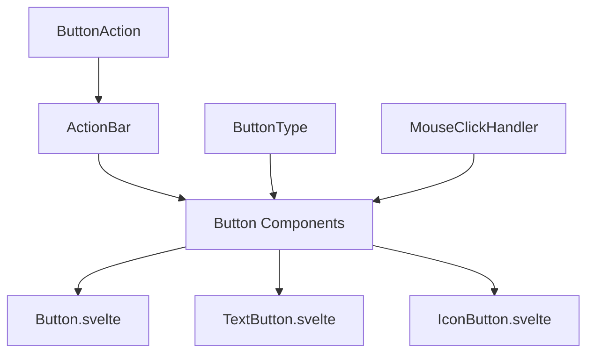

# Button Components & ActionBar

The Uniface Element Button system provides a comprehensive set of interactive button components for Svelte applications. It includes standard buttons, text buttons, icon buttons, and a flexible action bar component for organizing multiple actions.

## Table of Contents

- [Architecture Overview](#architecture-overview)
- [Button Component](#button-component)
- [TextButton Component](#textbutton-component)
- [IconButton Component](#iconbutton-component)
- [ActionBar Component](#actionbar-component)
- [Button Types & Styling](#button-types--styling)
- [API Reference](#api-reference)
- [Usage Examples](#usage-examples)
- [Best Practices](#best-practices)
- [Accessibility](#accessibility)

## Architecture Overview

The button system consists of several interconnected components:

- **Button**: Full-featured button component with icon and label support
- **TextButton**: Simplified text-only button component
- **IconButton**: Icon-only button component for compact interfaces
- **ActionBar**: Container component for organizing multiple buttons
- **ButtonAction**: Interface defining button configuration for ActionBar
- **ButtonType**: Type definition for button styling variants



## Button Component

The primary `Button` component provides comprehensive button functionality with icon and label support.

### Basic Usage

```svelte
<script lang="ts">
  import { Button } from '@ticatec/uniface-element';
  
  const handleClick = async (event: MouseEvent) => {
    console.log('Button clicked!');
    // Perform async operation
  };
</script>

<Button 
  label="Save Changes"
  type="primary"
  icon="fas fa-save"
  onClick={handleClick}
/>
```

### Advanced Configuration

```svelte
<script lang="ts">
  import { Button } from '@ticatec/uniface-element';
  import type { ButtonType } from '@ticatec/uniface-element';
  
  let isSubmitting = false;
  
  const handleSubmit = async (event: MouseEvent) => {
    isSubmitting = true;
    try {
      await submitForm();
    } finally {
      isSubmitting = false;
    }
  };
</script>

<Button 
  label={isSubmitting ? "Submitting..." : "Submit Form"}
  type="primary"
  size="big"
  variant="round"
  icon="fas fa-paper-plane"
  disabled={isSubmitting}
  style="margin: 16px;"
  onClick={handleSubmit}
/>
```

### Button Properties

| Property | Type | Default | Description |
|----------|------|---------|-------------|
| `label` | `string` | `''` | Button text label |
| `type` | `ButtonType` | `'default'` | Visual style variant |
| `size` | `'big' \| 'medium' \| 'mini'` | `'medium'` | Button size |
| `variant` | `'plain' \| 'round' \| ''` | `''` | Additional style variant |
| `icon` | `string \| null` | `null` | Icon class (e.g., Font Awesome) |
| `disabled` | `boolean` | `false` | Disable button interaction |
| `style` | `string` | `''` | Custom CSS styles |
| `onClick` | `(event: MouseEvent) => void` | - | Click event handler |

### Button with Slot Content

```svelte
<Button type="secondary" onClick={handleAction}>
  <i class="fas fa-star"></i>
  <span>Custom Content</span>
  <span class="badge">3</span>
</Button>
```

## TextButton Component

The `TextButton` component is optimized for text-only buttons with minimal styling.

### Basic Usage

```svelte
<script lang="ts">
  import { TextButton } from '@ticatec/uniface-element';
  
  const handleCancel = async (event: MouseEvent) => {
    // Handle cancel action
  };
</script>

<TextButton 
  label="Cancel"
  type="secondary"
  onClick={handleCancel}
/>
```

### Text Button Examples

```svelte
<script lang="ts">
  import { TextButton } from '@ticatec/uniface-element';
  
  const actions = {
    save: async () => { /* save logic */ },
    delete: async () => { /* delete logic */ },
    cancel: async () => { /* cancel logic */ }
  };
</script>

<!-- Different button types -->
<TextButton label="Primary Action" type="primary" onClick={actions.save} />
<TextButton label="Secondary" type="secondary" onClick={actions.cancel} />
<TextButton label="Danger Action" type="third" onClick={actions.delete} />

<!-- Different sizes -->
<TextButton label="Large" size="big" onClick={actions.save} />
<TextButton label="Normal" size="medium" onClick={actions.save} />
<TextButton label="Small" size="mini" onClick={actions.save} />

<!-- With custom content -->
<TextButton type="primary" onClick={actions.save}>
  <i class="fas fa-check"></i> Confirm Changes
</TextButton>
```

### TextButton Properties

| Property | Type | Default | Description |
|----------|------|---------|-------------|
| `label` | `string` | `''` | Button text label |
| `type` | `ButtonType` | `'default'` | Visual style variant |
| `size` | `'big' \| 'medium' \| 'mini'` | `'medium'` | Button size |
| `disabled` | `boolean` | `false` | Disable button interaction |
| `style` | `string` | `''` | Custom CSS styles |
| `onClick` | `MouseClickHandler` | - | Async click event handler |

## IconButton Component

The `IconButton` component is designed for icon-only buttons in compact interfaces.

### Basic Usage

```svelte
<script lang="ts">
  import { IconButton } from '@ticatec/uniface-element';
  
  const handleEdit = async (event: MouseEvent) => {
    // Handle edit action
  };
</script>

<IconButton 
  icon="fas fa-edit"
  type="primary"
  onClick={handleEdit}
/>
```

### Icon Button Examples

```svelte
<script lang="ts">
  import { IconButton } from '@ticatec/uniface-element';
  
  const toolbarActions = {
    edit: async () => { /* edit logic */ },
    delete: async () => { /* delete logic */ },
    share: async () => { /* share logic */ },
    favorite: async () => { /* favorite logic */ }
  };
</script>

<!-- Toolbar with icon buttons -->
<div class="toolbar">
  <IconButton icon="fas fa-edit" type="default" onClick={toolbarActions.edit} />
  <IconButton icon="fas fa-trash" type="third" onClick={toolbarActions.delete} />
  <IconButton icon="fas fa-share" type="secondary" onClick={toolbarActions.share} />
  <IconButton icon="fas fa-heart" type="primary" onClick={toolbarActions.favorite} />
</div>

<!-- Different sizes -->
<IconButton icon="fas fa-cog" size="big" onClick={toolbarActions.edit} />
<IconButton icon="fas fa-cog" size="medium" onClick={toolbarActions.edit} />
<IconButton icon="fas fa-cog" size="mini" onClick={toolbarActions.edit} />

<!-- With custom slot content -->
<IconButton type="primary" onClick={toolbarActions.edit}>
  <i class="fas fa-edit"></i>
</IconButton>

<style>
  .toolbar {
    display: flex;
    gap: 8px;
    align-items: center;
  }
</style>
```

### IconButton Properties

| Property | Type | Default | Description |
|----------|------|---------|-------------|
| `icon` | `string` | `''` | Icon class (e.g., Font Awesome) |
| `type` | `ButtonType` | `'default'` | Visual style variant |
| `size` | `'big' \| 'medium' \| 'mini'` | `'medium'` | Button size |
| `disabled` | `boolean` | `false` | Disable button interaction |
| `style` | `string` | `''` | Custom CSS styles |
| `onClick` | `(event: MouseEvent) => void` | - | Click event handler |

## ActionBar Component

The `ActionBar` component provides a container for organizing multiple button actions with consistent spacing and layout.

### Basic Usage

```svelte
<script lang="ts">
  import { ActionBar } from '@ticatec/uniface-element';
  import type { ButtonActions } from '@ticatec/uniface-element';
  
  const actions: ButtonActions = [
    {
      label: "Save",
      type: "primary",
      icon: "icon_google_save",
      handler: async () => {
        await saveChanges();
      }
    },
    {
      label: "Cancel",
      type: "secondary",
      handler: async () => {
        closeDialog();
      }
    }
  ];
</script>

<ActionBar buttons={actions} />
```

### Advanced ActionBar Usage

```svelte
<script lang="ts">
  import { ActionBar } from '@ticatec/uniface-element';
  import type { ButtonActions } from '@ticatec/uniface-element';
  
  let isProcessing = false;
  
  const formActions: ButtonActions = [
    {
      label: "Reset",
      type: "default",
      icon: "icon_google_undo",
      handler: async () => {
        resetForm();
      }
    },
    null, // Separator
    {
      label: "Preview",
      type: "secondary",
      icon: "icon_google_visibility",
      handler: async () => {
        showPreview();
      }
    },
    {
      label: isProcessing ? "Processing..." : "Submit",
      type: "primary",
      icon: "icon_google_send",
      disabled: isProcessing,
      handler: async () => {
        isProcessing = true;
        try {
          await submitForm();
        } finally {
          isProcessing = false;
        }
      }
    }
  ];
</script>

<ActionBar 
  buttons={formActions} 
  gap={12}
  style="padding: 16px; justify-content: flex-end;"
/>
```

### ActionBar with Custom Content

```svelte
<script lang="ts">
  import { ActionBar, Button } from '@ticatec/uniface-element';
</script>

<!-- When no buttons prop is provided, slot content is used -->
<ActionBar gap={16} style="padding: 20px;">
  <Button label="Custom Action 1" type="primary" onClick={action1} />
  <Button label="Custom Action 2" type="secondary" onClick={action2} />
  <Button label="Custom Action 3" type="default" onClick={action3} />
</ActionBar>
```

### ActionBar Properties

| Property | Type | Default | Description |
|----------|------|---------|-------------|
| `buttons` | `ButtonActions` | `[]` | Array of button configurations |
| `style` | `string` | `''` | Custom CSS styles |
| `gap` | `number` | `8` | Space between buttons in pixels |

## Button Types & Styling

### ButtonType Options

```typescript
type ButtonType = 'default' | 'primary' | 'secondary' | 'third' | 'forth';
```

### Visual Appearance

- **default**: Standard neutral button appearance
- **primary**: Emphasized button for main actions (usually blue)
- **secondary**: Secondary action button (usually gray)
- **third**: Alternative styling (often used for warnings/cautions)
- **forth**: Additional styling variant

### Size Variants

- **big**: Large button size for prominent actions
- **medium**: Standard button size for most use cases
- **mini**: Small button size for compact interfaces

### Style Variants (Button only)

- **plain**: Minimal styling variant
- **round**: Rounded corners variant
- **'' (empty)**: Standard styling

## API Reference

### ButtonAction Interface

```typescript
interface ButtonAction {
  /** Button label text */
  label: string;
  
  /** Whether the button is disabled */
  disabled?: boolean;
  
  /** Icon class (e.g., Google Material Icons) */
  icon?: string;
  
  /** Button type for styling */
  type?: ButtonType;
  
  /** Click event handler */
  handler?: MouseClickHandler;
}

type ButtonActions = Array<ButtonAction | null>;
```

### MouseClickHandler Type

```typescript
type MouseClickHandler = (event: MouseEvent) => Promise<void>;
```

### Click Throttling

All button components implement automatic click throttling with a 500ms cooldown to prevent accidental double-clicks and ensure proper async operation handling.

### Icon Usage

The components use `@ticatec/uniface-google-material-icons` for icons. Simply pass the icon class name:

```svelte
<!-- Common Material Icons -->
<Button icon="icon_google_save" label="Save" />
<Button icon="icon_google_edit" label="Edit" />
<Button icon="icon_google_delete" label="Delete" />
<Button icon="icon_google_add" label="Add" />
<Button icon="icon_google_remove" label="Remove" />
<Button icon="icon_google_search" label="Search" />
<Button icon="icon_google_settings" label="Settings" />
<Button icon="icon_google_home" label="Home" />
<Button icon="icon_google_check" label="Confirm" />
<Button icon="icon_google_arrow_back" label="Back" />
```

## Usage Examples

### Dialog Actions

```svelte
<script lang="ts">
  import { ActionBar } from '@ticatec/uniface-element';
  import type { ButtonActions } from '@ticatec/uniface-element';
  
  export let onSave: () => Promise<void>;
  export let onCancel: () => void;
  
  const dialogActions: ButtonActions = [
    {
      label: "Cancel",
      type: "secondary",
      handler: async () => {
        onCancel();
      }
    },
    {
      label: "Save Changes",
      type: "primary",
      icon: "icon_google_save",
      handler: async () => {
        await onSave();
      }
    }
  ];
</script>

<div class="dialog-footer">
  <ActionBar buttons={dialogActions} style="justify-content: flex-end;" />
</div>
```

### Data Table Actions

```svelte
<script lang="ts">
  import { IconButton } from '@ticatec/uniface-element';
  
  export let item: any;
  export let onEdit: (item: any) => Promise<void>;
  export let onDelete: (item: any) => Promise<void>;
  export let onView: (item: any) => Promise<void>;
</script>

<div class="table-actions">
  <IconButton 
    icon="icon_google_visibility" 
    type="default" 
    onClick={async () => await onView(item)} 
  />
  <IconButton 
    icon="icon_google_edit" 
    type="primary" 
    onClick={async () => await onEdit(item)} 
  />
  <IconButton 
    icon="icon_google_delete" 
    type="third" 
    onClick={async () => await onDelete(item)} 
  />
</div>

<style>
  .table-actions {
    display: flex;
    gap: 4px;
  }
</style>
```

### Form Buttons

```svelte
<script lang="ts">
  import { Button, TextButton } from '@ticatec/uniface-element';
  
  let formData = {};
  let isSubmitting = false;
  let isDraft = false;
  
  const handleSubmit = async () => {
    isSubmitting = true;
    try {
      await submitForm(formData);
    } finally {
      isSubmitting = false;
    }
  };
  
  const handleSaveDraft = async () => {
    isDraft = true;
    try {
      await saveDraft(formData);
    } finally {
      isDraft = false;
    }
  };
  
  const handleReset = async () => {
    formData = {};
  };
</script>

<form>
  <!-- Form fields here -->
  
  <div class="form-actions">
    <TextButton 
      label="Reset" 
      type="default" 
      onClick={handleReset} 
    />
    
    <Button 
      label={isDraft ? "Saving..." : "Save Draft"}
      type="secondary"
      icon="icon_google_save"
      disabled={isDraft}
      onClick={handleSaveDraft}
    />
    
    <Button 
      label={isSubmitting ? "Submitting..." : "Submit"}
      type="primary"
      icon="icon_google_send"
      disabled={isSubmitting}
      onClick={handleSubmit}
    />
  </div>
</form>

<style>
  .form-actions {
    display: flex;
    gap: 12px;
    justify-content: flex-end;
    margin-top: 24px;
  }
</style>
```

### Toolbar Implementation

```svelte
<script lang="ts">
  import { ActionBar } from '@ticatec/uniface-element';
  import type { ButtonActions } from '@ticatec/uniface-element';
  
  let selectedItems = [];
  
  const toolbarActions: ButtonActions = [
    {
      label: "Select All",
      icon: "icon_google_check_box",
      type: "default",
      handler: async () => {
        selectAll();
      }
    },
    null, // Separator
    {
      label: "Export",
      icon: "icon_google_download",
      type: "secondary",
      disabled: selectedItems.length === 0,
      handler: async () => {
        await exportItems(selectedItems);
      }
    },
    {
      label: "Delete Selected",
      icon: "icon_google_delete",
      type: "third",
      disabled: selectedItems.length === 0,
      handler: async () => {
        if (confirm(`Delete ${selectedItems.length} items?`)) {
          await deleteItems(selectedItems);
        }
      }
    }
  ];
</script>

<div class="toolbar">
  <div class="toolbar-info">
    {selectedItems.length} items selected
  </div>
  <ActionBar buttons={toolbarActions} />
</div>

<style>
  .toolbar {
    display: flex;
    justify-content: space-between;
    align-items: center;
    padding: 12px;
    border-bottom: 1px solid #eee;
  }
  
  .toolbar-info {
    color: #666;
    font-size: 14px;
  }
</style>
```

## Best Practices

### 1. Use Appropriate Button Types

Choose the right button type based on action importance:

```svelte
<!-- Primary actions -->
<Button label="Save" type="primary" />
<Button label="Submit" type="primary" />

<!-- Secondary actions -->
<Button label="Cancel" type="secondary" />
<Button label="Preview" type="secondary" />

<!-- Destructive actions -->
<Button label="Delete" type="third" />
<Button label="Remove" type="third" />
```

### 2. Handle Async Operations Properly

Always handle loading states and errors:

```svelte
<script lang="ts">
  let isLoading = false;
  let error = null;
  
  const handleAction = async () => {
    isLoading = true;
    error = null;
    
    try {
      await performAction();
    } catch (err) {
      error = err.message;
    } finally {
      isLoading = false;
    }
  };
</script>

<Button 
  label={isLoading ? "Processing..." : "Start Process"}
  type="primary"
  disabled={isLoading}
  onClick={handleAction}
/>

{#if error}
  <div class="error">{error}</div>
{/if}
```

### 3. Use ActionBar for Related Actions

Group related actions together:

```svelte
<script lang="ts">
  const dialogActions = [
    { label: "Cancel", type: "secondary", handler: cancel },
    { label: "Apply", type: "primary", handler: apply }
  ];
  
  const editActions = [
    { label: "Undo", icon: "icon_google_undo", handler: undo },
    { label: "Redo", icon: "icon_google_redo", handler: redo },
    null, // separator
    { label: "Save", type: "primary", handler: save }
  ];
</script>
```

### 4. Provide Visual Feedback

Use icons and appropriate styling:

```svelte
<!-- Success action -->
<Button label="Save" icon="icon_google_save" type="primary" />

<!-- Destructive action -->
<Button label="Delete" icon="icon_google_delete" type="third" />

<!-- Navigation action -->
<Button label="Back" icon="icon_google_arrow_back" type="secondary" />
```

### 5. Consider Mobile Responsiveness

Use appropriate sizes for different screen sizes:

```svelte
<div class="responsive-buttons">
  <!-- Desktop: normal size, Mobile: bigger for touch -->
  <Button label="Action" size="big" class="mobile-friendly" />
</div>

<style>
  .responsive-buttons .mobile-friendly {
    /* Responsive styles */
  }
  
  @media (max-width: 768px) {
    .responsive-buttons .mobile-friendly {
      min-height: 44px; /* iOS recommended touch target */
    }
  }
</style>
```

## Accessibility

### Current Limitations

**⚠️ Important Notice**: The current button components have several accessibility limitations:

- **Non-semantic elements**: All buttons use `<div>` elements instead of `<button>`
- **Hidden from screen readers**: All buttons have `aria-hidden="true"` by default
- **No keyboard navigation**: Components don't support Tab navigation or Enter/Space activation
- **No focus management**: Components don't expose focus methods or support `bind:this`
- **No ARIA attribute support**: Custom aria-* attributes are not passed through

### Recommendations for Better Accessibility

For production applications requiring full accessibility compliance, consider:

1. **Wrapping components in proper button elements**:
```svelte
<button 
  class="custom-button-wrapper"
  disabled={disabled}
  aria-label="Edit user profile"
  on:click={handleClick}
>
  <IconButton 
    icon="icon_google_edit"
    onClick={() => {}} // Handle via outer button
  />
</button>
```

2. **Adding keyboard event handlers**:
```svelte
<script>
  const handleKeydown = (e) => {
    if (e.key === 'Enter' || e.key === ' ') {
      e.preventDefault();
      handleClick(e);
    }
  };
</script>

<div 
  class="accessible-button" 
  role="button" 
  tabindex="0"
  aria-label="Action description"
  on:click={handleClick}
  on:keydown={handleKeydown}
>
  <Button onClick={() => {}} label="Action" />
</div>
```

3. **Managing focus programmatically**:
```svelte
<script>
  let buttonElement;
  
  const focusButton = () => {
    buttonElement?.focus();
  };
</script>

<div 
  bind:this={buttonElement}
  class="focusable-wrapper"
  tabindex="0"
  role="button"
  on:click={handleAction}
>
  <Button onClick={() => {}} label="Focusable Action" />
</div>
```

### Future Improvements Needed

To make these components fully accessible, the following changes would be recommended:

- Replace `<div>` with `<button>` elements
- Remove `aria-hidden="true"` and allow ARIA attribute customization
- Add keyboard event handling
- Support focus management with `bind:this`
- Add proper semantic roles and states