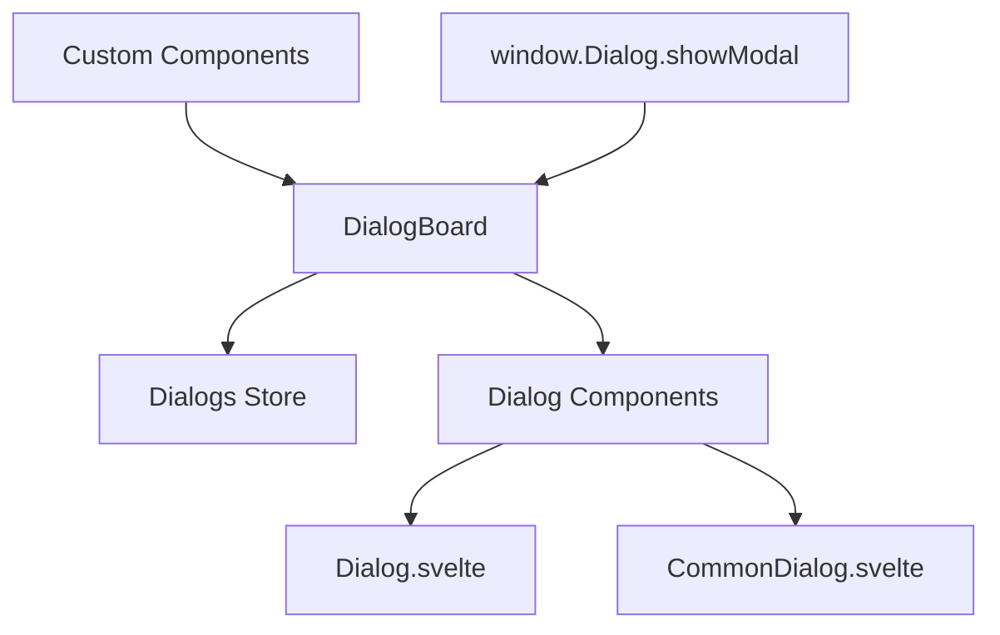

# 对话框系统

Uniface Element 对话框系统为 Svelte 应用程序提供了全面的模态对话框解决方案。它包括全局对话框管理、内置对话框组件和灵活的自定义选项。

## 目录

- [架构概述](#架构概述)
- [DialogBoard - 全局对话框管理器](#dialogboard---全局对话框管理器)
- [内置对话框组件](#内置对话框组件)
- [创建自定义对话框](#创建自定义对话框)
- [API 参考](#api-参考)
- [高级用法](#高级用法)
- [最佳实践](#最佳实践)

## 架构概述

对话框系统由几个相互关联的组件组成：

- **DialogBoard**: 处理对话框生命周期的全局对话框管理器
- **Dialog**: 具有标准 UI 元素的基础对话框组件
- **CommonDialog**: 为常见用例预配置的对话框
- **IDialog**: 全局对话框访问的 TypeScript 接口
- **Dialogs Store**: 管理对话框状态的 Svelte store



## DialogBoard - 全局对话框管理器

`DialogBoard` 组件管理应用程序中的所有模态对话框，并通过 `window.Dialog` API 提供全局访问。

### 设置

在根布局中包含 `DialogBoard`：

```svelte
<!-- +layout.svelte 或 app.html -->
<script lang="ts">
  import { DialogBoard } from "@ticatec/uniface-element/DialogBoard";
</script>

<!-- 您的应用程序内容 -->
<main>
  <slot />
</main>

<!-- 全局对话框管理器 -->
<DialogBoard />
```

### 全局 API

一旦 `DialogBoard` 挂载，您就可以全局访问对话框系统：

```typescript
// 将任何 Svelte 组件作为模态对话框打开
window.Dialog.showModal(MyComponent, {
  // 传递给组件的属性
  title: "我的对话框",
  data: someData,
  onSave: (result) => {
    console.log("已保存:", result);
  }
});
```

### TypeScript 支持

添加全局类型声明：

```typescript
// src/app.d.ts
import type { IDialog } from '@ticatec/uniface-element';

declare global {
  interface Window {
    Dialog: IDialog;
  }
}
```

## 内置对话框组件

### Dialog 组件

基础 `Dialog` 组件提供标准的对话框功能：

```svelte
<script lang="ts">
  import Dialog from '@ticatec/uniface-element/Dialog';
  import type { ButtonActions } from '@ticatec/uniface-element';
  
  let modalResult = null;
  
  const actions: ButtonActions = [
    {
      label: "保存",
      type: "primary",
      handler: async () => {
        // 执行保存操作
        await saveData();
        return true; // 返回 true 自动关闭对话框
      }
    }
  ];
  
  const onClose = (result) => {
    console.log("对话框关闭，结果:", result);
  };
</script>

<Dialog
  title="我的对话框"
  width="500px"
  height="400px"
  bind:modalResult
  {actions}
  {onClose}
>
  <!-- 对话框内容 -->
  <p>这是对话框内容。</p>
</Dialog>
```

#### Dialog 属性

| 属性 | 类型 | 描述 |
|------|------|------|
| `title` | `string` | 对话框标题 |
| `width` | `string` | 对话框宽度（CSS 值） |
| `height` | `string` | 对话框高度（CSS 值） |
| `actions` | `ButtonActions` | 操作按钮数组 |
| `closeConfirm` | `DialogCloseConfirm` | 关闭确认函数 |
| `content$style` | `string` | 内容区域的自定义样式 |
| `modalResult` | `ModalResult` | 程序化关闭的结果绑定 |
| `onClose` | `OnClose` | 对话框关闭时的回调 |

### CommonDialog 组件

`CommonDialog` 是为典型用例预配置的对话框：

```svelte
<script lang="ts">
  import CommonDialog, ModalResult from '@ticatec/uniface-element/CommonDialog, ModalResult';
  
  export let user: any;
  export let onSave: (user: any) => void;
  
  let modalResult = null;
  let enableConfirm = true;
  
  const confirmHandler = async () => {
    try {
      await onSave(user);
      return true; // 返回 true 自动关闭
    } catch (error) {
      console.error("保存失败:", error);
      return false; // 出错时保持对话框打开
    }
  };
  
  const onClose = (result) => {
    if (result === ModalResult.Ok) {
      console.log("用户保存成功");
    }
  };
</script>

<CommonDialog
  title="编辑用户"
  width="600px"
  height="500px"
  bind:modalResult
  bind:enableConfirm
  {confirmHandler}
  confirmText="保存更改"
  {onClose}
>
  <div class="form-content">
    <label>
      姓名:
      <input bind:value={user.name} />
    </label>
    <label>
      邮箱:
      <input bind:value={user.email} type="email" />
    </label>
  </div>
</CommonDialog>

<style>
  .form-content {
    display: flex;
    flex-direction: column;
    gap: 16px;
  }
  
  label {
    display: flex;
    flex-direction: column;
    gap: 4px;
  }
  
  input {
    padding: 8px;
    border: 1px solid #ccc;
    border-radius: 4px;
  }
</style>
```

#### CommonDialog 属性

| 属性 | 类型 | 描述 |
|------|------|------|
| `title` | `string` | 对话框标题 |
| `width` | `string` | 对话框宽度 |
| `height` | `string` | 对话框高度 |
| `closeConfirm` | `DialogCloseConfirm` | 关闭确认函数 |
| `content$style` | `string` | 内容区域自定义样式 |
| `modalResult` | `ModalResult` | 结果绑定 |
| `enableConfirm` | `boolean` | 启用/禁用确认按钮 |
| `confirmHandler` | `() => Promise<boolean>` | 确认按钮处理器 |
| `confirmText` | `string` | 自定义确认按钮文本 |
| `onClose` | `OnClose` | 关闭回调 |

## 创建自定义对话框

### 方法 1: 使用全局对话框 API

```svelte
<!-- UserEditDialog.svelte -->
<script lang="ts">
  import { getContext } from 'svelte';
  import CommonDialog, ModalResult from '@ticatec/uniface-element/CommonDialog, ModalResult';
  
  export let user: any;
  export let onSave: (user: any) => Promise<void>;
  
  // 从上下文获取关闭函数
  const closeDialog = getContext('closeDialog');
  
  let saving = false;
  let formData = { ...user };
  let enableConfirm = true;
  
  const handleSave = async () => {
    if (saving) return false;
    
    saving = true;
    try {
      await onSave(formData);
      return true; // 成功时自动关闭
    } catch (error) {
      console.error('保存失败:', error);
      return false; // 出错时保持打开
    } finally {
      saving = false;
    }
  };
</script>

<CommonDialog
  title="编辑用户"
  width="600px"
  height="400px"
  bind:enableConfirm
  confirmHandler={handleSave}
  confirmText={saving ? "保存中..." : "保存更改"}
>
  <form class="user-form">
    <div class="field">
      <label for="name">姓名:</label>
      <input id="name" bind:value={formData.name} required />
    </div>
    
    <div class="field">
      <label for="email">邮箱:</label>
      <input id="email" type="email" bind:value={formData.email} required />
    </div>
    
    <div class="field">
      <label for="role">角色:</label>
      <select id="role" bind:value={formData.role}>
        <option value="user">普通用户</option>
        <option value="admin">管理员</option>
        <option value="moderator">协调员</option>
      </select>
    </div>
  </form>
</CommonDialog>

<style>
  .user-form {
    display: flex;
    flex-direction: column;
    gap: 16px;
    padding: 20px;
  }
  
  .field {
    display: flex;
    flex-direction: column;
    gap: 4px;
  }
  
  label {
    font-weight: 500;
    color: #374151;
  }
  
  input, select {
    padding: 8px 12px;
    border: 1px solid #d1d5db;
    border-radius: 6px;
    font-size: 14px;
  }
  
  input:focus, select:focus {
    outline: none;
    border-color: #3b82f6;
    box-shadow: 0 0 0 3px rgba(59, 130, 246, 0.1);
  }
</style>
```

### 方法 2: 自定义模态组件

```svelte
<!-- ConfirmationDialog.svelte -->
<script lang="ts">
  import { createEventDispatcher } from 'svelte';
  import Button from '@ticatec/uniface-element/Button';
  
  export let title = "确认操作";
  export let message = "您确定要继续吗？";
  export let confirmText = "确认";
  export let cancelText = "取消";
  export let danger = false;
  
  const dispatch = createEventDispatcher();
  
  const handleConfirm = () => {
    dispatch('confirm');
  };
  
  const handleCancel = () => {
    dispatch('cancel');
  };
  
  // 处理背景点击
  const handleBackdrop = (e) => {
    if (e.target === e.currentTarget) {
      handleCancel();
    }
  };
</script>

<div class="modal-backdrop" on:click={handleBackdrop}>
  <div class="confirmation-dialog" role="dialog" aria-labelledby="dialog-title">
    <div class="dialog-header">
      <h2 id="dialog-title">{title}</h2>
    </div>
    
    <div class="dialog-body">
      <p>{message}</p>
    </div>
    
    <div class="dialog-footer">
      <Button
        label={cancelText}
        type="secondary"
        onClick={handleCancel}
      />
      <Button
        label={confirmText}
        type={danger ? "third" : "primary"}
        onClick={handleConfirm}
      />
    </div>
  </div>
</div>

<style>
  .modal-backdrop {
    position: fixed;
    top: 0;
    left: 0;
    width: 100%;
    height: 100%;
    background: rgba(0, 0, 0, 0.5);
    display: flex;
    align-items: center;
    justify-content: center;
    z-index: 1000;
  }
  
  .confirmation-dialog {
    background: white;
    border-radius: 8px;
    box-shadow: 0 20px 25px -5px rgba(0, 0, 0, 0.1);
    max-width: 400px;
    width: 90%;
    max-height: 90vh;
    overflow: hidden;
  }
  
  .dialog-header {
    padding: 20px 20px 0;
  }
  
  .dialog-header h2 {
    margin: 0;
    font-size: 1.25rem;
    color: #374151;
  }
  
  .dialog-body {
    padding: 16px 20px;
  }
  
  .dialog-body p {
    margin: 0;
    color: #6b7280;
    line-height: 1.5;
  }
  
  .dialog-footer {
    padding: 16px 20px 20px;
    display: flex;
    justify-content: flex-end;
    gap: 12px;
  }
</style>
```

## 高级用法

### 带表单验证的对话框

```svelte
<script lang="ts">
  import CommonDialog from '@ticatec/uniface-element/CommonDialog';
  
  export let product: any;
  export let onSave: (product: any) => Promise<void>;
  
  let formData = { ...product };
  let errors = {};
  let saving = false;
  
  $: enableConfirm = isFormValid(formData) && !saving;
  
  const isFormValid = (data) => {
    const newErrors = {};
    
    if (!data.name?.trim()) {
      newErrors.name = "产品名称是必填项";
    }
    
    if (!data.price || data.price <= 0) {
      newErrors.price = "价格必须大于 0";
    }
    
    if (!data.category) {
      newErrors.category = "必须选择分类";
    }
    
    errors = newErrors;
    return Object.keys(newErrors).length === 0;
  };
  
  const handleSave = async () => {
    if (!isFormValid(formData) || saving) {
      return false;
    }
    
    saving = true;
    try {
      await onSave(formData);
      return true;
    } catch (error) {
      console.error('保存失败:', error);
      return false;
    } finally {
      saving = false;
    }
  };
</script>

<CommonDialog
  title="编辑产品"
  width="700px"
  height="600px"
  bind:enableConfirm
  confirmHandler={handleSave}
  confirmText={saving ? "保存中..." : "保存产品"}
>
  <form class="product-form">
    <div class="field">
      <label for="name">产品名称 *</label>
      <input
        id="name"
        bind:value={formData.name}
        class:error={errors.name}
        placeholder="输入产品名称"
      />
      {#if errors.name}
        <span class="error-text">{errors.name}</span>
      {/if}
    </div>
    
    <div class="field">
      <label for="price">价格 *</label>
      <input
        id="price"
        type="number"
        min="0"
        step="0.01"
        bind:value={formData.price}
        class:error={errors.price}
        placeholder="0.00"
      />
      {#if errors.price}
        <span class="error-text">{errors.price}</span>
      {/if}
    </div>
    
    <div class="field">
      <label for="category">分类 *</label>
      <select
        id="category"
        bind:value={formData.category}
        class:error={errors.category}
      >
        <option value="">选择分类</option>
        <option value="electronics">电子产品</option>
        <option value="clothing">服装</option>
        <option value="books">图书</option>
        <option value="home">家居园艺</option>
      </select>
      {#if errors.category}
        <span class="error-text">{errors.category}</span>
      {/if}
    </div>
    
    <div class="field">
      <label for="description">描述</label>
      <textarea
        id="description"
        bind:value={formData.description}
        placeholder="产品描述（可选）"
        rows="4"
      ></textarea>
    </div>
  </form>
</CommonDialog>

<style>
  .product-form {
    padding: 20px;
    display: flex;
    flex-direction: column;
    gap: 16px;
  }
  
  .field {
    display: flex;
    flex-direction: column;
    gap: 4px;
  }
  
  label {
    font-weight: 500;
    color: #374151;
    font-size: 14px;
  }
  
  input, select, textarea {
    padding: 8px 12px;
    border: 1px solid #d1d5db;
    border-radius: 6px;
    font-size: 14px;
    transition: border-color 0.2s, box-shadow 0.2s;
  }
  
  input:focus, select:focus, textarea:focus {
    outline: none;
    border-color: #3b82f6;
    box-shadow: 0 0 0 3px rgba(59, 130, 246, 0.1);
  }
  
  input.error, select.error, textarea.error {
    border-color: #ef4444;
  }
  
  .error-text {
    color: #ef4444;
    font-size: 12px;
    margin-top: 2px;
  }
  
  textarea {
    resize: vertical;
    min-height: 80px;
  }
</style>
```

## API 参考

### 全局对话框接口

```typescript
interface IDialog {
  showModal<T>(component: any, props?: T): void;
}
```

### ModalResult 枚举

```typescript
enum ModalResult {
  None = 0,
  Ok = 1,
  Cancel = 2,
  Abort = 3,
  Retry = 4,
  Ignore = 5,
  Yes = 6,
  No = 7
}
```

### 事件处理器

```typescript
type OnClose = (result: ModalResult) => void;
type DialogCloseConfirm = () => Promise<boolean>;
type ConfirmHandler = () => Promise<boolean>;
```

## 最佳实践

### 1. 使用适当的对话框大小

```svelte
<!-- 小型确认对话框 -->
<CommonDialog width="400px" height="200px">

<!-- 表单对话框 -->
<CommonDialog width="600px" height="500px">

<!-- 大型内容对话框 -->
<CommonDialog width="800px" height="700px">
```

### 2. 处理加载状态

```svelte
<script>
  let saving = false;
  let enableConfirm = true;
  
  const handleSave = async () => {
    saving = true;
    enableConfirm = false;
    
    try {
      await saveData();
      return true; // 关闭对话框
    } catch (error) {
      // 处理错误，保持对话框打开
      return false;
    } finally {
      saving = false;
      enableConfirm = true;
    }
  };
</script>

<CommonDialog
  bind:enableConfirm
  confirmHandler={handleSave}
  confirmText={saving ? "保存中..." : "保存"}
>
```

### 3. 实现适当的验证

```svelte
<script>
  let formData = { name: '', email: '' };
  let errors = {};
  
  $: enableConfirm = isValid(formData);
  
  const isValid = (data) => {
    return data.name.trim() && 
           data.email.trim() && 
           data.email.includes('@');
  };
</script>
```

### 4. 使用上下文处理复杂对话框

```svelte
<script>
  import { setContext } from 'svelte';
  
  // 为子组件提供辅助函数
  setContext('showNotification', (message) => {
    // 显示通知
  });
  
  setContext('closeDialog', () => {
    modalResult = ModalResult.Cancel;
  });
</script>
```

### 5. 键盘导航支持

```svelte
<script>
  import { onMount } from 'svelte';
  
  onMount(() => {
    const handleKeydown = (e) => {
      if (e.key === 'Escape') {
        handleCancel();
      } else if (e.key === 'Enter' && e.ctrlKey) {
        handleConfirm();
      }
    };
    
    document.addEventListener('keydown', handleKeydown);
    
    return () => {
      document.removeEventListener('keydown', handleKeydown);
    };
  });
</script>
```

## 无障碍访问注意事项

- 始终提供适当的 `aria-labelledby` 和 `role="dialog"` 属性
- 确保键盘导航正常工作（Tab、Enter、Escape）
- 焦点管理 - 焦点应该被限制在对话框内
- 为必填字段提供清晰的视觉指示器
- 在对话框内容中使用语义化HTML元素
- 确保所有文本和交互元素有足够的颜色对比度

## 浏览器支持

- 需要支持 ES2020+ 的现代浏览器
- 布局需要 CSS Grid 和 Flexbox 支持
- 反应式存储需要 JavaScript Proxy 支持