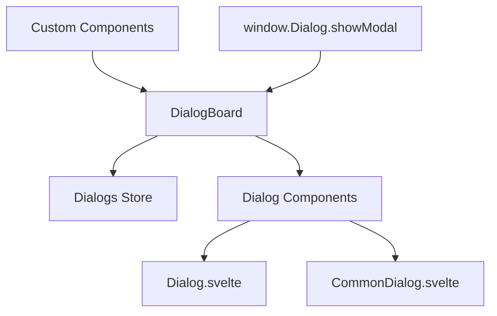

# Dialog System

The Uniface Element Dialog System provides a comprehensive modal dialog solution for Svelte applications. It includes global dialog management, built-in dialog components, and flexible customization options.

## Table of Contents

- [Architecture Overview](#architecture-overview)
- [DialogBoard - Global Dialog Manager](#dialogboard---global-dialog-manager)
- [Built-in Dialog Components](#built-in-dialog-components)
- [Creating Custom Dialogs](#creating-custom-dialogs)
- [API Reference](#api-reference)
- [Advanced Usage](#advanced-usage)
- [Best Practices](#best-practices)

## Architecture Overview

The dialog system consists of several interconnected components:

- **DialogBoard**: Global dialog manager that handles dialog lifecycle
- **Dialog**: Base dialog component with standard UI elements
- **CommonDialog**: Pre-configured dialog for common use cases
- **IDialog**: TypeScript interface for global dialog access
- **Dialogs Store**: Svelte store managing dialog state



## DialogBoard - Global Dialog Manager

The `DialogBoard` component manages all modal dialogs in your application and provides global access through the `window.Dialog` API.

### Setup

Include `DialogBoard` in your root layout:

```svelte
<!-- +layout.svelte or app.html -->
<script lang="ts">
  import { DialogBoard } from "@ticatec/uniface-element/DialogBoard";
</script>

<!-- Your application content -->
<main>
  <slot />
</main>

<!-- Global dialog manager -->
<DialogBoard />
```

### Global API

Once `DialogBoard` is mounted, you can access the dialog system globally:

```typescript
// Open any Svelte component as a modal dialog
window.Dialog.showModal(MyComponent, {
  // Props to pass to the component
  title: "My Dialog",
  data: someData,
  onSave: (result) => {
    console.log("Saved:", result);
  }
});
```

### TypeScript Support

Add global type declarations:

```typescript
// src/app.d.ts
import type { IDialog } from '@ticatec/uniface-element';

declare global {
  interface Window {
    Dialog: IDialog;
  }
}
```

## Built-in Dialog Components

### Dialog Component

The base `Dialog` component provides standard dialog functionality:

```svelte
<script lang="ts">
  import { Dialog } from '@ticatec/uniface-element';
  import type { ButtonActions } from '@ticatec/uniface-element';
  
  let modalResult = null;
  
  const actions: ButtonActions = [
    {
      label: "Save",
      type: "primary",
      handler: async () => {
        // Perform save operation
        await saveData();
        return true; // Return true to auto-close dialog
      }
    }
  ];
  
  const onClose = (result) => {
    console.log("Dialog closed with result:", result);
  };
</script>

<Dialog
  title="My Dialog"
  width="500px"
  height="400px"
  bind:modalResult
  {actions}
  {onClose}
>
  <!-- Dialog content -->
  <p>This is the dialog content.</p>
</Dialog>
```

#### Dialog Properties

| Property | Type | Description |
|----------|------|-------------|
| `title` | `string` | Dialog title |
| `width` | `string` | Dialog width (CSS value) |
| `height` | `string` | Dialog height (CSS value) |
| `actions` | `ButtonActions` | Array of action buttons |
| `closeConfirm` | `DialogCloseConfirm` | Confirmation function for close |
| `content$style` | `string` | Custom styles for content area |
| `modalResult` | `ModalResult` | Result binding for programmatic close |
| `onClose` | `OnClose` | Callback when dialog closes |

### CommonDialog Component

The `CommonDialog` is a pre-configured dialog for typical use cases:

```svelte
<script lang="ts">
  import { CommonDialog, ModalResult } from '@ticatec/uniface-element';
  
  export let user: any;
  export let onSave: (user: any) => void;
  
  let modalResult = null;
  let enableConfirm = true;
  
  const confirmHandler = async () => {
    try {
      await onSave(user);
      return true; // Return true to auto-close
    } catch (error) {
      console.error("Save failed:", error);
      return false; // Keep dialog open on error
    }
  };
  
  const onClose = (result) => {
    if (result === ModalResult.Ok) {
      console.log("User saved successfully");
    }
  };
</script>

<CommonDialog
  title="Edit User"
  width="600px"
  height="500px"
  bind:modalResult
  bind:enableConfirm
  {confirmHandler}
  confirmText="Save Changes"
  {onClose}
>
  <div class="form-content">
    <label>
      Name:
      <input bind:value={user.name} />
    </label>
    <label>
      Email:
      <input bind:value={user.email} type="email" />
    </label>
  </div>
</CommonDialog>

<style>
  .form-content {
    display: flex;
    flex-direction: column;
    gap: 16px;
  }
  
  label {
    display: flex;
    flex-direction: column;
    gap: 4px;
  }
  
  input {
    padding: 8px;
    border: 1px solid #ccc;
    border-radius: 4px;
  }
</style>
```

#### CommonDialog Properties

| Property | Type | Description |
|----------|------|-------------|
| `title` | `string` | Dialog title |
| `width` | `string` | Dialog width |
| `height` | `string` | Dialog height |
| `closeConfirm` | `DialogCloseConfirm` | Close confirmation function |
| `content$style` | `string` | Content area custom styles |
| `modalResult` | `ModalResult` | Result binding |
| `enableConfirm` | `boolean` | Enable/disable confirm button |
| `confirmHandler` | `() => Promise<boolean>` | Confirm button handler |
| `confirmText` | `string` | Custom confirm button text |
| `onClose` | `OnClose` | Close callback |

## Creating Custom Dialogs

### Method 1: Using Global Dialog API

```svelte
<!-- UserEditDialog.svelte -->
<script lang="ts">
  import { getContext } from 'svelte';
  import { CommonDialog, ModalResult } from '@ticatec/uniface-element';
  
  export let user: any;
  export let onSave: (user: any) => Promise<void>;
  
  // Get close function from context
  const closeDialog = getContext('closeDialog');
  
  let saving = false;
  let formData = { ...user };
  let enableConfirm = true;
  
  const handleSave = async () => {
    if (saving) return false;
    
    saving = true;
    try {
      await onSave(formData);
      return true; // Auto-close on success
    } catch (error) {
      console.error('Save failed:', error);
      return false; // Keep open on error
    } finally {
      saving = false;
    }
  };
</script>

<CommonDialog
  title="Edit User"
  width="600px"
  height="400px"
  bind:enableConfirm
  confirmHandler={handleSave}
  confirmText={saving ? "Saving..." : "Save Changes"}
>
  <form class="user-form">
    <div class="field">
      <label for="name">Name:</label>
      <input id="name" bind:value={formData.name} required />
    </div>
    
    <div class="field">
      <label for="email">Email:</label>
      <input id="email" type="email" bind:value={formData.email} required />
    </div>
    
    <div class="field">
      <label for="role">Role:</label>
      <select id="role" bind:value={formData.role}>
        <option value="user">User</option>
        <option value="admin">Admin</option>
        <option value="moderator">Moderator</option>
      </select>
    </div>
  </form>
</CommonDialog>

<style>
  .user-form {
    display: flex;
    flex-direction: column;
    gap: 16px;
    padding: 20px;
  }
  
  .field {
    display: flex;
    flex-direction: column;
    gap: 4px;
  }
  
  label {
    font-weight: 500;
    color: #374151;
  }
  
  input, select {
    padding: 8px 12px;
    border: 1px solid #d1d5db;
    border-radius: 6px;
    font-size: 14px;
  }
  
  input:focus, select:focus {
    outline: none;
    border-color: #3b82f6;
    box-shadow: 0 0 0 3px rgba(59, 130, 246, 0.1);
  }
</style>
```

### Method 2: Custom Modal Component

```svelte
<!-- ConfirmationDialog.svelte -->
<script lang="ts">
  import { createEventDispatcher } from 'svelte';
  import { Button } from '@ticatec/uniface-element';
  
  export let title = "Confirm Action";
  export let message = "Are you sure you want to continue?";
  export let confirmText = "Confirm";
  export let cancelText = "Cancel";
  export let danger = false;
  
  const dispatch = createEventDispatcher();
  
  const handleConfirm = () => {
    dispatch('confirm');
  };
  
  const handleCancel = () => {
    dispatch('cancel');
  };
  
  // Handle backdrop click
  const handleBackdrop = (e) => {
    if (e.target === e.currentTarget) {
      handleCancel();
    }
  };
</script>

<div class="modal-backdrop" on:click={handleBackdrop}>
  <div class="confirmation-dialog" role="dialog" aria-labelledby="dialog-title">
    <div class="dialog-header">
      <h2 id="dialog-title">{title}</h2>
    </div>
    
    <div class="dialog-body">
      <p>{message}</p>
    </div>
    
    <div class="dialog-footer">
      <Button
        label={cancelText}
        type="secondary"
        onClick={handleCancel}
      />
      <Button
        label={confirmText}
        type={danger ? "third" : "primary"}
        onClick={handleConfirm}
      />
    </div>
  </div>
</div>

<style>
  .modal-backdrop {
    position: fixed;
    top: 0;
    left: 0;
    width: 100%;
    height: 100%;
    background: rgba(0, 0, 0, 0.5);
    display: flex;
    align-items: center;
    justify-content: center;
    z-index: 1000;
  }
  
  .confirmation-dialog {
    background: white;
    border-radius: 8px;
    box-shadow: 0 20px 25px -5px rgba(0, 0, 0, 0.1);
    max-width: 400px;
    width: 90%;
    max-height: 90vh;
    overflow: hidden;
  }
  
  .dialog-header {
    padding: 20px 20px 0;
  }
  
  .dialog-header h2 {
    margin: 0;
    font-size: 1.25rem;
    color: #374151;
  }
  
  .dialog-body {
    padding: 16px 20px;
  }
  
  .dialog-body p {
    margin: 0;
    color: #6b7280;
    line-height: 1.5;
  }
  
  .dialog-footer {
    padding: 16px 20px 20px;
    display: flex;
    justify-content: flex-end;
    gap: 12px;
  }
</style>
```

## Advanced Usage

### Dialog with Form Validation

```svelte
<script lang="ts">
  import { CommonDialog } from '@ticatec/uniface-element';
  
  export let product: any;
  export let onSave: (product: any) => Promise<void>;
  
  let formData = { ...product };
  let errors = {};
  let saving = false;
  
  $: enableConfirm = isFormValid(formData) && !saving;
  
  const isFormValid = (data) => {
    const newErrors = {};
    
    if (!data.name?.trim()) {
      newErrors.name = "Product name is required";
    }
    
    if (!data.price || data.price <= 0) {
      newErrors.price = "Price must be greater than 0";
    }
    
    if (!data.category) {
      newErrors.category = "Category is required";
    }
    
    errors = newErrors;
    return Object.keys(newErrors).length === 0;
  };
  
  const handleSave = async () => {
    if (!isFormValid(formData) || saving) {
      return false;
    }
    
    saving = true;
    try {
      await onSave(formData);
      return true;
    } catch (error) {
      console.error('Save failed:', error);
      return false;
    } finally {
      saving = false;
    }
  };
</script>

<CommonDialog
  title="Edit Product"
  width="700px"
  height="600px"
  bind:enableConfirm
  confirmHandler={handleSave}
  confirmText={saving ? "Saving..." : "Save Product"}
>
  <form class="product-form">
    <div class="field">
      <label for="name">Product Name *</label>
      <input
        id="name"
        bind:value={formData.name}
        class:error={errors.name}
        placeholder="Enter product name"
      />
      {#if errors.name}
        <span class="error-text">{errors.name}</span>
      {/if}
    </div>
    
    <div class="field">
      <label for="price">Price *</label>
      <input
        id="price"
        type="number"
        min="0"
        step="0.01"
        bind:value={formData.price}
        class:error={errors.price}
        placeholder="0.00"
      />
      {#if errors.price}
        <span class="error-text">{errors.price}</span>
      {/if}
    </div>
    
    <div class="field">
      <label for="category">Category *</label>
      <select
        id="category"
        bind:value={formData.category}
        class:error={errors.category}
      >
        <option value="">Select category</option>
        <option value="electronics">Electronics</option>
        <option value="clothing">Clothing</option>
        <option value="books">Books</option>
        <option value="home">Home & Garden</option>
      </select>
      {#if errors.category}
        <span class="error-text">{errors.category}</span>
      {/if}
    </div>
    
    <div class="field">
      <label for="description">Description</label>
      <textarea
        id="description"
        bind:value={formData.description}
        placeholder="Product description (optional)"
        rows="4"
      ></textarea>
    </div>
  </form>
</CommonDialog>

<style>
  .product-form {
    padding: 20px;
    display: flex;
    flex-direction: column;
    gap: 16px;
  }
  
  .field {
    display: flex;
    flex-direction: column;
    gap: 4px;
  }
  
  label {
    font-weight: 500;
    color: #374151;
    font-size: 14px;
  }
  
  input, select, textarea {
    padding: 8px 12px;
    border: 1px solid #d1d5db;
    border-radius: 6px;
    font-size: 14px;
    transition: border-color 0.2s, box-shadow 0.2s;
  }
  
  input:focus, select:focus, textarea:focus {
    outline: none;
    border-color: #3b82f6;
    box-shadow: 0 0 0 3px rgba(59, 130, 246, 0.1);
  }
  
  input.error, select.error, textarea.error {
    border-color: #ef4444;
  }
  
  .error-text {
    color: #ef4444;
    font-size: 12px;
    margin-top: 2px;
  }
  
  textarea {
    resize: vertical;
    min-height: 80px;
  }
</style>
```

## API Reference

### Global Dialog Interface

```typescript
interface IDialog {
  showModal<T>(component: any, props?: T): void;
}
```

### ModalResult Enum

```typescript
enum ModalResult {
  None = 0,
  Ok = 1,
  Cancel = 2,
  Abort = 3,
  Retry = 4,
  Ignore = 5,
  Yes = 6,
  No = 7
}
```

### Event Handlers

```typescript
type OnClose = (result: ModalResult) => void;
type DialogCloseConfirm = () => Promise<boolean>;
type ConfirmHandler = () => Promise<boolean>;
```

## Best Practices

### 1. Use Appropriate Dialog Sizes

```svelte
<!-- Small confirmation dialogs -->
<CommonDialog width="400px" height="200px">

<!-- Form dialogs -->
<CommonDialog width="600px" height="500px">

<!-- Large content dialogs -->
<CommonDialog width="800px" height="700px">
```

### 2. Handle Loading States

```svelte
<script>
  let saving = false;
  let enableConfirm = true;
  
  const handleSave = async () => {
    saving = true;
    enableConfirm = false;
    
    try {
      await saveData();
      return true; // Close dialog
    } catch (error) {
      // Handle error, keep dialog open
      return false;
    } finally {
      saving = false;
      enableConfirm = true;
    }
  };
</script>

<CommonDialog
  bind:enableConfirm
  confirmHandler={handleSave}
  confirmText={saving ? "Saving..." : "Save"}
>
```

### 3. Implement Proper Validation

```svelte
<script>
  let formData = { name: '', email: '' };
  let errors = {};
  
  $: enableConfirm = isValid(formData);
  
  const isValid = (data) => {
    return data.name.trim() && 
           data.email.trim() && 
           data.email.includes('@');
  };
</script>
```

### 4. Use Context for Complex Dialogs

```svelte
<script>
  import { setContext } from 'svelte';
  
  // Provide helper functions to child components
  setContext('showNotification', (message) => {
    // Show notification
  });
  
  setContext('closeDialog', () => {
    modalResult = ModalResult.Cancel;
  });
</script>
```

### 5. Keyboard Navigation Support

```svelte
<script>
  import { onMount } from 'svelte';
  
  onMount(() => {
    const handleKeydown = (e) => {
      if (e.key === 'Escape') {
        handleCancel();
      } else if (e.key === 'Enter' && e.ctrlKey) {
        handleConfirm();
      }
    };
    
    document.addEventListener('keydown', handleKeydown);
    
    return () => {
      document.removeEventListener('keydown', handleKeydown);
    };
  });
</script>
```

## Accessibility Considerations

- Always provide proper `aria-labelledby` and `role="dialog"` attributes
- Ensure keyboard navigation works (Tab, Enter, Escape)
- Focus management - focus should be trapped within the dialog
- Provide clear visual indicators for required fields
- Use semantic HTML elements within dialog content
- Ensure sufficient color contrast for all text and interactive elements

## Browser Support

- Modern browsers with ES2020+ support
- CSS Grid and Flexbox support required for layout
- JavaScript Proxy support needed for reactive stores