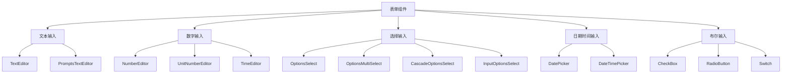

# 表单组件

Uniface Element 表单组件为 Svelte 应用程序提供了一套全面的输入控件，用于构建丰富的表单和数据录入界面。这些组件设计有一致的样式、验证支持和灵活的配置选项。

> **重要说明**：表单组件通常独立使用，不需要配合标签。当需要标签和错误处理时，可以与 `FormField` 组件配合使用来显示标签和错误信息。对于高级验证，建议集成 [@ticatec/web-bean-validator](https://github.com/ticatec/web-bean-validator) 进行全面的表单验证。

## 目录

- [FormField 集成](#formfield-集成)
- [Web Bean Validator 验证](#web-bean-validator-验证)
- [架构概述](#架构概述)
- [TextEditor 组件](#texteditor-组件)
- [NumberEditor 组件](#numbereditor-组件)
- [TimeEditor 组件](#timeeditor-组件)
- [UnitNumberEditor 组件](#unitnumbereditor-组件)
- [CheckBox 组件](#checkbox-组件)
- [RadioButton 组件](#radiobutton-组件)
- [OptionsSelect 组件](#optionsselect-组件)
- [OptionsMultiSelect 组件](#optionsmultiselect-组件)
- [PromptsTextEditor 组件](#promptstexteditor-组件)
- [Switch 组件](#switch-组件)
- [InputOptionsSelect 组件](#inputoptionsselect-组件)
- [LookupEditor 组件](#lookupeditor-组件)
- [DatePicker 组件](#datepicker-组件)
- [DateTimePicker 组件](#datetimepicker-组件)
- [CascadeOptionsSelect 组件](#cascadeoptionsselect-组件)
- [通用属性](#通用属性)
- [显示模式](#显示模式)
- [样式和主题](#样式和主题)
- [验证和事件](#验证和事件)
- [最佳实践](#最佳实践)
- [无障碍访问](#无障碍访问)

## FormField 集成

表单组件与 `FormField` 组件完美配合，提供标签、错误信息和一致的表单布局：

```svelte
<script lang="ts">
  import TextEditor, FormField from '@ticatec/uniface-element/TextEditor, FormField';
  
  let userEmail = '';
  let emailError = '';
  
  const validateEmail = (value: string) => {
    if (!value) {
      emailError = '邮箱是必填项';
    } else if (!/^[^\s@]+@[^\s@]+\.[^\s@]+$/.test(value)) {
      emailError = '请输入有效的邮箱地址';
    } else {
      emailError = '';
    }
  };
</script>

<FormField 
  label="邮箱地址" 
  error={emailError}
  required={true}
>
  <TextEditor
    bind:value={userEmail}
    placeholder="输入您的邮箱"
    onChange={validateEmail}
  />
</FormField>
```

## Web Bean Validator 验证

对于高级表单验证，可以集成 `@ticatec/web-bean-validator` 进行声明式、类型安全的验证：

### 安装

```bash
npm install @ticatec/web-bean-validator
```

### 基本使用

```svelte
<script lang="ts">
  import TextEditor, NumberEditor, FormField from '@ticatec/uniface-element/TextEditor, NumberEditor, FormField';
  import beanValidator from '@ticatec/web-bean-validator';
  import { StringValidator, NumberValidator } from '@ticatec/entity-validator';
  
  let formData = {
    name: '',
    email: '',
    age: null
  };
  
  let errors = {};
  
  // 定义验证规则
  const validationRules = [
    new StringValidator('name', { minLen: 2, required: true }),
    new StringValidator('email', {
      required: true,
      format: {
        regex: /^[^\s@]+@[^\s@]+\.[^\s@]+$/,
        message: '邮箱格式无效'
      }
    }),
    new NumberValidator('age', { min: 18, max: 120, required: false })
  ];
  
  const validateForm = () => {
    const result = beanValidator.validate(formData, validationRules);
    
    // 将验证结果转换为错误对象
    errors = {};
    if (result.errors) {
      result.errors.forEach(error => {
        errors[error.field] = error.message;
      });
    }
    
    return result.isValid;
  };
  
  const handleSubmit = () => {
    if (validateForm()) {
      console.log('表单验证通过:', formData);
    }
  };
</script>

<form class="validation-form">
  <FormField label="姓名" error={errors.name} required>
    <TextEditor
      bind:value={formData.name}
      placeholder="输入您的姓名"
      on:blur={validateForm}
    />
  </FormField>
  
  <FormField label="邮箱" error={errors.email} required>
    <TextEditor
      bind:value={formData.email}
      placeholder="输入您的邮箱"
      on:blur={validateForm}
    />
  </FormField>
  
  <FormField label="年龄" error={errors.age}>
    <NumberEditor
      bind:value={formData.age}
      placeholder="输入您的年龄"
      min={18}
      max={120}
      precision={0}
      on:blur={validateForm}
    />
  </FormField>
  
  <button type="button" on:click={handleSubmit}>
    提交表单
  </button>
</form>
```

### 高级验证示例

```svelte
<script lang="ts">
  import DatePicker, FormField from '@ticatec/uniface-element/DatePicker, FormField';
  import beanValidator from '@ticatec/web-bean-validator';
  import { DateValidator } from '@ticatec/entity-validator';
  
  let projectData = {
    startDate: null,
    endDate: null
  };
  
  let errors = {};
  
  // 自定义验证函数
  const validateDateRange = (value: any, data: any) => {
    if (data.endDate && data.startDate && data.endDate < data.startDate) {
      return "结束日期不能早于开始日期";
    }
  };
  
  const validationRules = [
    new DateValidator('startDate', { 
      required: true,
      minDaysAfter: 0 // 不能是过去的日期
    }),
    new DateValidator('endDate', { 
      required: true,
      customCheck: validateDateRange
    })
  ];
  
  const validateDates = () => {
    const result = beanValidator.validate(projectData, validationRules);
    
    errors = {};
    if (result.errors) {
      result.errors.forEach(error => {
        errors[error.field] = error.message;
      });
    }
  };
</script>

<div class="date-range-form">
  <FormField label="开始日期" error={errors.startDate} required>
    <DatePicker
      bind:value={projectData.startDate}
      onChange={validateDates}
    />
  </FormField>
  
  <FormField label="结束日期" error={errors.endDate} required>
    <DatePicker
      bind:value={projectData.endDate}
      onChange={validateDates}
    />
  </FormField>
</div>
```

## 架构概述

Uniface Element 中的表单组件遵循一致的架构：

- **CommonEditor**: 提供一致样式和行为的基础包装器
- **CommonPicker**: 下拉/选择器组件的基础
- **DisplayMode**: 支持编辑/查看/显示模式
- **类型安全**: 完整的 TypeScript 支持和适当的类型定义
- **事件处理**: 一致的 onChange/onSelected 事件模式
- **图标集成**: 使用 `@ticatec/uniface-google-material-icons`



## TextEditor 组件

一个多功能的文本输入组件，支持前缀、后缀和各种样式选项。

### 基本用法

```svelte
<script lang="ts">
  import TextEditor from '@ticatec/uniface-element/TextEditor';
  
  let userInput = '';
  
  const handleChange = (value: string) => {
    console.log('文本改变:', value);
  };
</script>

<TextEditor 
  bind:value={userInput}
  placeholder="在此输入文本"
  onChange={handleChange}
/>
```

### 高级功能

```svelte
<script lang="ts">
  import TextEditor from '@ticatec/uniface-element/TextEditor';
  
  let email = '';
  let searchTerm = '';
  
  const handleEmailChange = (value: string) => {
    // 验证邮箱格式
    const isValid = /^[^\s@]+@[^\s@]+\.[^\s@]+$/.test(value);
    console.log('邮箱有效:', isValid);
  };
</script>

<!-- 带验证的邮箱输入 -->
<TextEditor 
  bind:value={email}
  placeholder="输入邮箱地址"
  prefix="@"
  variant="outlined"
  onChange={handleEmailChange}
>
  <i class="icon_google_email" slot="leading-icon"></i>
</TextEditor>

<!-- 带清除按钮的搜索输入 -->
<TextEditor 
  bind:value={searchTerm}
  placeholder="搜索..."
  removable={true}
  compact={true}
>
  <i class="icon_google_search" slot="leading-icon"></i>
</TextEditor>
```

### TextEditor 属性

| 属性 | 类型 | 默认值 | 描述 |
|------|------|--------|------|
| `value` | `string` | `''` | 输入值 |
| `placeholder` | `string` | `''` | 占位符文本 |
| `disabled` | `boolean` | `false` | 禁用输入 |
| `readonly` | `boolean` | `false` | 只读模式 |
| `variant` | `'' \| 'plain' \| 'outlined' \| 'filled'` | `''` | 视觉样式变体 |
| `compact` | `boolean` | `false` | 紧凑布局 |
| `prefix` | `string` | `''` | 文本前缀 |
| `suffix` | `string` | `''` | 文本后缀 |
| `removable` | `boolean` | `true` | 显示清除按钮 |
| `displayMode` | `DisplayMode` | `DisplayMode.Edit` | 显示模式 |
| `onChange` | `(value: string) => void` | - | 改变事件处理器 |
| `setFocus` | `() => void` | - | 聚焦方法 |

## NumberEditor 组件

专门的数字输入，具有精度控制、格式化和验证功能。

### 基本用法

```svelte
<script lang="ts">
  import NumberEditor from '@ticatec/uniface-element/NumberEditor';
  
  let amount = null;
  let quantity = 1;
  
  const handleAmountChange = (value: number | null) => {
    console.log('金额:', value);
  };
</script>

<NumberEditor 
  bind:value={amount}
  placeholder="输入金额"
  precision={2}
  allowNegative={false}
  onChange={handleAmountChange}
/>

<NumberEditor 
  bind:value={quantity}
  min={1}
  max={100}
  precision={0}
  prefix="数量: "
/>
```

### 货币和格式化

```svelte
<script lang="ts">
  let price = 99.99;
  let percentage = 15.5;
  let weight = 2.5;
</script>

<!-- 货币输入 -->
<NumberEditor 
  bind:value={price}
  prefix="¥"
  precision={2}
  allowNegative={false}
  placeholder="0.00"
/>

<!-- 百分比输入 -->
<NumberEditor 
  bind:value={percentage}
  suffix="%"
  precision={1}
  min={0}
  max={100}
/>

<!-- 重量与单位 -->
<NumberEditor 
  bind:value={weight}
  suffix="kg"
  precision={2}
  allowNegative={false}
>
  <i class="icon_google_scale" slot="leading-icon"></i>
</NumberEditor>
```

### NumberEditor 属性

| 属性 | 类型 | 默认值 | 描述 |
|------|------|--------|------|
| `value` | `number \| null` | `null` | 数字值 |
| `precision` | `number \| null` | `null` | 小数位数 |
| `min` | `number \| null` | `null` | 最小值 |
| `max` | `number \| null` | `null` | 最大值 |
| `allowNegative` | `boolean` | `false` | 允许负数 |
| `placeholder` | `string` | `''` | 占位符文本 |
| `prefix` | `string` | `''` | 文本前缀 |
| `suffix` | `string` | `''` | 文本后缀 |
| `removable` | `boolean` | `true` | 显示清除按钮 |
| `onChange` | `OnChangeHandler<number \| null>` | - | 改变事件处理器 |

## CheckBox 组件

布尔输入组件，支持不确定状态。

### 基本用法

```svelte
<script lang="ts">
  import CheckBox from '@ticatec/uniface-element/CheckBox';
  
  let agreedToTerms = false;
  let enableNotifications = true;
  
  const handleTermsChange = (checked: boolean) => {
    console.log('同意条款:', checked);
  };
</script>

<CheckBox
  bind:value={agreedToTerms}
  label="我同意条款和条件"
  onChange={handleTermsChange}
/>

<CheckBox
  bind:value={enableNotifications}
  label="启用通知"
  compact={true}
/>
```

### 复选框组

```svelte
<script lang="ts">
  let selectedFeatures = {
    darkMode: false,
    notifications: true,
    autoSave: true,
    analytics: false
  };
  
  const features = [
    { key: 'darkMode', label: '深色模式' },
    { key: 'notifications', label: '推送通知' },
    { key: 'autoSave', label: '自动保存' },
    { key: 'analytics', label: '使用分析' }
  ];
  
  const handleFeatureChange = (key: string) => (checked: boolean) => {
    selectedFeatures[key] = checked;
    selectedFeatures = { ...selectedFeatures };
  };
</script>

<div class="checkbox-group">
  <h3>应用设置</h3>
  {#each features as feature}
    <CheckBox
      value={selectedFeatures[feature.key]}
      label={feature.label}
      onChange={handleFeatureChange(feature.key)}
    />
  {/each}
</div>

<style>
  .checkbox-group {
    display: flex;
    flex-direction: column;
    gap: 12px;
  }
</style>
```

### CheckBox 属性

| 属性 | 类型 | 默认值 | 描述 |
|------|------|--------|------|
| `value` | `boolean` | `false` | 复选框状态 |
| `label` | `string \| null` | `null` | 复选框标签 |
| `indeterminate` | `boolean` | `false` | 不确定状态 |
| `disabled` | `boolean` | `false` | 禁用复选框 |
| `readonly` | `boolean` | `false` | 只读模式 |
| `compact` | `boolean` | `false` | 紧凑布局 |
| `autoFocus` | `boolean` | `false` | 挂载时自动聚焦 |
| `onChange` | `OnChangeHandler<boolean>` | - | 改变事件处理器 |
| `onClick` | `(event: MouseEvent) => void` | - | 点击事件处理器 |
| `setFocus` | `() => void` | - | 聚焦方法 |

## OptionsSelect 组件

带有搜索和过滤功能的下拉选择组件。

### 基本用法

```svelte
<script lang="ts">
  import OptionsSelect from '@ticatec/uniface-element/OptionsSelect';
  
  let selectedCountry = null;
  let selectedCategory = 'electronics';
  
  const countries = [
    { code: 'CN', text: '中国' },
    { code: 'US', text: '美国' },
    { code: 'UK', text: '英国' },
    { code: 'JP', text: '日本' }
  ];
  
  const categories = [
    { code: 'electronics', text: '电子产品' },
    { code: 'clothing', text: '服装' },
    { code: 'books', text: '图书' },
    { code: 'home', text: '家居用品' }
  ];
  
  const handleCountryChange = (value: any) => {
    console.log('选择的国家:', value);
  };
  
  const handleCountrySelected = (item: any) => {
    console.log('选择的国家对象:', item);
  };
</script>

<OptionsSelect
  bind:value={selectedCountry}
  options={countries}
  keyField="code"
  textField="text"
  placeholder="选择国家"
  onChange={handleCountryChange}
  onSelected={handleCountrySelected}
/>

<OptionsSelect
  bind:value={selectedCategory}
  options={categories}
  keyField="code"
  textField="text"
  mandatory={true}
/>
```

### OptionsSelect 属性

| 属性 | 类型 | 默认值 | 描述 |
|------|------|--------|------|
| `value` | `any` | `null` | 选择的值 |
| `options` | `Array<any>` | - | 可用选项 |
| `keyField` | `string` | `'code'` | 键字段名 |
| `textField` | `string` | `'text'` | 显示文本字段 |
| `placeholder` | `string` | `''` | 占位符文本 |
| `emptyText` | `string` | - | 空值的文本 |
| `mandatory` | `boolean` | `false` | 必须选择 |
| `disableOptions` | `string[]` | `[]` | 禁用的选项键 |
| `hideOptions` | `string[]` | `[]` | 隐藏的选项键 |
| `itemRender` | `any` | `null` | 自定义项渲染器 |
| `menu$height` | `number` | `0` | 菜单高度（像素） |
| `onChange` | `OnChangeHandler<any>` | - | 改变事件处理器 |
| `onSelected` | `OnSelectedHandler` | - | 选择事件处理器 |
| `setFocus` | `() => void` | - | 聚焦方法 |

## 通用属性

大多数表单组件共享这些通用属性：

### 样式属性

| 属性 | 类型 | 默认值 | 描述 |
|------|------|--------|------|
| `variant` | `'' \| 'plain' \| 'outlined' \| 'filled'` | `''` | 视觉样式变体 |
| `compact` | `boolean` | `false` | 紧凑布局模式 |
| `style` | `string` | `''` | 自定义 CSS 样式 |
| `class` | `string` | `''` | CSS 类名 |

### 状态属性

| 属性 | 类型 | 默认值 | 描述 |
|------|------|--------|------|
| `disabled` | `boolean` | `false` | 禁用组件 |
| `readonly` | `boolean` | `false` | 只读模式 |
| `mandatory` | `boolean` | `false` | 必填字段 |

### 行为属性

| 属性 | 类型 | 默认值 | 描述 |
|------|------|--------|------|
| `placeholder` | `string` | `''` | 占位符文本 |
| `displayMode` | `DisplayMode` | `DisplayMode.Edit` | 显示模式 |

## 显示模式

组件支持不同的显示模式：

```typescript
enum DisplayMode {
  Edit = 'edit',     // 完整的编辑功能
  View = 'view',     // 只读显示
  Display = 'display' // 最小显示模式
}
```

### 使用示例

```svelte
<script lang="ts">
  import DisplayMode from '@ticatec/uniface-element/DisplayMode';
  
  let currentMode = DisplayMode.Edit;
  let userInput = '示例文本';
</script>

<!-- 编辑模式 - 完全交互 -->
<TextEditor
  bind:value={userInput}
  displayMode={DisplayMode.Edit}
  placeholder="编辑我"
/>

<!-- 查看模式 - 只读显示 -->
<TextEditor
  value={userInput}
  displayMode={DisplayMode.View}
/>

<!-- 显示模式 - 最小呈现 -->
<TextEditor
  value={userInput}
  displayMode={DisplayMode.Display}
/>
```

## 样式和主题

### CSS 自定义属性

表单组件使用 CSS 自定义属性进行主题设置：

```css
:root {
  --uniface-primary-color: #007bff;
  --uniface-border-color: #ddd;
  --uniface-background-color: #fff;
  --uniface-text-color: #333;
  --uniface-disabled-color: #999;
  --uniface-focus-color: #0056b3;
}
```

### 变体样式

```svelte
<!-- 默认样式 -->
<TextEditor value="默认样式" />

<!-- 朴素变体 - 最小边框 -->
<TextEditor value="朴素样式" variant="plain" />

<!-- 轮廓变体 - 突出边框 -->
<TextEditor value="轮廓样式" variant="outlined" />

<!-- 填充变体 - 背景填充 -->
<TextEditor value="填充样式" variant="filled" />
```

## 事件处理

表单组件提供一致的事件处理模式，用于响应用户交互和数据变化。

## 最佳实践

### 1. 使用 FormField 显示标签和处理错误

当需要标签、错误信息或表单结构时，始终使用 `FormField`：

```svelte
<!-- 推荐：使用 FormField -->
<FormField label="用户名" error={nameError} required>
  <TextEditor bind:value={userName} placeholder="输入姓名" />
</FormField>

<!-- 独立使用：仅在不需要标签/错误时 -->
<TextEditor bind:value={searchQuery} placeholder="搜索..." />
```

### 2. 在复杂表单中集成 Web Bean Validator

对于有多个验证规则的表单，使用 `@ticatec/web-bean-validator`：

```svelte
<script lang="ts">
  import beanValidator from '@ticatec/web-bean-validator';
  import { StringValidator, NumberValidator } from '@ticatec/entity-validator';
  
  const rules = [
    new StringValidator('email', { required: true, format: emailRegex }),
    new NumberValidator('age', { min: 18, max: 120 })
  ];
  
  const validateForm = () => beanValidator.validate(formData, rules);
</script>
```

### 3. 使用合适的输入类型

为您的数据类型选择正确的组件：

```svelte
<!-- 文本数据使用 FormField -->
<FormField label="姓名" error={errors.name}>
  <TextEditor bind:value={userName} />
</FormField>

<!-- 数字数据 -->
<FormField label="价格" error={errors.price}>
  <NumberEditor bind:value={price} precision={2} />
</FormField>

<!-- 布尔数据 -->
<CheckBox bind:value={isEnabled} label="启用通知" />

<!-- 选择组件 -->
<FormField label="分类" error={errors.category}>
  <OptionsSelect bind:value={selectedCategory} options={categories} />
</FormField>
```

### 4. 提供清晰的标签和占位符

```svelte
<!-- 使用 FormField 而不是手动标签设置 -->
<FormField label="邮箱地址" required error={emailError}>
  <TextEditor
    bind:value={email}
    placeholder="输入您的邮箱地址"
    variant="outlined"
  />
</FormField>
```

### 5. 处理加载状态

```svelte
<script lang="ts">
  let isSubmitting = false;
  
  const handleSubmit = async () => {
    isSubmitting = true;
    try {
      await submitForm();
    } finally {
      isSubmitting = false;
    }
  };
</script>

<TextEditor
  bind:value={formData.field}
  disabled={isSubmitting}
  placeholder={isSubmitting ? "提交中..." : "输入值"}
/>
```

## 无障碍访问

### 当前无障碍功能

表单组件包括基本的无障碍功能：

- 尽可能使用语义化 HTML 结构
- 标签关联支持
- 部分组件的键盘导航
- 与屏幕阅读器兼容的内容

### 无障碍改进

为了更好的无障碍性，考虑这些改进：

```svelte
<!-- 适当的标签 -->
<label for="user-name">全名 *</label>
<TextEditor
  id="user-name"
  bind:value={userName}
  required
  aria-describedby="name-help"
/>
<div id="name-help">输入您的姓名</div>

<!-- 错误提示 -->
<TextEditor
  bind:value={email}
  aria-invalid={emailError ? 'true' : 'false'}
  aria-describedby={emailError ? 'email-error' : undefined}
/>
{#if emailError}
  <div id="email-error" role="alert">{emailError}</div>
{/if}

<!-- 字段集分组 -->
<fieldset>
  <legend>联系偏好</legend>
  <CheckBox value={emailNotifications} label="邮件通知" />
  <CheckBox value={smsNotifications} label="短信通知" />
</fieldset>
```

## 浏览器支持

- 支持 ES2020+ 的现代浏览器
- 布局需要 CSS Grid 和 Flexbox 支持
- 增强验证需要表单验证 API
- 用户交互需要事件处理

这份全面指南涵盖了 Uniface Element 库中的主要表单组件，提供了示例、最佳实践和实现细节，用于构建健壮的表单界面。