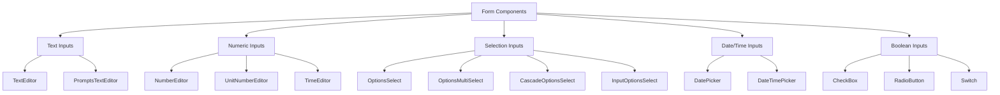

# Form Components

The Uniface Element Form Components provide a comprehensive set of input controls for building rich forms and data entry interfaces in Svelte applications. These components are designed with consistent styling, validation support, and flexible configuration options.

> **Important Note**: Form components are typically used standalone and don't require labels. When labels and error handling are needed, use them in combination with `FormField` component for displaying labels and error messages. For advanced validation, integrate with [@ticatec/web-bean-validator](https://github.com/ticatec/web-bean-validator) for comprehensive form validation.

## Table of Contents

- [FormField Integration](#formfield-integration)
- [Validation with Web Bean Validator](#validation-with-web-bean-validator)
- [Architecture Overview](#architecture-overview)
- [TextEditor Component](#texteditor-component)
- [NumberEditor Component](#numbereditor-component)
- [TimeEditor Component](#timeeditor-component)
- [UnitNumberEditor Component](#unitnumbereditor-component)
- [CheckBox Component](#checkbox-component)
- [RadioButton Component](#radiobutton-component)
- [OptionsSelect Component](#optionsselect-component)
- [OptionsMultiSelect Component](#optionsmultiselect-component)
- [PromptsTextEditor Component](#promptstexteditor-component)
- [Switch Component](#switch-component)
- [InputOptionsSelect Component](#inputoptionsselect-component)
- [LookupEditor Component](#lookupeditor-component)
- [DatePicker Component](#datepicker-component)
- [DateTimePicker Component](#datetimepicker-component)
- [CascadeOptionsSelect Component](#cascadeoptionsselect-component)
- [Common Properties](#common-properties)
- [Display Modes](#display-modes)
- [Styling and Theming](#styling-and-theming)
- [Validation and Events](#validation-and-events)
- [Best Practices](#best-practices)
- [Accessibility](#accessibility)

## FormField Integration

Form components work seamlessly with the `FormField` component to provide labels, error messages, and consistent form layouts:

```svelte
<script lang="ts">
  import TextEditor, FormField from '@ticatec/uniface-element/TextEditor, FormField';
  
  let userEmail = '';
  let emailError = '';
  
  const validateEmail = (value: string) => {
    if (!value) {
      emailError = 'Email is required';
    } else if (!/^[^\s@]+@[^\s@]+\.[^\s@]+$/.test(value)) {
      emailError = 'Please enter a valid email address';
    } else {
      emailError = '';
    }
  };
</script>

<FormField 
  label="Email Address" 
  error={emailError}
  required={true}
>
  <TextEditor
    bind:value={userEmail}
    placeholder="Enter your email"
    onChange={validateEmail}
  />
</FormField>
```

## Validation with Web Bean Validator

For advanced form validation, integrate with `@ticatec/web-bean-validator` for declarative, type-safe validation:

### Installation

```bash
npm install @ticatec/web-bean-validator
```

### Basic Usage

```svelte
<script lang="ts">
  import TextEditor, NumberEditor, FormField from '@ticatec/uniface-element/TextEditor, NumberEditor, FormField';
  import beanValidator from '@ticatec/web-bean-validator';
  import { StringValidator, NumberValidator } from '@ticatec/entity-validator';
  
  let formData = {
    name: '',
    email: '',
    age: null
  };
  
  let errors = {};
  
  // Define validation rules
  const validationRules = [
    new StringValidator('name', { minLen: 2, required: true }),
    new StringValidator('email', {
      required: true,
      format: {
        regex: /^[^\s@]+@[^\s@]+\.[^\s@]+$/,
        message: 'Invalid email format'
      }
    }),
    new NumberValidator('age', { min: 18, max: 120, required: false })
  ];
  
  const validateForm = () => {
    const result = beanValidator.validate(formData, validationRules);
    
    // Convert validation results to error object
    errors = {};
    if (result.errors) {
      result.errors.forEach(error => {
        errors[error.field] = error.message;
      });
    }
    
    return result.isValid;
  };
  
  const handleSubmit = () => {
    if (validateForm()) {
      console.log('Form is valid:', formData);
    }
  };
</script>

<form class="validation-form">
  <FormField label="Full Name" error={errors.name} required>
    <TextEditor
      bind:value={formData.name}
      placeholder="Enter your full name"
      on:blur={validateForm}
    />
  </FormField>
  
  <FormField label="Email" error={errors.email} required>
    <TextEditor
      bind:value={formData.email}
      placeholder="Enter your email"
      on:blur={validateForm}
    />
  </FormField>
  
  <FormField label="Age" error={errors.age}>
    <NumberEditor
      bind:value={formData.age}
      placeholder="Enter your age"
      min={18}
      max={120}
      precision={0}
      on:blur={validateForm}
    />
  </FormField>
  
  <button type="button" on:click={handleSubmit}>
    Submit Form
  </button>
</form>
```

### Advanced Validation Example

```svelte
<script lang="ts">
  import DatePicker, FormField from '@ticatec/uniface-element/DatePicker, FormField';
  import beanValidator from '@ticatec/web-bean-validator';
  import { DateValidator } from '@ticatec/entity-validator';
  
  let projectData = {
    startDate: null,
    endDate: null
  };
  
  let errors = {};
  
  // Custom validation function
  const validateDateRange = (value: any, data: any) => {
    if (data.endDate && data.startDate && data.endDate < data.startDate) {
      return "End date cannot be earlier than start date";
    }
  };
  
  const validationRules = [
    new DateValidator('startDate', { 
      required: true,
      minDaysAfter: 0 // Cannot be in the past
    }),
    new DateValidator('endDate', { 
      required: true,
      customCheck: validateDateRange
    })
  ];
  
  const validateDates = () => {
    const result = beanValidator.validate(projectData, validationRules);
    
    errors = {};
    if (result.errors) {
      result.errors.forEach(error => {
        errors[error.field] = error.message;
      });
    }
  };
</script>

<div class="date-range-form">
  <FormField label="Start Date" error={errors.startDate} required>
    <DatePicker
      bind:value={projectData.startDate}
      onChange={validateDates}
    />
  </FormField>
  
  <FormField label="End Date" error={errors.endDate} required>
    <DatePicker
      bind:value={projectData.endDate}
      onChange={validateDates}
    />
  </FormField>
</div>
```

## Architecture Overview

Form components in Uniface Element follow a consistent architecture:

- **CommonEditor**: Base wrapper providing consistent styling and behavior
- **CommonPicker**: Base for dropdown/picker components
- **DisplayMode**: Support for Edit/View/Display modes
- **Type Safety**: Full TypeScript support with proper type definitions
- **Event Handling**: Consistent onChange/onSelected event patterns
- **Icon Integration**: Uses `@ticatec/uniface-google-material-icons`



## TextEditor Component

A versatile text input component with support for prefixes, suffixes, and various styling options.

### Basic Usage

```svelte
<script lang="ts">
  import TextEditor from '@ticatec/uniface-element/TextEditor';
  
  let userInput = '';
  
  const handleChange = (value: string) => {
    console.log('Text changed:', value);
  };
</script>

<TextEditor 
  bind:value={userInput}
  placeholder="Enter text here"
  onChange={handleChange}
/>
```

### Advanced Features

```svelte
<script lang="ts">
  import TextEditor from '@ticatec/uniface-element/TextEditor';
  
  let email = '';
  let searchTerm = '';
  
  const handleEmailChange = (value: string) => {
    // Validate email format
    const isValid = /^[^\s@]+@[^\s@]+\.[^\s@]+$/.test(value);
    console.log('Email valid:', isValid);
  };
</script>

<!-- Email input with validation -->
<TextEditor 
  bind:value={email}
  placeholder="Enter email address"
  prefix="@"
  variant="outlined"
  onChange={handleEmailChange}
>
  <i class="icon_google_email" slot="leading-icon"></i>
</TextEditor>

<!-- Search input with clear button -->
<TextEditor 
  bind:value={searchTerm}
  placeholder="Search..."
  removable={true}
  compact={true}
>
  <i class="icon_google_search" slot="leading-icon"></i>
</TextEditor>
```

### TextEditor Properties

| Property | Type | Default | Description |
|----------|------|---------|-------------|
| `value` | `string` | `''` | Input value |
| `placeholder` | `string` | `''` | Placeholder text |
| `disabled` | `boolean` | `false` | Disable input |
| `readonly` | `boolean` | `false` | Read-only mode |
| `variant` | `'' \| 'plain' \| 'outlined' \| 'filled'` | `''` | Visual style variant |
| `compact` | `boolean` | `false` | Compact layout |
| `prefix` | `string` | `''` | Text prefix |
| `suffix` | `string` | `''` | Text suffix |
| `removable` | `boolean` | `true` | Show clear button |
| `displayMode` | `DisplayMode` | `DisplayMode.Edit` | Display mode |
| `onChange` | `(value: string) => void` | - | Change event handler |
| `setFocus` | `() => void` | - | Focus method |

## NumberEditor Component

Specialized numeric input with precision control, formatting, and validation.

### Basic Usage

```svelte
<script lang="ts">
  import NumberEditor from '@ticatec/uniface-element/NumberEditor';
  
  let amount = null;
  let quantity = 1;
  
  const handleAmountChange = (value: number | null) => {
    console.log('Amount:', value);
  };
</script>

<NumberEditor 
  bind:value={amount}
  placeholder="Enter amount"
  precision={2}
  allowNegative={false}
  onChange={handleAmountChange}
/>

<NumberEditor 
  bind:value={quantity}
  min={1}
  max={100}
  precision={0}
  prefix="Qty: "
/>
```

### Currency and Formatting

```svelte
<script lang="ts">
  let price = 99.99;
  let percentage = 15.5;
  let weight = 2.5;
</script>

<!-- Currency input -->
<NumberEditor 
  bind:value={price}
  prefix="$"
  precision={2}
  allowNegative={false}
  placeholder="0.00"
/>

<!-- Percentage input -->
<NumberEditor 
  bind:value={percentage}
  suffix="%"
  precision={1}
  min={0}
  max={100}
/>

<!-- Weight with unit -->
<NumberEditor 
  bind:value={weight}
  suffix="kg"
  precision={2}
  allowNegative={false}
>
  <i class="icon_google_scale" slot="leading-icon"></i>
</NumberEditor>
```

### NumberEditor Properties

| Property | Type | Default | Description |
|----------|------|---------|-------------|
| `value` | `number \| null` | `null` | Numeric value |
| `precision` | `number \| null` | `null` | Decimal places |
| `min` | `number \| null` | `null` | Minimum value |
| `max` | `number \| null` | `null` | Maximum value |
| `allowNegative` | `boolean` | `false` | Allow negative numbers |
| `placeholder` | `string` | `''` | Placeholder text |
| `prefix` | `string` | `''` | Text prefix |
| `suffix` | `string` | `''` | Text suffix |
| `removable` | `boolean` | `true` | Show clear button |
| `onChange` | `OnChangeHandler<number \| null>` | - | Change event handler |

## CheckBox Component

Boolean input component with support for indeterminate state.

### Basic Usage

```svelte
<script lang="ts">
  import CheckBox from '@ticatec/uniface-element/CheckBox';
  
  let agreedToTerms = false;
  let enableNotifications = true;
  
  const handleTermsChange = (checked: boolean) => {
    console.log('Terms agreed:', checked);
  };
</script>

<CheckBox
  bind:value={agreedToTerms}
  label="I agree to the terms and conditions"
  onChange={handleTermsChange}
/>

<CheckBox
  bind:value={enableNotifications}
  label="Enable notifications"
  compact={true}
/>
```

### Checkbox Groups

```svelte
<script lang="ts">
  let selectedFeatures = {
    darkMode: false,
    notifications: true,
    autoSave: true,
    analytics: false
  };
  
  const features = [
    { key: 'darkMode', label: 'Dark Mode' },
    { key: 'notifications', label: 'Push Notifications' },
    { key: 'autoSave', label: 'Auto Save' },
    { key: 'analytics', label: 'Usage Analytics' }
  ];
  
  const handleFeatureChange = (key: string) => (checked: boolean) => {
    selectedFeatures[key] = checked;
    selectedFeatures = { ...selectedFeatures };
  };
</script>

<div class="checkbox-group">
  <h3>Application Settings</h3>
  {#each features as feature}
    <CheckBox
      value={selectedFeatures[feature.key]}
      label={feature.label}
      onChange={handleFeatureChange(feature.key)}
    />
  {/each}
</div>

<style>
  .checkbox-group {
    display: flex;
    flex-direction: column;
    gap: 12px;
  }
</style>
```

### CheckBox Properties

| Property | Type | Default | Description |
|----------|------|---------|-------------|
| `value` | `boolean` | `false` | Checkbox state |
| `label` | `string \| null` | `null` | Checkbox label |
| `indeterminate` | `boolean` | `false` | Indeterminate state |
| `disabled` | `boolean` | `false` | Disable checkbox |
| `readonly` | `boolean` | `false` | Read-only mode |
| `compact` | `boolean` | `false` | Compact layout |
| `autoFocus` | `boolean` | `false` | Auto focus on mount |
| `onChange` | `OnChangeHandler<boolean>` | - | Change event handler |
| `onClick` | `(event: MouseEvent) => void` | - | Click event handler |
| `setFocus` | `() => void` | - | Focus method |

## OptionsSelect Component

Dropdown selection component with search and filtering capabilities.

### Basic Usage

```svelte
<script lang="ts">
  import OptionsSelect from '@ticatec/uniface-element/OptionsSelect';
  
  let selectedCountry = null;
  let selectedCategory = 'electronics';
  
  const countries = [
    { code: 'US', text: 'United States' },
    { code: 'UK', text: 'United Kingdom' },
    { code: 'CA', text: 'Canada' },
    { code: 'AU', text: 'Australia' }
  ];
  
  const categories = [
    { code: 'electronics', text: 'Electronics' },
    { code: 'clothing', text: 'Clothing' },
    { code: 'books', text: 'Books' },
    { code: 'home', text: 'Home & Garden' }
  ];
  
  const handleCountryChange = (value: any) => {
    console.log('Selected country:', value);
  };
  
  const handleCountrySelected = (item: any) => {
    console.log('Selected country object:', item);
  };
</script>

<OptionsSelect
  bind:value={selectedCountry}
  options={countries}
  keyField="code"
  textField="text"
  placeholder="Select a country"
  onChange={handleCountryChange}
  onSelected={handleCountrySelected}
/>

<OptionsSelect
  bind:value={selectedCategory}
  options={categories}
  keyField="code"
  textField="text"
  mandatory={true}
/>
```

### OptionsSelect Properties

| Property | Type | Default | Description |
|----------|------|---------|-------------|
| `value` | `any` | `null` | Selected value |
| `options` | `Array<any>` | - | Available options |
| `keyField` | `string` | `'code'` | Key field name |
| `textField` | `string` | `'text'` | Display text field |
| `placeholder` | `string` | `''` | Placeholder text |
| `emptyText` | `string` | - | Text for null value |
| `mandatory` | `boolean` | `false` | Require selection |
| `disableOptions` | `string[]` | `[]` | Disabled option keys |
| `hideOptions` | `string[]` | `[]` | Hidden option keys |
| `itemRender` | `any` | `null` | Custom item renderer |
| `menu$height` | `number` | `0` | Menu height (px) |
| `onChange` | `OnChangeHandler<any>` | - | Change event handler |
| `onSelected` | `OnSelectedHandler` | - | Selection event handler |
| `setFocus` | `() => void` | - | Focus method |

## Common Properties

Most form components share these common properties:

### Styling Properties

| Property | Type | Default | Description |
|----------|------|---------|-------------|
| `variant` | `'' \| 'plain' \| 'outlined' \| 'filled'` | `''` | Visual style variant |
| `compact` | `boolean` | `false` | Compact layout mode |
| `style` | `string` | `''` | Custom CSS styles |
| `class` | `string` | `''` | CSS class name |

### State Properties

| Property | Type | Default | Description |
|----------|------|---------|-------------|
| `disabled` | `boolean` | `false` | Disable component |
| `readonly` | `boolean` | `false` | Read-only mode |
| `mandatory` | `boolean` | `false` | Required field |

### Behavioral Properties

| Property | Type | Default | Description |
|----------|------|---------|-------------|
| `placeholder` | `string` | `''` | Placeholder text |
| `displayMode` | `DisplayMode` | `DisplayMode.Edit` | Display mode |

## Display Modes

Components support different display modes:

```typescript
enum DisplayMode {
  Edit = 'edit',     // Full editing capabilities
  View = 'view',     // Read-only display
  Display = 'display' // Minimal display mode
}
```

### Usage Example

```svelte
<script lang="ts">
  import DisplayMode from '@ticatec/uniface-element/DisplayMode';
  
  let currentMode = DisplayMode.Edit;
  let userInput = 'Sample text';
</script>

<!-- Edit mode - fully interactive -->
<TextEditor
  bind:value={userInput}
  displayMode={DisplayMode.Edit}
  placeholder="Edit me"
/>

<!-- View mode - read-only display -->
<TextEditor
  value={userInput}
  displayMode={DisplayMode.View}
/>

<!-- Display mode - minimal presentation -->
<TextEditor
  value={userInput}
  displayMode={DisplayMode.Display}
/>
```

## Styling and Theming

### CSS Custom Properties

Form components use CSS custom properties for theming:

```css
:root {
  --uniface-primary-color: #007bff;
  --uniface-border-color: #ddd;
  --uniface-background-color: #fff;
  --uniface-text-color: #333;
  --uniface-disabled-color: #999;
  --uniface-focus-color: #0056b3;
}
```

### Variant Styles

```svelte
<!-- Default styling -->
<TextEditor value="Default style" />

<!-- Plain variant - minimal borders -->
<TextEditor value="Plain style" variant="plain" />

<!-- Outlined variant - prominent borders -->
<TextEditor value="Outlined style" variant="outlined" />

<!-- Filled variant - background fill -->
<TextEditor value="Filled style" variant="filled" />
```

## Event Handling

Form components provide consistent event handling patterns for responding to user interactions and data changes.

## Best Practices

### 1. Use FormField for Labels and Error Handling

Always use `FormField` when you need labels, error messages, or form structure:

```svelte
<!-- Recommended: With FormField -->
<FormField label="User Name" error={nameError} required>
  <TextEditor bind:value={userName} placeholder="Enter name" />
</FormField>

<!-- Standalone: Only when no label/error is needed -->
<TextEditor bind:value={searchQuery} placeholder="Search..." />
```

### 2. Integrate Web Bean Validator for Complex Forms

For forms with multiple validation rules, use `@ticatec/web-bean-validator`:

```svelte
<script lang="ts">
  import beanValidator from '@ticatec/web-bean-validator';
  import { StringValidator, NumberValidator } from '@ticatec/entity-validator';
  
  const rules = [
    new StringValidator('email', { required: true, format: emailRegex }),
    new NumberValidator('age', { min: 18, max: 120 })
  ];
  
  const validateForm = () => beanValidator.validate(formData, rules);
</script>
```

### 3. Use Appropriate Input Types

Choose the right component for your data type:

```svelte
<!-- Text data with FormField -->
<FormField label="Name" error={errors.name}>
  <TextEditor bind:value={userName} />
</FormField>

<!-- Numeric data -->
<FormField label="Price" error={errors.price}>
  <NumberEditor bind:value={price} precision={2} />
</FormField>

<!-- Boolean data -->
<CheckBox bind:value={isEnabled} label="Enable notifications" />

<!-- Selection components -->
<FormField label="Category" error={errors.category}>
  <OptionsSelect bind:value={selectedCategory} options={categories} />
</FormField>
```

### 4. Provide Clear Labels and Placeholders

```svelte
<!-- Use FormField instead of manual label setup -->
<FormField label="Email Address" required error={emailError}>
  <TextEditor
    bind:value={email}
    placeholder="Enter your email address"
    variant="outlined"
  />
</FormField>
```

### 5. Handle Loading States

```svelte
<script lang="ts">
  let isSubmitting = false;
  
  const handleSubmit = async () => {
    isSubmitting = true;
    try {
      await submitForm();
    } finally {
      isSubmitting = false;
    }
  };
</script>

<TextEditor
  bind:value={formData.field}
  disabled={isSubmitting}
  placeholder={isSubmitting ? "Submitting..." : "Enter value"}
/>
```

## Accessibility

### Current Accessibility Features

Form components include basic accessibility features:

- Semantic HTML structure where possible
- Label association support
- Keyboard navigation for some components
- Screen reader compatible content

### Accessibility Improvements

For better accessibility, consider these enhancements:

```svelte
<!-- Proper labeling -->
<label for="user-name">Full Name *</label>
<TextEditor
  id="user-name"
  bind:value={userName}
  required
  aria-describedby="name-help"
/>
<div id="name-help">Enter your first and last name</div>

<!-- Error announcements -->
<TextEditor
  bind:value={email}
  aria-invalid={emailError ? 'true' : 'false'}
  aria-describedby={emailError ? 'email-error' : undefined}
/>
{#if emailError}
  <div id="email-error" role="alert">{emailError}</div>
{/if}

<!-- Fieldset grouping -->
<fieldset>
  <legend>Contact Preferences</legend>
  <CheckBox value={emailNotifications} label="Email notifications" />
  <CheckBox value={smsNotifications} label="SMS notifications" />
</fieldset>
```

## Browser Support

- Modern browsers with ES2020+ support
- CSS Grid and Flexbox support for layouts
- Form validation APIs for enhanced validation
- Event handling for user interactions

This comprehensive guide covers the major form components in the Uniface Element library, providing examples, best practices, and implementation details for building robust form interfaces.